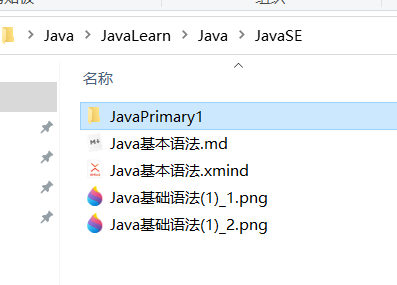
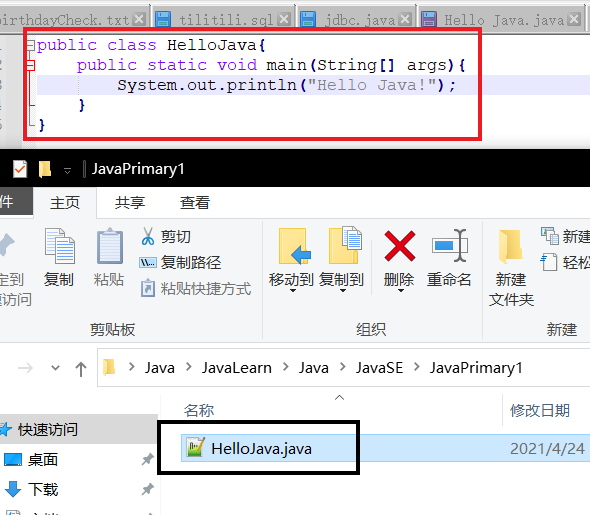
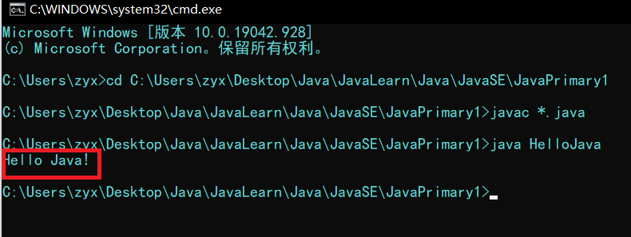
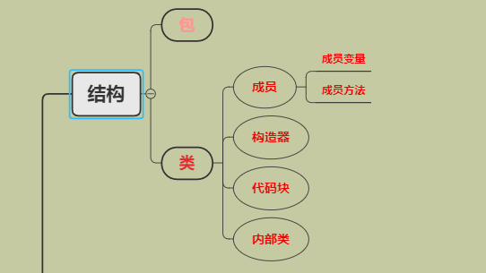
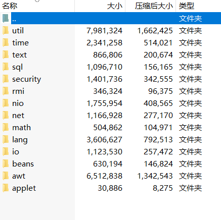

# Java基本语法

## 前言

大一，学习后端开发一段时间，有一些地方也没有很了解。该教程目的是引入更多的小伙伴一起学习Java，也给新手一个入门的通道。如果有哪里错误的地方请大佬在评论区指出。

### Java是什么

Java是一组有序指令的**集合**，说人话就是一门计算机语言，计算机语言有很多，常见的有：C语言、C++、C#、Java、Python等等。它们有各自的特性，由于这些特性的不同，所以它们常常会各司其职，负责各个领域的工作。

如：嵌入式开发需要用到C语言；游戏开发可以使用Java、C#、C++；数据挖掘以Python居多；而Java的应用面其实很广泛，它可以做桌面端的应用，如qq，微信，也可以做网页端的开发。当然，只学Java一门语言是不够的，不管哪个领域，都需要学习多门语言。所以，初学者不需要考虑该学习哪一门语言。你只需要一门好上手的语言学习编程思想，学精了一门语言以后，转别的语言需要的只是适应别的语言的语法，不需要重新学习。

## 学习Java的准备工作

### 安装JDK

JDK是Java官方提供给我们的一个语言包，里面有很多前人已经写好了的工具（<font style="font-size:90%;color:grey">还没学到类，暂且这么称呼吧</font>），我们以后就要基于这一个工具包来学习Java。

csdn上安装JDK（推荐1.8或者11），包括配置环境变量的教程简直多到不知道哪里去了，随便找一个跟着安装、设置就好，这里不过多赘述，太过于麻烦。这里提供一个教程（随便找的，写的还挺详细）：

> <a href="https://blog.csdn.net/qq_38436214/article/details/105071088?ops_request_misc=%7B%22request%5Fid%22%3A%22161917658716780269851322%22%2C%22scm%22%3A%2220140713.130102334..%22%7D&request_id=161917658716780269851322&biz_id=0&utm_medium=distribute.pc_search_result.none-task-blog-2~all~top_positive~default-1-105071088.first_rank_v2_pc_rank_v29&utm_term=jdk">JDK的安装</a>

### 安装文本编辑器

安装文本编辑器是为了让我们能够更好地写代码，编辑器自带的换行功能和自动缩进还是很舒服的（不难受的话用记事本也是可以的）。<font style="color:darkcyan;font-size:90%;">不建议一上来就使用idea或者eclipse，新手多手敲代码绝对百利无一害！</font>

如果你已经安装好了上面这两个工具并且配置好了环境变量，恭喜你。

<font style="color:red;font-size:1.3rem;">初期的学习准备工作已经就绪了！</font>

## 第一个程序

"Hello World!"可以说是程序员编程的敲门砖，我们搞特殊我们不写"Hello World!"，我们来写一写"Hello Java!"。

在随意一个地方创建一个用于存放Java代码的文件夹（建议文件路径不含中文），像这样:point_down:



接着我们进入这个文件夹，新建一个空白文档，把后缀改为`.java`，编写我们的第一个Java程序：



那么我们现在就已经写好了我们的第一个程序，下面我们需要编译运行它，那么怎么编译呢？

* 编译

  打开dos命令行，把当前路径切换到你的java文件所处的路径下（*可以在命令行里敲入`cd + 空格 + <你所在的路径>`来切换路径，可以直接复制当前路径贴到命令行里使用*）。

  那么来到这个路径以后，使用`javac + 空格 + <文件名>.java`来编译这个文件，完成以后，会生成一个同名的`.class`文件。这说明你已经编译成功了

* 运行

  编译完以后，当然就要运行一下这个程序，命令行当前路径同样切换到Java文件路径下`java + 空格 + <文件名>`就可以成功运行，运行结果:point_down:

  

  输出成功！

## Java的结构

* 接下来先了解一下Java的结构：



Java的结构中分为以上这一些，包我认为是不那么重要的概念，所以单独拿出来了。那么包是什么？首先先上图：



这是Java的源代码的文件夹，里面有很多小的文件夹（如util、time），文件夹里面有很多`.class`文件，这些文件夹就是**包**。

它就是一个存放了Java代码的文件夹，一个包中可以有很多`.class`文件，像我们写的`HelloJava.class`，就在JavaPrimary1**包**下。

<font style="color:orange;font-weight:700">目前只需要了解包这个概念，具体的分包细节以后再说。</font>

### <font style="color:darkred;">类</font>

* 类是Java中很重要的部分，它是所有代码的归属，一切的代码都需要在一个类下，才能被加载到Java虚拟机（JVM）中，回去看看我们的第一个程序，`.java`编译后的`.class`文件其实就是一个**类**。
* Java中，类的名字是<font style="color:red;font-size:20px;font-weight:700">class</font>

```java
public class HelloJava{
    // ↑这就是一个类
    // ↓这些是类里面包含的'内容'
	public static void main(String[] args){
		System.out.println("Hello Java!");
	}
}
```

#### 成员

Java的一个类下具有两种成员：成员变量和成员方法。

下面来简单写写。

```java
// 我是一个类
public class myClass{
    // 我是一个成员变量
    public int wo_Shi_Yi_Ge_Cheng_Yuan_Bian_Liang;
    // 我是一个成员方法
    public void wo_Shi_Yi_Ge_Cheng_Yuan_Fang_Fa(){
        
    }
}
```

上面清楚地展示了什么是成员变量，什么是成员方法，这种写法非常不规范，但是为了方便理解，先这么写着。

成员方法一般我们通常直接叫方法，但是成员变量必须只能叫成员变量，不能直接叫变量，原因可以看变量部分的学习

##### 变量

* 变量有局部变量和成员变量
  * 成员变量是归属于一个类的变量，也有人叫它是一个类的属性，我习惯叫成员变量
  * 局部变量是存在于一个方法或是一个代码块里的变量，这个变量的作用域（生效的范围）只限于该方法或代码块，出了这个范围不能访问或调用。
* 如何定义变量

##### 方法

方法是完成一件事情所需要的代码的**集合**。

例如：我们需要银行转账100块，需要从转出账户的余额减去100块，从转入账户的余额加上100块，那么完成这一件事我们就可以写一个方法，把这串代码封装起来，到时候**调用**这个方法就可以了。

### 构造器

先看代码：

```java
public class myClass{
	public myClass(){
        // 我是一个构造器
    }
}
```

