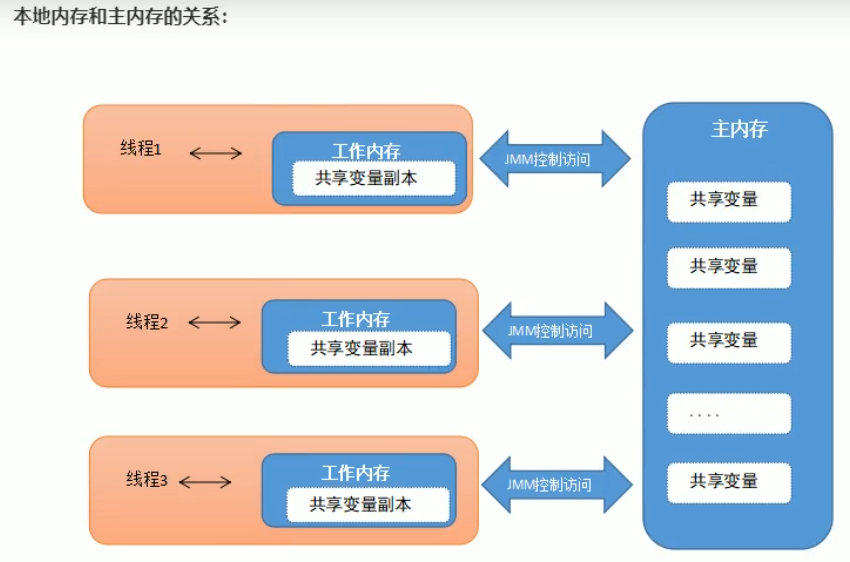

# 多线程的概述

* 多线程又称并发编程（`Java Util Concurrent`即`JUC`）

## 什么是进程

* 程序是静止的，运行中的程序就是进程
* 进程的三个特征
  * 动态性：进程是运行中的程序，要动态的占用内存，`CPU`和网络等资源
  * 独立性：进程与进程之间是相互独立的，彼此有自己的独立内存区域
  * 并发性：假如`CPU`是单核的，同一个时刻其实内存中只有一个进程在被执行，`CPU`会分时轮询切换一次为每个进程服务，因为切换的速度非常快，给我们的感觉这些进程在同时执行，这就是并发性
* 并行，同一时刻同时有多个进程在执行

## 什么是线程

* 线程是属于进程的，一个进程可以包含多个线程，这就是多线程
* 线程是进程中的一个独立执行单元
* 线程创建开销相对于进程来说比较小
* 线程也支持并发性

## 线程的作用

* 可以提高程序的效率，线程也支持并发性，可以有更多机会得到`CPU`
* 多线程可以解决很多业务模型
* 大型高并发技术的核心技术

# 线程的创建

多线程是很有用的，我们在进程中创建线程的方式有三种：

* 直接定义一个类继承线程类`Thread`，重写`run()`方法，创建线程对象，调用线程对象的`start()`方法启动线程
* 定义一个线程任务类实现`Runnable()`接口，重写`run()`方法，创建线程任务对象，把线程任务对象包装成线程对象，调用线程对现象的`start()`方法启动线程
* 实现`Callabale`接口（扩展）

*Tips：`main`方法是由主线程执行的*

## 继承Thread类创建线程

1. 定义一个线程类继承`Thread`类

2. 重写`run()`方法

3. 创建一个新的线程对象

4. 调用线程对象的`start()`方法启动线程

   <font style="color:dark-gray;font-size:90%">*Tips：这里必须调用线程对象的`start()`方法才是真正启动了线程，如果直接调用`run()`方法，其实只是把线程的`run()`方法当作普通方法执行，此时还是只有`main`方法一个主线程，并不存在多线程*</font>

例：

```java
public class ThreadDemo{
    public static void main(String[] args){
		// 3.通过父类Thread创建MyThread线程对象，Java多态的体现
        Thread t = new MyThread();
		// 4.启动线程
        t.start();
        
        for(int i = 0; i < 5; i++){
            System.out.println("main线程输出:" + i)
        }
    }
}

// 1.创建一个MyThread类继承Thread类
class MyThread extends Thread{
    // 2.重写run()方法
    @override
    public void run(){
        for(int i = 0; i < 5; i++){
            System.out.println("子线程输出：" + i);
        }
    }
}
```

直接继承Thread类的优缺点：

* 优点：编码简单
* 缺点：线程类已经继承了Thread类，无法继承其他类了，功能不能通过继承拓展（单继承的局限性）

## 实现Runnable接口创建线程

1. 创建一个线程任务类实现`Runnable`接口
2. 重写`run()`方法
3. 创建一个线程任务对象
4. 把线程任务对象包装成线程对象
5. 调用线程对象的`start()`方法启动线程

```java
public class ThreadDemo{
    public static void main(String[] args){
        // 3.创建一个线程任务对象，Tips：线程任务对象不是线程对象，只是用于执行线程任务
        Runable target = new MyRunnable();
        // 4.把线程任务对象包装成线程对象
        Thread t = new Thread(target);
        // 5.调用线程对象的start()方法启动线程
        t.start();
    }
}

// 1.创建一个线程任务类实现Runnable接口
class MyRunnable implements Runnable{
    // 2.重写run()方法
    @override
    public void run() {
        for(int i = 0; i < 10; i++){
            System.out.println(Thread.currentThread().getName() + "===>" + i);
        }
    }
}
```

实现`Runnable`接口创建线程的优缺点：

* 缺点：
  * 代码复杂
  * 不能直接得到线程执行的结果
* 优点：
  * 线程任务类只是实现了`Runnable`接口，可以继续继承其他类，而且可以实现其他接口，避免了单继承的局限性
  * 同一个线程任务对象可以被包装成多个线程对象
  * 实现了解耦操作，线程任务代码可以被多个线程共享，线程任务代码和线程独立
  * 线程池可以放入实现了`Runnable`或`Callable`的线程任务对象

### 通过匿名内部类的形式简化实现Runnable接口

```java
public class ThreadDemo{
    public static void main(String[] args){
        new Thread(new Runnable(){
            @override
            public void run(){
                for(int i = 0; i < 10; i++){
                    System.out.println(Thread.currentThread().getName() + "===>" + i);
                }
            }
        }).start();
    }
}
```

## 实现Callable接口创建线程

1. 定义一个线程任务类实现`Callable`接口，什么线程执行的结果类型
2. 重写线程任务类的`call()`方法，这个方法可以直接返回执行的结果
3. 创建一个`Callable`的线程任务对象
4. 把`Callable`的线程任务对象包装成一个未来任务对象
   * 未来任务对象其实就是一个`Runnable`对象，这样才可以被包装成线程对象，这样做的目的是得到线程执行后的结果
5. 把未来任务对象包装成线程对象
6. 调用线程的`start()`方法启动线程

```java
public class ThreadDemo{
    public static void main(String[] args){
        // 3.创建一个Callable的线程任务对象
        Callable call = new MyCallable();
        // 4.把Callable任务对象包装成一个未来任务对象
        FutureTask<String> task = new FutureTask<>(call);
        // 5.把未来任务对象包装成线程对象
        Thread t = new Thread(task);
        // 6.启动线程对象
        t.start();
        
        for(int i = 0; i < 10; i++){
            System.out.println(Thread.currentThread().getName() + "===>" + i);
        }
        
        // 在最后去获取线程执行的结果，如果线程没有结果，主线程会让出CPU等线程执行完，再来获取结果
        try{
            String rs = task.get();
            System.out.println(rs);
        } catch (Exception e){
            e.printStackTrace();
        }
    }
}

// 1.创建一个线程任务类实现Callable接口，申明线程返回的结果类型
class MyCallable implements Callable<String>{
    // 2.重写线程任务类的call()方法
    @override
    public String call() throws Exception{
        int sum = 0;
        for(int i = 0; i< 10; i++){
            System.out.println(Thread.currentThread().getName() + "===>" + i);
            sum += i;
        }
        return Thread.currentThread().getName() + "执行的结果是：" + sum;
    }
}
```

实现`Callable`接口创建线程的优缺点

* 优点：
  * 线程任务类只是实现了`Runnable`接口，可以继续继承其他类，同时可以继续实现其他接口
  * 一个线程任务对象可以被共享成多个线程对象，适合做多线程的资源共享操作
  * 很适合做线程池的执行任务
  * 可以直接获取线程执行的结果
* 缺点：代码复杂

# Thread类的常用API

* `public void setName(String name)`：给当前线程取名字
* `public void getName()`：获取当前线程的名字
  * 线程存在默认名称，子线程的默认名称为：`Thread-索引`
  * 主线程的默认名称为：`main`
* `public static Thread currentThread()`：获取当前线程对象，这个代码在哪个线程中，就得到哪个线程对象

----

* `public static void sleep(long time)`：让当前线程休眠多少`(time)`毫秒再继续执行

# Thread类的构造器

* `public Thread()`：创建一个默认名字的线程
* `public Thread(String name)`：创建一个名字为`name`的线程
* `public Thread(Runnable target)`：将`target`线程任务对象包装成一个默认名字的线程
* `public Thread(Runnable target, String name)`：将`target`线程任务对象包装成一个名字为`name`的线程

# 线程安全问题

* 线程安全问题：多个线程同时操作同一个共享资源的时候可能会出现线程安全问题

  模拟取款问题的案例：

  ​	Tips：应用高度面向对象的思想设计

  分析：

  * 提供一个账户类Account作为创建共享资源账户对象的类
  * 定义一个线程类来用于创建2个线程分别代表小明和小红来取钱

```java 
public class ThreadSafe{
    public static void main(String[] args) {
        // 1.创建一个共享资源账户对象
        Account acc = new Account("ICBC-110", 100000);
        
        // 2.创建两个线程去账户对象中取钱
        Thread ming = new DrawThread(acc, "小明");
        ming.start();
        
        Thread hong = new DrawThread(acc, "小红");
        hong.start();
    }
}
```

* **账户类**

```java
// 账户类
public class Account{
    private String cardId;
    private double money;
    
    public Account() {
    }
    
    public Account(String cardId, double money) {
        this.cardId = cardId;
        this.money = money;
    }
    
    public String getCardId() {
        return cardId;
    }
    
    public void setCardId(String cardId) {
        this.cardId = cardId;
    }
    
    public double getMoney() {
        return money;
    }
    
    public void setMoney(double money) {
        this.money = money;
    }
    
    public void drawMoney(double money) {
        // 开始判断取钱逻辑
        // 1.先知道谁来取钱
        String name = Thread.currentThread().getName();
        // 2.判断余额是否足够
        if(this.money >= money) {
            System.out.println(name + "来取钱，余额足够，吐出" + money);
            // 3.更新余额
            this.money -= money;
            System.out.println(name + "来取钱后，余额剩余" + this.money);
        } else {
            System.out.println(name + "来取钱，余额不足 ");
        }
    }
}
```

* **线程类**

```java
// 线程类：创建取钱线程对象的
public class DrawThread extends Thread{
    // 定义一个成员变量接收账户
    private Account acc;
    public DrawThread(Account acc, String name) {
        super(name);
        this.acc = acc;
    }
    
    @override
	public void run() {
        acc.drawMoney(100000);
    }
}
```

**以上案例是线程不安全的，因为在小明在通过了取钱余额的逻辑判断以后，这时有可能CPU被小红线程抢走，为其工作，由于此时小明仅仅通过了余额是否充足的逻辑判断，但并还没有取钱（即还没从余额中减去需要取走的钱）。所以，小红也通过了余额是否充足的逻辑判断，这时候两者再取走钱（从余额中减去需要取走的钱），则会出现从100000元中取走200000元的情况，所以说此时是线程不安全的**

# 线程同步

* 以上的案例说明多线程存在线程不安全的问题，那么我们需要想办法解决这个问题。最直观、直接的方法，就是利用同步代码块

* 线程同步解决线程安全问题的核心思想：

  ​		这种问题产生的原因主要是因为多个线程同时访问共享资源。所以解决线程安全一般有两种思路：

  * **不允许线程访问共享资源**。也就是说，只有多个线程同时访问共享资源，才会出现安全问题
  * **不允许线程同时访问共享资源**。当多个线程先后访问，即前一个线程访问完毕后，另一个线程再进入访问。这样就保证了在一个线程对共享资源进行修改时，另一个线程不访问，也就不存在线程安全问题了（即对可能存在线程安全问题的代码**上锁**），这就是**线程同步**

## 同步代码块

* 作用：把出现线程安全问题的核心代码**上锁**，每次只能一个线程进入。执行完毕后自动解锁，其他线程才可以进行操作

* 格式：

  ```java
  synchronized(锁对象) {
      // 访问共享资源的核心代码
  }
  ```

* 锁对象：理论上可以是任意的*唯一*对象即可

* 原则上：**锁对象建议使用共享资源**

所以，上述案例只需要将余额**逻辑判断内**的代码用`synchronized`加锁以后，线程就安全了

## 同步方法

* 作用：把出现线程安全问题的核心方法给锁起来，每次只能一个线程进入访问，其他线程必须在方法外面等待

* 用法：直接给方法加上一个修饰符 `synchronized`

* 原理：同步方法的原理和同步代码块的底层原理其实是完全一样的，只是同步方法是把整个方法的代码都锁起来的

  同步方法底层其实也有锁对象：

  * 如果方法是实例方法，同步方法默认用`this`作为锁的对象
  * 如果方法是静态方法，同步方法默认用类名.class作为锁的对象

  例：

```java
public synchronized void demo() {
    // 被锁住的代码
}
```

## Lock显示锁

* `Lock`是`Java`提供的锁机制，同步代码块和同步方法所具有的功能`Lock`都有，除此以外，它还有更加强大的功能
* `Lock`也叫同步锁，加锁和释放锁方法化了，如下：
  * `public void lock()`：加同步锁
  * `public void unlock()`：释放同步锁

## Lock显示锁的使用

* 创建`Lock`锁对象：`Lock lock = new ReentrantLock();`

  `Lock`类是一个接口，而`ReentrantLock`才是它的实现类

* 加锁/释放锁：

  ```java
  // 创建锁对象
  Lock lock = new ReentrantLock();
  
  // 上锁
  lock.lock();
  try{
      // 存在线程安全问题的代码
  } catch (Exception e) {
      // 如果在代码执行过程中出现了异常，则抛出
      e.priintStackTrace();
  } finally {
      // 解锁
      // 不管执行过程中有无异常抛出，均需要释放锁资源
      lock.unlock()
  }
  ```

**总结：线程同步虽然解决了线程安全问题，但是性能差。所以在实际开发中，如果没有要求线程安全，我们可以不采取线程安全的做法，来提高系统的性能**

# 线程通信

* 多个线程因为在同一个进程中，所以互相通信比较容易

* 线程通信的经典模型：生产者与消费者
  * 生产者负责生成商品，消费者负责消费商品
  * 生产不能过剩，消费不能没有

## 线程通信的核心方法

* `Object`类提供了以下方法帮助我们完成线程通信
  * `public void wait()`：让当前线程进入等待状态，此方法必须锁对象调用
  * `public void notify()`：唤醒当前锁对象上等待状态的某个线程，此方法必须锁对象调用
  * `public void notifyAll()`：唤醒当前锁对象上等待状态的全部线程，此方法必须锁对象调用

## 模拟案例：

* 小明和小红有一个共同账户
* 他们有三个爸爸（亲爸，岳父，干爹）

* 模型：
  * 小明和小红去取钱。如果有钱就取出，然后**等待自己**，唤醒他们的3个爸爸来存钱；
  * 他们的爸爸来存钱，如果发现有钱就不存，没钱就存钱，然后**等待自己**，唤醒孩子们来取钱

* 分析：
  * **生产者线程**：亲爸，岳父，干爹
  * **消费者线程**：小明，小红
  * **共享资源**：账户对象

* Tips：
  1. 线程通信一定是多个线程在操作同一个资源才需要进行通信
  2. 线程通信必须先保证线程安全，否则毫无意义，代码也会报错

---

* 账户类

```java 
// 账户
public class Account {
    private String cardId;
    private double money;
    
    public Account() {
    }
    
    public Acccout(String cardId, double money) {
        this.cardId = cardId;
        this.money = money;
    }
    
    public String getCardId() {
        return cardId;
    }
    
    public void setCardId(String cardId) {
        this.cardId = cardId;
    }
    
    public double getMoney() {
        return money;
    }
    
    public void setMoney(double money) {
        this.money = money;
    }
    
    public synchronized void drawMoney(double money) {
        try{
	        // 先获取谁来取钱
	        String name = Thread.currentThread().getName();
	        // 1.判断余额是否足够
	        if(this.money >= 0) {
        	    // 2.开始吐钱
    	        this.money -= money;
	            System.out.println(name + "来取钱，取钱：" + money + "剩余：" + this.money);
	            // 3.取钱后等待自己唤醒别人
                this.notifyAll();
            	this.wait();
        	} else {
                // 余额不足
                this.notifyAll();
                this.sleep();
            }
    	} catch (Exception e) {
            e.printStackTrace();
        }
    }
    
    // 亲爹、干爹、岳父
    public synchronized void saveMoney(double money) {
        try{
	        // 先获取谁来存钱
	        String name = Thread.currentThread().getName();
	        // 1.判断余额是否足够
	        if(this.money >= money) {
	            // 2.有钱了，唤醒别人，等待自己
                this.notifyAll();
            	this.wait();
        	} else {
                this.money += money;
                System.out.println(name + "来存钱：" + money);
                // 3.唤醒别人等待自己
                this.notifyAll();
                this.wait();
            }
    	} catch (Exception e) {
            e.printStackTrace();
        }
    }
}
```

* 取钱线程类

```java
// 取钱线程
public class DrawThread extends Thread{
    // 定义一个成员变量接收账户
    private Account acc;
    public DrawThread(Account acc, String name) {
        super(name);
        this.acc = acc;
    }
    
    @override
	public void run() {
        while(true) {
            try {
                Thread.sleep(3000);
            } catch (Exception e) {
                e.printStackTrace();
            }
            acc.drawMoney(100000)
        }
    }
}
```

* 存钱的线程类

```java
// 存钱线程
public class SaveThread extends Thread{
    // 定义一个成员变量接收账户
    private Account acc;
    public DrawThread(Account acc, String name) {
        super(name);
        this.acc = acc;
    }
    
    @override
	public void run() {
        while(true) {
            try {
                Thread.sleep(3000);
            } catch (Exception e) {
                e.printStackTrace();
            }
            acc.saveMoney(100000)
        }
    }
}
```

* 线程通信类

```java
// 线程通信
public class ThreadCommunication {
    public static void main(String[] args){
        // 1.创建一个共享账户
        Account acc = new Account("ICBC-111", 0);
        // 2.创建两个线程对象代表小红和小明
        new DrawThread(acc, "小明").start();
		new DrawThread(acc, "小红").start();
        
        new SaveThread(acc, "亲爹").start();
        new SaveThread(acc, "干爹").start();
        new SaveThread(acc, "岳父").start();
    }
}
```

# 线程状态

* Java为线程的状态定义了以下6种枚举类

  `NEW`、`RUNNABLE`、`BLOCKED`、`WAITING`、`TIMED_WAITING`、`TERMINATED`

|               线程状态               |                         状态发生条件                         |
| :----------------------------------: | :----------------------------------------------------------: |
|           **NEW**（新建）            |      线程刚被创建，但是并未启动。即还没调用`start`方法       |
|        **Runnable**（可运行）        | 线程可以在`Java`虚拟机中运行的状态，可能在运行自己的代码，也可能没有，这取决于操作系统处理器。此时已经调用了`start`方法 |
|        **Blocked**（锁阻塞）         | 当一个线程试图获取一个对象锁，而该对象锁被其他的线程持有，则该线程进入**Blocked**状态 |
|       **Waiting**（无限等待）        | 一个线程在等待另一个线程执行一个（唤醒）动作时，该线程进入**Waiting**状态。进入这个状态以后是不能自动唤醒的，必须等待另一个线程调用`notify`或`notifyAll`方法才能够被唤醒 |
|    **Timed Waiting**（计时等待）     | 同**Waiting**状态，有几个方法有超时参数，调用他们将进入**Timed Waiting**状态。这一状态将一直保持到超时期满或者接收到唤醒通知。带有超时参数的常用方法有`Thread.sleep`、`Object.wait` |
| **Terminated**（被终止，即线程死亡） | 因为`run`方法正常退出而死亡，或者因为没有捕获的异常终止了`run`方法而死亡 |

* <font style="color:red;font-weight:bold">Tips：线程在调用了`wait`方法以后会释放锁，把锁的占据权让给其他线程；但`sleep`方法不同，此时线程只是会进行休眠，并不会释放锁。也就是说，在调用了`wait`方法时，线程会进入等待状态并且释放锁，此时其他线程可以占用锁进行操作；而在调用了sleep方法时，线程只会进入休眠状态，并不会释放锁的使用权，其他线程无法占用锁进行操作</font>

# 线程池

> 线程属于非常宝贵的系统资源，如果我们使用一个线程的时候就去创建一个线程，这样使用起来固然很方便，但是这样就会带来一个问题：
>
> 当我们并发的数量很多，而且每一个线程都执行一个很短的任务就结束了（即线程进入死亡的生命周期），这样大量创建线程销毁线程需要消耗庞大的系统资源，降低系统的效率。
>
> 那么有没有办法可以通过复用已有的线程，来减少线程的创建与销毁，以此达到提高系统效率的目的呢？

* **线程池**：其实就是一个容纳多个线程的容器，其中的线程可以反复使用，省去了反复创建线程和销毁线程对象的操作，减少了系统资源的损耗

* 线程池的组成：
  * **工作线程**（`PoolWorker`）：线程池中的线程，在没有任务时处于等待状态，可以循环的执行任务
  * **任务队列**（`TaskQueue`）：用于存放没有处理的任务。提供一种缓冲机制
  * **任务接口**（`Task`）：每个任务必须实现的接口，以供工作线程调度任务的执行，它主要预定了任务的入口，任务执行完后的首位工作，任务的执行状态等
  * **线程池管理器**（`ThreadPool`）：用于创建并管理线程池，包括：创建线程池，销毁线程池，添加新线程和新任务

* 线程池的好处：
  * **降低资源损耗**：减少了创建和销毁线程的次数，每个工作线程都可以被重复利用，可执行多个任务
  * **提高响应速度**：不需要频繁的创建线程，如果有线程可以直接用，不会出现系统僵死
  * **提高线程的可管理性**：线程池可以约束系统最多只能由多少个线程，不会因为线程过多而死机
* **池的核心思想**：宝贵资源的复用，一个资源用于处理多个任务，减少系统资源的损耗（例：数据库连接池、线程池）

## 线程池的创建和原理

* 线程池在`Java`中的代表类：`ExecutorService`（接口）
* `Executors`提供了一个静态方法来让我们获取一个线程池的对象：
  * `public static ExecutorService newFixedThreadPool(int nThreads)`：创建一个线程池并返回
* `ExecutorService`的一些常见方法
  * `Future<?> submit(Runnable task)`：提交一个`Runnable`的任务对象给线程池执行
  * `Future<?> submit(Callable task)`：提交一个`Callable`的任务对象给线程池执行
  * `public void shutdown()`：等待任务执行结束以后才会关闭线程池
  * `public void shutdownNow()`：立即关闭线程池，无论任务是否执行完毕
* 例：

```java
// Runnable
public class ThreadPoolsDemo {
    public static void main(String[] args) {
        // 1.创建一个线程池，指定线程的固定数量是3
        ExecutorService pools = Executors.newFixedThreadPool(3);
        // 2.添加线程任务让线程池处理
        Runnable target = new MyRunnable();
        // 第1次提交任务，此时线程池创建新线程，自动触发执行
        pools.submit(target);
        // 第2次提交任务，此时线程池创建新线程，自动触发执行
        pools.submit(target);
        // 第3次提交任务，此时线程池创建新线程，自动触发执行
        pools.submit(target);
        // 第4次提交任务，此时线程池已经达到3个线程，那么线程池不会创建新线程，而是复用之前的线程
        pools.submit(target);
    }
}

class MyRunnable implements Runnable {
    @override
    public void run() {
        for(int i = 0; i < 5; i++) {
            System.out.println(Thread.currentThread().getName() + "===>" + i);
        }
    }
}
```

```java
// Callable
public class ThreadPoolsDemo {
    public static void main(String[] args) {
        // 1.创建一个线程池，指定线程的固定数量是3
        ExecutorService pools = Executors.newFixedThreadPool(3);
        
        // 2.提交Callable的任务对象返回一个未来任务对象
        Future<String> t1 = pools.submit(new MyCallable(100));
        Future<String> t2 = pools.submit(new MyCallable(100));
        Future<String> t3 = pools.submit(new MyCallable(100));
        Future<String> t4 = pools.submit(new MyCallable(100));
        
        try {
            // 3.获取线程执行的任务的结果
	        String rs1 = t1.get();
	        String rs2 = t2.get();
    	    String rs3 = t3.get();
        	String rs4 = t4.get();
        } catch (Exception e) {
            e.printStackTrace();
        }
        System.out.println(s1);
        System.out.println(s2);
        System.out.println(s3);
        System.out.println(s4);
    }
}
class MyCallable implements Callable<String> {
    // 需求：使用线程池，计算出 1-100，1-200，1-300 的和并返回
    private int n;
    public MyCallable(int n) {
        this.n = n;
    }
    
    @override
    public String call() throws Exception {
        int sum = 0;
        for(int i = 1; i <= n; i++) {
            sum += i;
        }
        return Thread.currentThread().getName() + "执行的结果是：" + sum;
    }
}
```


* 底层参数：

  以上方法创建一个线程池，实际上在底层通过创建一个线程池执行器（`ThreadPoolExecutor`）来返回给用户：

  `public ThreadPoolExecutor(int corePoolSize, int maximumPoolSize, long keepAliveTime, TimeUnit unit, Blocking< Runnable > workQueue) {...}`

  * `corePoolSize`：线程池的核心数量
  * `maximumPoolSize`：线程池的最大线程数
  * `keepAliveTime`：任务的最大等待时间（如果任务超出了最大等待时间，任务会直接死亡）
  * `unit`：秒
  * `workQueue`：阻塞（工作）队列，当任务大于线程池的线程数量时，任务会自动到阻塞队列中进行等待，当出现线程空闲的情况会自动调用这个工作队列给线程分派任务

# 死锁

* 死锁是指多个线程同时被阻塞，它们中的一个或者全部都在等待某个资源被释放，由于线程被无限期地阻塞，因此程序不可能正常终止

* 死锁的四个必要条件（**开发中应该避免死锁！**）

  * **互斥使用**，即当资源被一个线程使用（占有）时，别的线程不能使用

  * **不可抢占**，资源请求者不能强制从资源占有者手中夺取资源，资源只能由资源占有者主动释放

  * **请求和保持**，即当资源请求者在请求其他的资源的同时保持对原有资源的占有

  * **循环等待**，即存在一个等待循环队列，`p1`要`p2`的资源，`p2`要`p1`的资源。这样就形成了一个等待环路

    当上述四个条件都成立的时候，便形成死锁。当然，死锁的情况下如果打破上述任何一个条件，便可让死锁消失

* 代码实现死锁：

```java
public class ThreadDead {
    // 定义一个资源对象
    public static Object resources1 = new Object();
    public static Object resources2 = new Object();
    
    public static void main(String[] args) {
        // 定义2个线程
        new Thread(new Runnable() {
            @override
            public void run() {
                synchronized (resources1) {
                    System.out.println("线程1占用资源1请求资源2");
                    // 让线程1在此处"睡"1秒，保证线程2可以占据到资源2
                    try {
                        Thread.sleep(1000);
                    } catch (Exception e) {
                        e.printStackTrace();
                    }
                    synchronized (resources2) {
                        System.out.println("线程1成功占用资源2")
                    }
                }
            }
        }).start();
        
        new Thread(new Runnable() {
            @override
            public void run() {
                synchronized (resources2) {
                    System.out.println("线程2占用资源2请求资源1");
                    try {
                        Thread.sleep(1000);
                    } catch (Exception e) {
                        e.printStackTrace();
                    }
                    synchronized (resources1) {
                        System.out.println("线程2成功占用资源1")
                    }
                }
            }
        }).start();
    }
}
```

* 以上代码形成了**必然死锁**，当线程1占据了资源1入了休眠状态，此时线程2占据了资源2，并也开始休眠，当两个线程都”醒过来“以后，线程1开始请求资源2，线程2开始请求资源1，但是由于两个资源都被另一个线程占据，两个线程都不释放资源，又在等待另一个资源，形成了等待环路。所以形成了必然死锁

# 并发变量

* **变量不可见性**：多个线程访问共享变量，会出现一个线程修改变量的值后，其他线程看不到最新值的情况

例：

```java
public class VolatileDemo extends Thread {
    private boolean flag = false;
    
    @override
    public void run() {
        try {
            Thread.sleep();
        } catch (Exception e) {
            e.printStackTrace();
        }
        // 线程中修改变量
        flag = true;
    }
    
    public boolean isFlag() {
        return flag;
    }
    
    public void setFlag(boolean flag) {
        this.flag = flag;
        
        System.out.println("flag = " + flag);
    }
}

class VisabilityDemo {
    public static void main(String[] args) {
        VolatileDemo t = new VolatileDemo();
        t.start();
        
        // 2.主线程
        while(true) {
            if (t.isFlag()) {
                System.out.println("主线程进入执行......");
            }
        }
    }
}
```

* 以上的代码在子线程中修改了`flag`为`true`以后，在主线程中`flag`的值依然为`false`

  结论：多线程修改变量，会出现线程间变量的**不可见性**

## 变量不可见性的原因

* 在了解变量不可见性之前，我们需要先了解一下`Java`的内存模型——`JMM(Java Memory Model)`



在多线程中，为了提高线程的工作效率，访问共享变量并不是直接访问主内存中的共享变量，并对其进行操作的，而是先在主内存中获取一个共享变量的副本，存到每一个线程**自己独立**的工作内存中（如上图），也就是说，每一个线程的工作内存其实都是**独立、分割**的。所以，线程在对共享变量操作时，先对自己的工作内存的值进行操作，然后再去修改主内存的值，这就有可能导致其他线程不能“看见”主内存中变量值的改变，这就是多线程中，**变量的不可见性**

## 变量不可见性的解决

* 加锁

  每次加锁都会清空线程自己的工作内存，再重新读取主内存中的变量最新值

* 对共享的变量进行`volatile`关键字修饰

  * `volatile`修饰的变量可以在多线程并发修改下，实现线程间变量的可见性
  * `volatile`关键字解决变量不可见性的原理：一旦一个线程修改了`volatile`修饰的变量，它会立即到主线程中去修改变量的值，并且”通知“其他所有需要该变量的线程，让所有线程的值保持最新

* `volatile`和`synchronized`的区别

  * `volatile`只能修饰实例变量和类变量；而`synchronized`可以修饰方法和代码块
  * `volatile`保证数据的可见性，但是不保证**原子性**（多线程进行写擦欧总，不保证线程安全）；而`synchronized`是一种排他（互斥）的机制（保证原子性）

## 原子性

* 概述：原子性指的是一次操作或多次操作当中，要么**所有的操作全部得到了执行并且不会受到任何因素的干扰而中断**，要么**所有的操作都不执行**（操作的完整性）
* `volatile`关键字只能保证线程间变量的可见性，但不能保证变量操作的原子性
* 原子性可以用**加锁（synchronized）**来实现，并且加锁还可以保证共享变量的可见性

## 原子类

* 由于加锁对性能的影响较大，所以`Java`从`jdk1.5`开始为我们提供了`java.util.concurrent.atomic`包，该包下的类是用于给我们提供一些性能高效、用法简单、线程安全，又能保证原子性的功能

### 原子类CAS机制介绍

* **CAS（Compare And Swap）**：CAS是线代CPU广泛支持的一种对内存中的共享数据进行操作的一种特殊指令。CAS可以将`read-modify-check-write`转换为原子操作，这个原子操作直接由处理器保证
* CAS机制当中使用了三个基本操作数：**内存地址V，旧的预期值A，要修改的新值B**
* CAS实现：CAS为保证操作的原子性，在每一次修改数据同步到主内存之前，都会先比较一下主内存的值和它自己的旧值是否一致，如果不一致，说明这个数据已经被修改过了，那么这次操作会直接作废，并把新值存放到自己的工作内存中，再进行操作
* CAS与`synchronized`：乐观锁、悲观锁
  * `synchronized`是从**悲观的角度**出发，认为每次去拿数据的时候，数据都会被别人修改。所以每次在拿数据的时候都会上锁，这样就能阻止别人修改数据，确保线程安全（**悲观锁**）
  * CAS时从**乐观的角度**出发，认为每次去拿数据的时候，别人都不会修改，也就不会对数据上锁，但是在每次更新数据的时候都会判断一下在此期间，别人有没有来更新过这个数据（**乐观锁**）

### 原子型Integer

* `AtomicInteger`是原子型`Integer`，可以实现原子更新操作，以下是它的常用API

|                 常用API                  |                             说明                             |
| :--------------------------------------: | :----------------------------------------------------------: |
|         `public AtomicInteger()`         |             初始化一个默认值为0的原子型`Integer`             |
| `public AtomicInteger(int initialvalue)` |              初始化一个指定值的原子型`Integer`               |
|               `int get()`                |                            获取值                            |
|         `int getAndIncrement()`          |                          返回并自增                          |
|         `int incrementAndGet()`          |                          自增并返回                          |
|        `int addAndGet(int data)`         | 以原子方式将输入的数值与实例中的值(`AtomicInteger`里的`value`)相加，并返回结果 |
|      `int getAndSet(int newValue)`       |          以原子方式设置为`newValue`的值，并返回旧值          |

# 并发包

* 在实际开发中，如果不需要考虑线程安全问题，那么就不需要做线程安全，因为线程安全的保证会导致性能的下降。但是很多业务需要考虑线程的安全问题的，那么此时就必须考虑线程安全了。为了节省我们开发在算法上浪费的时间，`Java`为我们提供了性能优异，线程安全的**并发包**，我们可以根据自己的应用场景来选择合适的工具来使用，提高我们的开发效率

## `ConcurrentHashMap`

* `Map`集合中的经典集合——`HashMap`虽然性能高效，使用简单，但是它是**线程不安全**的，所以我们在线程不安全的情况下不能使用这个做`Map`集合
* `Hashtable`是线程安全的`HashMap`，它的所有方法都加了`synchronized`修饰，也就是说它是绝对线程安全的，但同时由于它全部方法都加了锁，所以它的工作效率十分的低下，性能较差，在现在开发中基本已经淘汰了
* `ConcurrentHashMap`是保证了线程安全的前提下，还具有了较好的性能，相比`Hashtable`，它的**综合**性能较好

## `CountDownLatch`

* `CountDownLatch`允许一个或多个线程等待其他线程完成操作，再执行自己

  例：

  线程1要执行打印：A和C，线程2要执行打印：B，但线程1在打印A后，要线程2打印B之后才能打印C，所以，在线程1打印A后，必须等待线程2打印完B之后才能继续执行，那么此时我们就可以使用`CountDownLatch`来实现这个功能

* `CountDownLatch`的常用API

|                        API                        |                           说明                           |
| :-----------------------------------------------: | :------------------------------------------------------: |
|        `public CountDownLatch(int count)`         |            初始化唤醒需要`down`几(`count`)步             |
| `public void await() throws InterruptedException` | 让当前线程等待，需要`down`够初始化时设定的步数才能够唤醒 |
|             `public void countDown()`             |                计数器进行减1（`down 1`）                 |

小结：这个类在构造时就需要指定步数（`count`），然后在每完成一步指定操作时就`down`一次，那么在步数达到0时，线程会被自动唤醒

## `CyclicBarrier`

* 某个线程任务必须等待其他线程执行完毕以后才能最终触发自己执行

  例：一个公司召集5名员工开会，等5名员工都到了，会议才开始

* `CyclicBarrier`的常用API

|                             API                             |                             说明                             |
| :---------------------------------------------------------: | :----------------------------------------------------------: |
| `public CyclicBarrier(int parties, Runnable barrierAction)` | 构造一个对象。用于在线程到达屏障数`parties`时，优先执行`barrierAction`任务 |
|                    `public int await()`                     | 每个线程调用`await`方法来告诉`CyclicBarrier`已经到达了屏障，然后当前线程被阻塞（被回收） |

小结：可以实现多线程中，某个任务等待其他线程执行完毕以后触发，循环屏障（`CyclicBarrier`）可以实现达到一组屏障就触发一个任务执行

## Semaphore

* **`Semaphore`**（发信号）的主要作用是控制线程的并发数量，控制访问特定资源的线程数目
* `synchronized`和`Semaphore`的比较
  * `synchronized`是”加锁“，在某一时间段内，只能有一个线程允许执行
  * `Semaphore`可以设置同时允许多少个线程执行
* `Semaphore`常用API

|                         API                         |                             说明                             |
| :-------------------------------------------------: | :----------------------------------------------------------: |
|           `public Semaphore(int permits)`           |                 `permits`表示许可线程的数量                  |
|    `public Semaphore(int permits, boolean fair)`    | `fair`表示公平性，如果这个设置为`true`的话，那么下一次执行的线程会是等待最久的线程 |
| `public void acquire() throws InterruptedException` |                           获取许可                           |
|               `public void release()`               |                           释放许可                           |

小结：可以实现控制线程并发时，占据锁的线程数量

## Exchanger

* **Exchanger**（交换者）是一个用于线程间写作的工具类。`Exchanger`用于进行线程间的数据交换。两个线程通过`exchange`方法交换数据，如果第一个线程先执行`exchange`方法，那么它将等待第二个线程执行`exchange`方法
* 常用API

|           API            |                             说明                             |
| :----------------------: | :----------------------------------------------------------: |
|   `public Exchanger()`   |                       构造一个*交换者*                       |
| `public V exchange(V x)` | 一个线程调用这个交换者对象的`exchange`方法，当有两个线程调用了同一交换者对象的`exchange`方法时，那么两个线程提供的信息将会交换 |

小结：

* `Exchanger`可以实现线程间的数据交换
* 一个线程如果等不到对方的数据就会一直等待
* 可以用这个机制来控制一个线程等待的时间
* 必须双方都进行交换了，才可以正常进行数据的交换