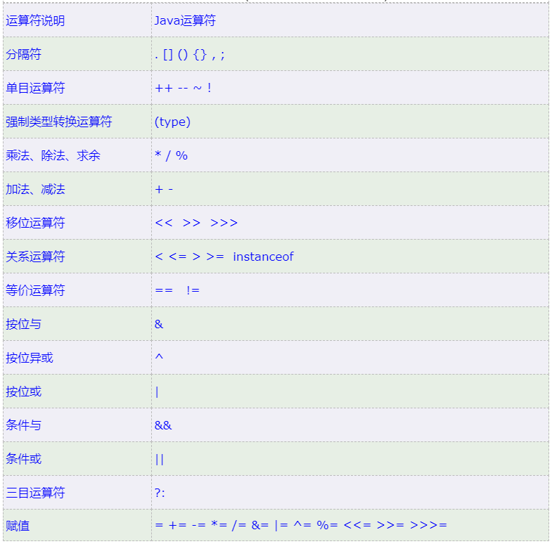

# Java基本语法

## 关键字

被Java赋予了**特殊含义的单词**

* *Tips：关键字字母全部小写*

----

## 常量

常量包括以下类型：字符（‘A’，‘2’，‘我’）、字符**串**（“内容”）、整数（e.g.：1，2，5，20）、小数（e.g.：1.34，5.21）、布尔（true/false）、**空常量（null）**

* *Tips：除空常量外，其他类型常量均可直接在控制台用out输出*

## 数据类型

Java是强类型语言*（每种数据都有明确的类型，不同的类型分配了不同的内存空间）*

### 基本数据类型

#### 数值型（***斜体深色为数据默认类型***）

* 整型：byte（1B）、short（2B）、***int（4B）***、long（8B）

* 浮点型：float（4B）、***double（8B）***

* 字符型：char（2B）

#### 非数值型

**boolean（1B）（即C#中的bool）**

---

#### 引用数据类型

##### class（类）

用于定义一个类，在一个类中可以包含多个方法*（类比于C语言中的函数库，方法类比于C语言中的函数）*。


##### interface（接口）

是抽象方法和常量值定义的集合*（相当于一种特殊的抽象类）*。接口中所有的成员变量都默认为public static final修饰，所有方法默认为public abstract修饰。


interface案例：

蝙蝠会飞,又会用牙齿咬

首先定义一个飞行的接口：

```java
package cn.com.Classwork190124;

/*
    如果一个类中，既有抽象方法，又有非抽象方法，那么该类只能定义为抽象类，不能定义为接口
    如果一个类中，只有抽象方法，没有非抽象方法，那么该类可以定义为接口
                            一般就定义为接口
    定义一个接口，使用interface关键字  接口，类，枚举，注解等都是java中的类型
    接口中所有的方法，都是抽象方法
        所以也可以说，接口就是一个特殊的抽象类

    接口中除了定义方法外，还可以定义成员变量
                特点；方法和属性默认都是public修饰，也可以使用protected，但不能用private
                      所有的属性都是静态的常量，默认省略了static和final修饰符，属性的值必须实例化（初始化）

 */

public interface Flyable {
    public final int wingsNumber = 2;
    public abstract void fly();

}
```

接着定义一个咬人的接口：

```java
package cn.com.Classwork190124;

public interface Bitable {
    public int teethNumber = 0;
    public abstract void bite();
}
```

最后定义蝙蝠类去实现这两个接口：

```java
package cn.com.Classwork190124;

/*
    在JAVA中，一个类无法继承自多个类，但是可以实现多个接口，使用关键字implements
                                        多个接口之间使用“,”隔开  多个接口之间，没有先后顺序
    这个类叫做实现类，这个类必须实现所有接口的所有方法
 */

public class Bat implements Flyable,Bitable {
    @Override
    public void bite() {
        System.out.println("吸血");
    }

    @Override
    public void fly() {
        System.out.println("用翅膀飞");
    }

    public static void main(String[] args) {
        System.out.println(Flyable.wingsNumber);
    }
}
```

[CSDN：Java中接口（interface）详解](https://blog.csdn.net/sun_shine56/article/details/86621481?ops_request_misc=%257B%2522request%255Fid%2522%253A%2522161554026716780357235223%2522%252C%2522scm%2522%253A%252220140713.130102334..%2522%257D&request_id=161554026716780357235223&biz_id=0&utm_medium=distribute.pc_search_result.none-task-blog-2~all~sobaiduend~default-2-86621481.pc_search_result_before_js&utm_term=interface)

##### []（数组）

用于存储一组相同类型的数据的数据类型

* *Tips：数组名指向数组的地址（指针），存放在栈内存中，而数组中的数据存放在对应地址的堆内存中*

案例：

```java
//定义了一个int型的数组，并且为它申请了内存空间
//数据类型+数组 数组名 = 申请内存空间 int型[数组长度]
int[] array = new int[常量];

array[2] = 3;
/*执行寻址时，系统先读取了数组名，然后在栈内存中获取了对应的地址，然后根据地址找到对应堆内存里的2号元素，并修改它的值为3.
如下图*/
```


###### 数组遍历

利用循环可以实现数组遍历

```java 
int[] array = new int[n];	//注意，这里的n是一个常量

for (int i = 0; i < n; i++){
    System.out.println(arrat[i]);
}
//这样就实现了把数组中的每个数据都输出一遍
```


## 数据类型的转换

### 自动转换

当一个数据范围较小的值赋值给一个数据范围较大的值时，数据类型会自动转换。

* *Tips：byte，short类型和char类型不能相互转换*

### 强制转换

格式：**（目标数据类型）**值或者变量

* *Tips：强制类型转换有可能造成数据丢失*

## 变量

变量定义：变量类型 变量名 = 变量值

*Tips*

* *变量名不允许出现重复；*

* *在定义时，必须对变量进行初始化；*

* ***变量在赋值时，等号右边的值会是它的默认类型而不是变量的类型***

Tip3案例：

```java
long num = 10000000000;
/*在上述代码中，右边的数值虽然被赋给了long型变量num，但它依然是它的默认类型，即int型变量，所以正确的写法应该是下面这样*/
long num = 10000000000L;
/*最后的‘L’起到了转换数据类型的作用，把普通整型数值转换成了长整型数值*/
```

## 标识符

### 标识符定义规则

* Java的标识符可以由字母、数字、下划线（_）和**美元符（$）**组成。

* 不能以数字开头

* 不能与关键字同名

* 区分大小写

### 驼峰式命名

#### 小驼峰命名法(针对方法和变量)

标识符的第一个单词首字母小写，接下来的单词首字母大写，例如：

my**N**ame, is**O**pen, next**C**heck**T**ime

#### 大驼峰命名法（针对类）

标识符所有单词首字母大写，例如：

**S**tudent, **I**s**O**pening

## 运算符



*Tips：“==”号做比较时，如果数据是基本数据类型，那么比较的是数据值是否相同；如果比较的是引用数据类型，比较的是地址值是否相同*

### 字符和字符串类型的运算

‘字符A’ + ‘字符B’ = 字符A对应的**Ascii**码 + 字符B对应的**Ascii**码。

”字符串A“ + ”字符串B“ = ”字符串A字符串B“（两串字符直接拼接起来）

*Tips：当一个式子中同时出现不同类型的数值时，在**同一优先级**的情况下按从左到右顺序结合。例如：*

```java
"I am " + 6 + 6 +" learning Java!" = "I am 66 learning Java!";
6 + 6 + " I am learning Java!" = "12 I am learning Java!"
```

### 短路运算符

短路运算符有短路与（&&）、短路或（||）

短路的原因：计算机在判断短路与和短路或时，是从左到右检测的。如果在检测过程中发现短路与的左边的布尔值为false，那么计算机就可以判断这个逻辑运算一定为false，那计算机就不会再运行到运算符的右边。同理，当短路或的左边为true时，计算机就不会执行右边的代码。

## 数据输入

Java的数据输入需要用到Scanner，并且在用之前需要**导包**，以下是详细步骤。

```java
//1.导包（类似C语言的include和C#的using）
import  java.util.Scanner;
//导包需出现在类定义之前

//2.创建对象
Scanner sc = new Scanner(System.in);

//3.接收数据
int i = sc.nextInt();
```

## 流程控制

### 顺序结构

按代码的顺序从上至下，依次执行。

### 分支结构

#### if语句

```java
if(/*condition*/){
    /*code*/
}
--------------------------------------------
if(/*condition*/){
    /*code*/
}else{
    /*code*/
}
--------------------------------------------
if(/*condition*/){
    /*code*/
}else if(/*condition*/){
    /*code*/
}
```

#### switch语句

```java
//格式
switch（表达式）{
    case 值1：
        /*code*/
        break;
    case 值2：
        /*code*/
        break;
    case 值3：
        /*code*/
        break;
    default:
    	/*code*/
}
```


格式说明：

表达式：取值可以为byte、short、int、char、enum*（JDK5以后）*、String*（JDK7以后）*

case：用于和表达式比较。

default：所有情况以外的时候执行的代码块

##### switch执行流程

先计算表达式的值，然后将表达式的值和case值进行比较，然后执行与之匹配的case值所有的代码块，否则将执行defaul语句。

### 循环结构

循环结构包括：初始化语句、条件判断语句、循环体语句、条件控制语句。

#### for语句

```java
//格式
for(初始化语句；条件判断语句；条件控制语句){
	/*循环体语句*/
}
```

#### while语句

```java
//格式
初始化语句;
while（条件判断语句）{
    /*循环体*/
    /*条件控制语句*/
}
```

#### do……while语句

```java
//格式
初始化语句；
do{
    /*循环体*/
    条件控制语句；
}while(条件判断语句)；
```

*Tips：while和do……while的区别是，在while语句进入循环前先判断一次条件，只要符合条件，就进入循环。而do……while语句中进入循环之前先运行一次循环体，再进行判断，若条件符合才继续循环*

#### 跳转控制语句

* continue：结束这一轮循环，进入下一轮循环。

* break：结束整一个循环，进入下一项指令。

## Random

Random用于生成随机数。

### 第一种随机数（Math）

调用这个Math.Random()函数能够返回带正号的**double**值，该值大于等于0.0且小于1.0，即**取值范围是[0.0,1.0)的左闭右开区间**，返回值是一个**伪随机选择的数，在该范围内（近似）均匀分布**。

```java
//1.导包
import java.lang.Math.Random;
//2.创建对象
double x = Math.Random();
//3.获取随机数
int number = x.nextInt();
```

### 第二种随机数（util）

```java
//1.导包
import java.util.Random;
//2.创建对象
Random x = new Random();
//3.获取随机数
int number = x.nextInt([参数：（*不影响随机数的生成区间*）]);
```

##  方法

方法（method）是一组具有特定功能的代码集*（函数）*

*Tips：方法需要有定义和调用两个过程*

### 方法的定义

格式：**访问级别 修饰符 返回类型 方法名(形参1，形参2) { }**，例：

```java
//方法定义
public static void getMaxNumber(int a，int b){
    /*方法体*/
}
```

*Tips：方法不允许嵌套定义*

### 方法的调用

格式：**函数名( 实参1，实参2);**，例：

```java
getMaxNumber(a，b);
```

### 返回值

若方法的返回类型不为空（void），那么在方法体中就需要返回一个值作为方法输出的值。例：

```java
//不需要返回值的方法
public static void getMaxNum(){
    /*方法体*/
    return;
}
//需要返回值的方法
public static int getMaxNum(){
    /*方法体*/
    return max;
}
```

*Tips：理解为带有返回值的方法赋给了他自己一个数值，而没有返回值的方法本身的值为空;*

*带有返回值的方法用变量接收*

### 方法重载

在**同一个类**中，具有**多个相同方法名**的方法，但他们的**参数、类型或数量不同**时，可以构成方法重载。

*Tips：是否构成重载只与方法名和参数有关*

### 方法的参数传递

​		当参数类型为基本数据类型时，实参传入方法后，将会在栈内存中开辟一个新的内存空间，存放和实参相同的值（副本），所以在方法中改变参数的值不影响实参的值（传值）。

​		而当参数类型为引用数据类型时，实参传入方法后，形参将会指向和实参相同的一块内存空间，所以在方法中改变参数的值会影响实参的值（传引用）。

# 面向对象

关注对象和描述对象的思想叫面向对象，它是以功能划分问题的，将问题拆分成多个对象，再通过在对象身上调用方法，从而解决问题。

面向对象有三大特征：**封装、继承、多态**

关注解决问题的过程和步骤的思想叫面向过程，它把一个问题拆分成很多步，按步骤一步步执行，来解决问题。

## 孰优孰劣

面向对象的编程语言由于封装了对象的各种特性，对象的独立性较高**（低耦合的系统）**，调试时可以只改变某个对象的数值。在后期维护时较方便，且扩展性较高。但由于在类的调用时需要实例化，所以消耗性能较高。

## 类

对具有**共同属性**和**行为**的对象的抽象。

------

类是对象的数据类型。

类是具有相同属性和行为的一组对象的集合。

----

类的属性：成员变量（在一个类中，在方法外的变量）

类的行为：成员方法（与普通的方法相比，成员方法不需要加static修饰符）

```java
public class collections.CollectionTest{
    //成员变量
    数据类型 变量1；
    数据类型 变量2；
    
    //成员方法
    public void method1(){}
    public void method2(){}
        
}
```

## 创建对象和使用对象

格式：

//创建

类名 对象名 = new 类名（）；

​			//使用

​			对象名**.**变量名

​			对象名**.**方法名（）；

```java
public static void main(String[] args){
    //创建对象
    collections.CollectionTest test = new collections.CollectionTest();
    //使用对象
    test.number = /*变量值*/
    test.getMax();
}
```

### 对象内存

在创建了新的对象之后，会在内存中开辟新的内存空间用于存储对象以及它的成员变量和成员方法。当调用成员变量时，会在栈内存中寻找变量名对应的地址，然后通过地址找到成员变量；在调用成员方法时，则会将成员方法和对象名载入到栈内存中执行。

*Tips：当多个对象指向相同地址时，改变一个对象的数值，其他对象的数值也会随之改变*


### 成员变量

成员变量是在类中方法外的变量。

它和局部变量的区别如下：


### 封装

将类的信息隐藏在类内部，不允许外部程序直接访问。

#### 封装的意义

* 通过方法控制各个成员的操作，提高了代码的安全性。

* 把代码用方法进行封装，提高了代码的复用性*（即避免多次编写相同代码）*。

#### private关键字

**private**关键字是一个权限修饰符，可以用于修饰成员，用于保护成员不被其他的类使用。

如果需要调用被private修饰的成员，有以下两种方法：

* 提供**“get变量名（）”**方法：用于获取成员变量的值，用**public**修饰。

* 提供**“set变量名（参数）”**方法：用于设置成员变量的值，用**public**修饰。

#### this关键字

**this**关键字用于指代成员变量，如果方法中的形参和成员变量同名，不加this修饰的变量默认为形参。

*Tips：方法被哪个对象调用，那么this对应的就是哪个对象的成员变量*

### 构造方法

当新对象被创建时，构造方法会被调用。**每一个类都有构造方法，当类中没有定义构造函数时，系统会默认给该类加上一个空的构造方法**。但当类中已有构造方法时，默认的构造方法就没有了。

特性：

* 支持方法重载

* 具有与类名相同的方法名

* 没有返回值

* 在创建对象时**自动调用**

# API

应用程序接口（**A**pplication **P**rogramming **I**nterface）

定义好操作对象的各种方法的接口类，叫做**API**

* Java API：即JDK中提供的各种功能的API（通过帮助文档查询）
* 查看源码：ctrl + B

* *Tips：若类不包含构造方法，则看类的成员是否为静态，如果是，则可以直接通过类名进行调用*

## 常用API

### Math类

Math类包含执行基本数字运算的方法

Math类常用方法：

|                    方法名                    |                           说明                            |
| :------------------------------------------: | :-------------------------------------------------------: |
|         public static int abs(int a)         |                     返回参数的绝对值                      |
|     public static double ceil(double a)      | 返回大于或等于参数的最小double值，fanhuiliang等于一个整数 |
|     public static double floor(double a)     |      返回小于或等于参数的最大double值，等于一个整数       |
|     public static int max(int a, int b)      |             按照四舍五入返回最接近参数的int值             |
|     public static int min(int a, int b)      |                   返回两个int中的较大值                   |
| public static double pow(double a, double b) |                  返回两个int值中的较小值                  |
|        public static double random()         |                       返回a的b次幂                        |
|       public static int round(float a)       |          返回值为double的正值，区间为[0.0，1.0）          |

### System类

| 方法名                                 | 说明                         |
| -------------------------------------- | ---------------------------- |
| public static void exit(int status)    | 终止当前运行的Java虚拟机     |
| public static long currentTimeMillis() | 返回当前时间（以毫秒为单位） |

### Object类

Object是类层次结构的根，所有类都直接或间接继承该类

* 构造方法：public Object（）

*Tips：只有一个无参构造方法，这也是为什么所有对象在创建时默认状态下会调用无参构造方法*

#### toString

返回字符串的表示形式，需要通过重写来获得简明扼要的表达

#### equals(区别String.equals（）)

|               方法名                |                             说明                             |
| :---------------------------------: | :----------------------------------------------------------: |
|       public String toString        |  返回对象的字符串表示形式，建议所有子类重写该方法，自动生成  |
| public boolean equals（object obj） | 比较对象是否相等。默认比较地址，重写后可以比较内容，自动生成 |

# Arrays

## 冒泡排序

对要进行排序的数据中相邻的数据两两比较，将较大的数排在后面，依次对所有的数据进行操作，直至所有数据按要求完成排序

冒泡排序的特点

* 如果有n个数进行排序，总共要比较n-1轮
* 每进行一轮排序，下一轮就少一个数据参与

~~~java
//冒泡排序

for(int x = 0; x < arr.length - 1; x++){
    //共进行n-1轮排序
    for(int i = 0; i < arr.length - 1 - x; i++){
        //排序时避免对已排好的数据多次排序
        if(arr[i] > arr[i + 1]){
            int temp = arr[i + 1];
            arr[i + 1] = arr[i];
            arr[i] = temp;
        }
    }
}
~~~

## Arrays类

|                 方法名                 |                说明                |
| :------------------------------------: | :--------------------------------: |
| public static String toString(int[] a) | 返回指定数组的内容的字符串表示形式 |
|    public static void sort(int[] a)    |     按照数字顺序排列指定的数组     |


# String

String（字符串类）：Java中的所有字符串（“abc”），都实现为String类的实例

特点

* 字符串不可变

* String的值不能改变，但可以被共享

* 字符串效果上相当于字符数组（char[]）、但是实际上它的底层原理是字节数组（byte[]）

## 构造方法

* public String（）*创建一个空白字符串对象*

* public String（char[] chs）*根据字符数组创建一个字符串对象*

* public String（byte[] bys）*根据字节数组创建一个字符串对象*

* String s = “abc”  *直接赋值创建一个字符串对象*

## String对象的特点

* 通过 **new** 创建的字符串对象，每一次 new 都会申请一个新的内存空间，所以即使数值相同，它的地址也是不同的。

* 以“ ”给出的字符串，只要它们的字母大小写，顺序相同，JVM就只创建一个String对象存储在字符串池中。

## 字符串的比较

* **equals( )**（boolean型）

格式：str1.equals（str2）

* **equals( )**和**==**的区别：equals（）用于比较字符串的内容是否相同，而==只能比较两字符串的地址是否相同

# StringBuilder

**StringBuilder**是一个**可变**的字符串**类**

*Tips：**String**内容是**不可变**的，而**StringBuilder**是可变的*

## StringBuilder构造方法

* **public StringBuilder（String str）**

* public StringBuilder（）

## StringBuilder的添加和反转

* public StringBuilder append（任意类型）*在字符串后添加另一个字符串并返回对象本身*

* public StringBuilder reverse（）*反转整个字符串*

## StringBuilder和String的相互转换

* public String toString（）：通过toString（）就可以实现把StringBuilder转换为String

而利用StringBuilder的构造就可以实现StringBuilder和String的转换

> ## StringBuilder构造方法
>
> **public StringBuilder（String str）**

# 集合

集合*（类比链表）*是一种存储空间可变的存储模型，存储的数据容量可变

## 集合体系

* 集合分为单列集合（Collection）和双列集合（Map）

* 单列集合：可重复（ArrayList、LinkedList）、不可重复（HashSet、TreeSet）

* 双列集合：HashMap

## 使用步骤

1. 创建集合对象

2. 添加元素：（1）创建元素；（2）添加元素到集合

3. 遍历集合

```java
//创建集合对象
Collection<String> c = new ArratList<String>();
//创建元素
String s = "Java";
//添加元素到集合
c.add(s);
//or
c.add("Java");
//遍历集合
Iterator<String> it = c.iterator();

```

## Collection集合

是单列集合的顶层接口，它所表示的对象称为Collection的元素

* Collection没有提供直接实现，而提供了更具体的子接口实现（Set、List）

创建Collection对象

* 多态
* 具体的实现类ArrayList

## Collection集合常用方法

|           方法名           |             说明             |
| :------------------------: | :--------------------------: |
|      boolean add(E e)      |           添加元素           |
|  boolean remove(Object o)  |    从集合中移除指定的元素    |
|        void clear()        |       清空集合中的元素       |
| boolean contains(Object o) | 判断集合中是否存在指定的元素 |
|     boolean isEmpty()      |       判断集合是否为空       |
|         int size()         |  集合的长度，也就是元素个数  |

### Collection的遍历

Iterator：迭代器，集合的专用遍历方式

* Iterator< E > iterator() ：返回此集合中元素的迭代器，通过集合的iterator()得到
* 迭代器是通过集合的iterator存在的所以它是依赖于集合存在的

Iterator的常用方法

* E next（）：返回迭代中的下一个元素
* boolean hasNext(); 如果迭代具有更多元素则返回true

## List< E >

List集合（序列）是一种接口，它实现了Collection集合。可以精确控制列表中每个元素的插入位置，且可以通过索引访问元素。

特性：有序（输出和存储顺序一致）、可重复（可存放相同数据）

### List集合特有方法

|             方法名             |                  说明                  |
| :----------------------------: | :------------------------------------: |
| void add(int index, E element) |   在此集合中的指定位置插入指定的元素   |
|      E remove(int index)       | 删除指定索引处的元素，返回被删除的元素 |
|  E set(int index, E element)   | 修改指定索引处的对象，返回被修改的元素 |
|        E get(int index)        |          返回指定索引处的对象          |

### LinkedList

LinkedList的底层数据结构是**链表**

补充：LinkedList的remove方法返回的是bool值而不是被删除的对象

*具体操作基本和List相同，具体见帮助文档*

#### LinkedList的特有功能

|          方法名           |              说明              |
| :-----------------------: | :----------------------------: |
| public void addFirst(E e) |   在该列表开头插入指定的元素   |
| public void addLast(E e)  | 将指定的元素追加到此列表的末尾 |
|   public E getFirst( )    |    返回此列表中的第一个元素    |
|    public E getLast( )    |   返回此列表中的最后一个元素   |
|  public E removeFirst( )  | 从此列表中删除并返回第一个元素 |
|  public E removeLast( )   | 从此列表删除并返回最后一个元素 |

### ArrayList< E >

ArrayList的底层数据结构是**数组**

< E >：一种特殊的数据类型：泛型

#### 构造方法和添加方法

* public ArrayList（）   创建一个空的集合对象

* public boolean add（**E** e）   将指定元素e追加到集合的末尾

* public void add（int index， **E** element）

*Tips :上述**E**均为泛型*

#### ArrayList常用方法

* public boolean remove(Object o)   删除指定的元素，返回是否删除成功
* public E remove(int index)   删除索引处的元素，返回被删除的元素
* public E set(int index, E element)   修改索引处的元素，返回被修改的元素
* public E get(int index)   返回指定索引处的元素
* public int size()   返回集合中的元素的个数

### 并发修改异常

分析源码（需慢慢学习）

### ListIterator

列表迭代器

* 通过List集合的listIterator（）方法得到，所以它是List集合特有的迭代器
* 用于沿任意方向遍历列表的列表迭代器，在此期间，迭代器可修改列表并获取迭代器的当前位置

ListIterator常用方法

* E next();		返回迭代中的下一元素
* boolean hasNext();        如果迭代具有更多元素，则返回true
* E previous();        返回列表中的上一个元素
* boolean hasPrevious();        如果此列表迭代器在相反方向遍历时具有更多元素，则返回true
* void add(E e);        将指定的元素插入列表

## Set< E >

Set集合是**不包含重复元素**的集合

特点

* 不包含重复元素
* 没有索引的方法，所以不能用普通的for循环遍历（可用迭代器/增强for循环）

## 哈希值

是JDK根据**对象的地址**或**字符串**或**数字**算出来的**int类型的** **数值**

利用Object类中的hasCode可以返回对象的哈希码值

*默认情况下，一个对象拥有一个它特有的哈希值；而通过重写hasCode方法可以改变对象的哈希值*

## HashSet< E >

HashSet的底层数据结构为**哈希表**，对集合的迭代顺序不做任何保证

实现了Collection接口，方法基本与Collection一致

## LinkedHashSet

继承了HashSet，实现了哈希表和链表

特点

* 由哈希表和链表实现的Set接口，具有可预测的迭代次序
* 由链表保证元素有序，即元素存放和取出顺序是一样的
* 由哈希表保证元素唯一

## TreeSet

特点

* 元素有序：按一定规则进行排序，具体取决于用什么构造方法
  * TreeSet( )：根据元素的自然顺序进行排序（无参构造）
  * TreeSet(Comparator comparator)：根据指定的比较器进行排序

### Comparator

比较器排序，就是让集合构造方法接收Comparator的实现类对象，重写compare(T o1, T o2)方法

当比较器(compareTo( ))中的返回值为正数时，数据正向排序；为负数时，反向排序

## Map

概述

* Interface Map<K, V>		K键的类型；V：值的类型
* 将键映射到值得对象，不能包含重复的键，每个键可以映射到最多一个值

例：

学生的学号和姓名：

001--->zyx

002--->lqq

* 创建Map集合的方法
  * 以多态的方式
  * 利用具体的实现类HashMap

### Map的常用方法

|               方法名                |                说明                |
| :---------------------------------: | :--------------------------------: |
|        V put(K key, V value)        |              添加元素              |
|        V remove(Object key)         |        根据键删除键值对元素        |
|            void clear( )            |        移除所有的键值对元素        |
|   boolean containsKey(Object key)   |      判断集合是否包含指定的键      |
| boolean containsValue(Object value) |      判断集合是否包含指定的值      |
|         boolean isEmpty( )          |          判断集合是否为空          |
|             int size( )             | 集合的长度，也就是集合中键值的个数 |

### Map的获取功能

|                 方法名                  |             说明             |
| :-------------------------------------: | :--------------------------: |
|            V get(Object key)            |         根据键获取值         |
|           Set < K > keySet( )           |       获取所有键的集合       |
|        Collection< V > values( )        |       获取所有值的集合       |
| **Set<Map.Entry< K , V >> entrySet( )** | **获取所有键值对对象的集合** |

### Map的遍历

* 方法一
  * 把键全部集中起来
  * 遍历每一个键
  * 通过键获取每一个值

```java
Map<String,String> map = new HAshMap<String,String>();
//创建map对象
map.put("A","a");
map.put("B","b");
map.put("C","c");
//对map集合添加数据
Set<String> keySet = map.keySet();
获取所有键的集合
for(String key : keySet){
    String value = map.get(key);
    System.out.println(key + "," + value);
}
//增强for循环获取键值并输出
```

* 方法二
  * 获取键值对对象的集合
  * 遍历所有键值对对象
  * 通过键值对对象的方法来获取键和值

```java
Map<String,String> map = new HAshMap<String,String>();
//创建map对象
map.put("A","a");
map.put("B","b");
map.put("C","c");
//对map集合添加数据
Set<Map.Entry<String,String>> entrySet = map.entrySet;
//获取所有键值对对象的集合
for(Map.Entry<String,String> me : entrySet){
    String key = me.getKey();
    String value = me.getValue();
    System.out.println(key + "," + value);
}
//增强for循环获取键值并输出
```

## collections

Collections是对集合进行操作的多态算法，简而言之，它是一个针对集合使用的工具类（所有方法均为静态方法）

* Collections常用方法
  * puublic static < T extends Comparable< ? super T > > void sort(List< T > list)：将指定的列表按升序排序
  * public static void reverse(List< ? > list)：反转指定列表中元素的排序
  * public static void shuffle(List < ? > list)：使用默认的随机源排列指定的列表

## 增强for循环

简化**数组**和**collection集合**的遍历

* 实现Iterable接口的类允许其对象成为增强型for的目标
* 原理是迭代器（only supported after JDK5)

格式：

```java
int[] arr = {1, 2, 3, 4}
/*for（元素数据类型 变量名：数组/Collection集合）*/
for(int i:arr){
    /*code*/
}
```


# 继承

面向对象的三大特征之一，可以使子类对象具有父类对象的属性和方法，还可以在子类中重新定义，追加属性和方法

* 继承的格式：访问级别 类 子类名 **extends** 父类名{ }

例：

```java
public class Father{
//创建了一个父类    
    /*code*/
}
public class Son extends Father{ }
//那么这个子类中继承了父类的所有方法并且可以在子类中重新定义追加属性和方法
```

* Father：父类，也叫基类、超类
* Son：子类，也叫派生类

子类的特点

* 子类中可以同时拥有父类的内容和自己特有的内容

## 继承的优与劣

优势

* 提高了代码的**复用性**
* 提高了代码的**维护性**

弊端

* 提高了类与类之间的耦合度，父类改变会直接导致子类发生改变，削弱了子类的独立性

## 继承的使用

当类与类之间具有确定的包含关系时，我们就可以使用继承

例：设计游戏时，我们需要设置敌人的数据，但不管敌人形态种类怎么变，敌人永远属于敌人这一个大类。那么我们就可以编写一个Enemies类（父类），在类中定义所有敌人都共有的特性（如生命值，攻击施法等等），并让所有的敌人的类（子类）别继承Enemies类，就可以简化我们的代码，降低工作量，提高代码的复用性。

## 继承中变量的访问特点

当一个变量在子类中被访问时

1. 在子类局部变量范围内找
2. 在子类成员变量范围内找
3. 在父类成员变量范围找
4. 报错*（Tips：不会再找到父类的父类）*

## super关键字

**super**用法与this相类似，同样代表访问成员变量，而他们的区别如下

* this表示的是访问本类中对象的引用
* super是父类存储空间的标识（≈父类对象的引用）

|    关键字     |  访问成员变量  | 访问构造方法 |     访问成员方法     |
| :-----------: | :------------: | :----------: | :------------------: |
| this（本类）  | this.成员变量  | this（...）  | this.成员方法（...） |
| super（父类） | super.成员变量 |  this（...)  |    super.成员方法    |

## 继承中构造方法的调用

特点

* 子类中所有的构造方法默认访问父类无参构造方法
  * 子类会继承父类的数据，所以在子类初始化前，必须先完成父类的初始化
  * 每一个子类构造方法的第一条语句默认是super（）

* 利用super（参数）可以访问父类中的带参构造方法

## 继承中成员方法的访问

当一个成员方法在子类中被访问时

1. 子类成员方法范围找
2. 父类成员方法范围找
3. 报错*（Tips：同变量被访问，不考虑父类的父类）*

## super内存

在内存中，

* 当对象被创建时使该类中的this和本对象在栈内存中的地址相同，所以当this关键字被使用时，会访问该对象下的变量或方法（即成员变量和成员方法）。
* 而super则是存储在堆内存中，通过关键字super调用时则是会访问对象下super里的变量和方法（即父类中的值成员变脸、方法）。
* 当不使用任何关键字时，则会直接访问main方法中的变量和方法（即局部变量和方法）

## 方法重写

当子类需要父类的内容，而子类本身又需要增加自己特有的功能时，则可以使用**方法的重写**

概念：子类中出现了和父类一模一样的方法声明

*Tips：利用**@Override**注解可以帮助我们检查重写方法的正确性（例如方法名是否出错）*

### 方法重写注意事项

* 子类不可重写父类中的私有方法（private关键字）
* 子类方法的访问级别不可以比父类更低（public > default > private）

## 继承的注意事项

* 一个类不能同时继承多个类
* 但一个类可以多层继承（即子类继承父类，父类继承父类的父类，则子类具有父类和父类的父类的属性和方法 ）

# 修饰符

## 包

* 作用：对类进行分类管理

* 包的定义格式：package 包名（多级包用“.”区分开）

```java
package zyx-lqq.zyx.Java.collections.CollectionTest
```

## 导包

* 格式：import 包名（在定义类前）

```java
import zyx-lqq.zyx.Java.Text
```

## 权限修饰符

* 方法变量访问权限

|  修饰符   | 同一个类中 | 同一个包中（与子类无关） | 不同包中 | 不同包的无关类 |
| :-------: | :--------: | :----------------------: | :------: | :------------: |
|  private  |     √      |                          |          |                |
|  default  |     √      |            √             |          |                |
| protected |     √      |            √             |    √     |                |
|  public   |     √      |            √             |    √     |       √        |

## 状态修饰符

### final

* **final**关键字，可以修饰成员方法，变量，类
* **final**修饰时的特点
  * 修饰成员方法：表明该方法是最终方法，不能被**重写**
  * 修饰成员变量：表明该变量是常量，不能被**赋值**
  * 修饰类：表明该类是最终类，不能被**继承**

* 当**final**修饰局部变量时（const）

  * final修饰的变量为基本数据类型时：变量的值不能被改变
  * final修饰的值为引用数据类型时：变量的地址不能被改变，但地址内的内容可以被改变

### static

* **static**关键字，可以修饰成员方法，成员变量
* static修饰的特点
  * 可以被类的所有对象共享（也只有这种情况需要用static关键字）
  * 通过类名调用（可以通过对象名调用，但不推荐）

#### static的访问特点

非静态的成员方法：无论它要访问的成员是否为静态，它都可以访问

静态的成员方法：只能访问静态的成员

# 多态

概念：同一对象在不同时候体现不同的形态

* 多态的形式
  * 具体类多态、**抽象类多态、接口多态**

多态的前提和体现

* 有继承/实现关系
* 有方法重写
* 有父类/接口引用指向子/实现类对象

## 多态的成员访问特点

* 访问成员变量时：编译时看创建对象时左边的类，运行亦然
* 访问成员方法时：编译时看创建对象时左边的类，运行时看创建对象时右边的类

*Tips：原因是方法在子类被重写*

## 多态的好处及弊端

利：提高了程序的扩展性

​		具体体现：定义方法时，使用父类型作为参数，而在使用的时候，则可以使用子类型进行操作

弊：父类无法使用子类特有的功能

## 多态中的转型

* 向上转型
  * 从子类到父类
  * 父类引用指向子类对象

```java
Father f = new Son();
```


* 向下转型
  * 从父类到子类
  * 父类引用指向子类对象

```java
Son s = (Son)f;
```

**根本：在栈内存中创立了一个新的对象指向和原来的对象相同的地址**

*Tips：如果原对象类型和要强制转换的对象类型不符，则不能成功被转换*

# 抽象类和接口

## 抽象类

修饰词：**abstract**

* 概述：在一个类中如果有**抽象方法**，该类必须被定义为**抽象类**，用于在普通类的基础上扩充一些抽象方法

* 抽象类的特点

  * 抽象类和抽象方法必须使用abstract修饰

  例: public abstract class 类名（）

  ​	  public abstract void eat ( ) 

* 抽象类中不一定有抽象方法，但有抽象方法的类一定是抽象类

  ​		父类的抽象方法用于限制子类必须重写父类的方法

* 抽象类是代表一类对象的大类，例如动物和猫狗，动物就是猫狗的抽象类。并且，抽象类不能被**直接**实例化。但可以通过被子类继承，通过子类的实例化达到抽象类的实例化，这就是**抽象类的多态**

* 抽象类的子类
  * 要么重写抽象类中的所有抽象方法
  * 要么是抽象类

## 接口

接口是一种**公共的规范标准**，只要符合标准就可以使用。在Java中体现在对行为的抽象。

* 类实现接口：class **implements** interface

*Tips：*

* *接口的实现要用实现接口的类来实例化（即和类的实例化相同）*
* *接口没有构造方法，因为接口主要用于对行为抽象*
* *接口中的成员变量默认被**public static final***
* *接口中的成员方法默认被**public abstract**修饰*

* *如果一个类没有父类，则默认继承自**Object**类*

## 接口和抽象的区别

成员区别：

* 抽象类：有变量、常量；有构造方法；有抽象和非抽象方法
* 接口：只有常量；只有抽象方法

关系区别

* 类与类：只有继承和单继承
* 类与接口：实现；可以单实现，也可以多实现
* 接口与接口：继承；单继承，多继承

设计理念区别

* 抽象类：对类抽象，包括属性，行为
* 接口：主要对行为抽象

### 抽象类/接口名作为形参和返回值

实际为需要该抽象类/接口的子类对象

# 内部类

定义：当一个类存在于另一个类内部，那这个类就叫做内部类

内部类的特点

* 内部类可以直接访问内部类的成员，包括私有成员
* 外部类若要访问内部类的成员，则必须要创建对象

## 成员内部类

定义：若内部类在成员位置定义，则为**成员内部类**

## 局部内部类

定义：内部类在类的局部位置定义，则为**局部内部类**

### 匿名内部类

前提：存在一个类/接口，这里的类可以是具体类也可以是抽象类

格式：new 类名/接口名（）{

​				重写方法；

}

```java
new Inter(){
    /*code*/  //重写方法
}；
//这个内部类相当于继承了Inter这个类的对象
```

匿名内部类的本质：是一个继承了该类或者实现了该接口的子类匿名**对象**

#### 内部类的作用


## 创建属于内部类的对象

* 格式：外部类名.内部类 对象名() = 外部类**对象**.内部类**对象**

例：

```java
Outer.Inner oi = new Outer().Inner();
```

# 基本类型包装类

将基本数据类型封装成对象，可以在对象中定义更多的功能方法去操作该数据

## Integer

包装对象中的原始类型int的值

|                方法名                 |                    说明                     |
| :-----------------------------------: | :-----------------------------------------: |
|     ~~public Integer(int value)~~     |  ~~根据int值创建Integer对象**（过时）**~~   |
|     ~~public Integer(String s)~~      | ~~根据String值创建integer对象**（过时）**~~ |
| public static Interger valueOf(int i) |      返回表示指定的int值得Integer实例       |
|   public static IntegerOf(String s)   |    返回一个保存指定值的Integer对象String    |

## int和String的相互转换

### int--->String

方法1：

```java
int number = 100;
String s = "" + number;
System.out.println(s)
```

*Tips：可用但不好（了解）*

方法2：

```java
int number = 100;
String s = Syring.valueOf(number);
System.out.println(s)
```

### String--->int

方法1：

```java
String s = "123";
Integer i = Integer.valueOf(s);
int x= i.intValue();
```

方法2：

```java
String s = "123";
int x = Integer.parseInt(s);
```

## 自动装箱和拆箱

### 装箱

* 装箱：把基本类型转化为对应的包装类类型

```java
//装箱
Integer i = Integer.valueOf(100);
//包装类类型（i）					基本类型（100）

//自动装箱
Integer ii = 100;
```

* 拆箱：把包装类类型转换为对应的基本数据类型

```java
//拆箱
ii = ii.intValue() + 200;
//	将包装类类型转换为基本类型（拆箱），然后自动装箱后赋值

//自动拆箱
ii += 200;
```

*Tips：在使用包装类类型时，在使用前最好先做是否为null的判断*

​			*所有基本类型，在存储时用的都是相应的包装类类型*

## 日期类

Date类代表了一个特定的时间，以**毫秒**为进度

构造方法

|         方法名         |                             说明                             |
| :--------------------: | :----------------------------------------------------------: |
|     public Date()      | 分配一个Date对象，并初始化，以使它代表它被分配的时间，精确到毫秒 |
| public Date(long date) | 分配一个Date对象，并将其初始化为表示成从标准基准时间起的毫秒数 |

常用方法

|             方法名             |                       说明                        |
| :----------------------------: | :-----------------------------------------------: |
|     public long getTime()      | 获取的是日期对象从1970年1月1日0时整到现在的毫秒值 |
| public void setTime(long time) |              设置时间，给的是毫秒值               |

### SimpleDataFormat

该类是一个具体类，用于以区域设置敏感的方式格式化和解析日期

常用模式字母及对应关系：

| 格式 | 表示意思                                                     |
| :--- | :----------------------------------------------------------- |
| yyyy | 年                                                           |
| MM   | 月                                                           |
| dd   | 日                                                           |
| HH   | 小时(24小时制)                                               |
| hh   | 小时(12小时制)                                               |
| mm   | 分钟                                                         |
| S    | 毫秒                                                         |
| D    | 一年中的第一几天                                             |
| F    | 一个月中的第几个星期(通过这个月的天数除7,例如5号那就是属于第一个星期) |
| W    | 一个月中的第几个星期(根据实际情况计算)                       |
| w    | 一年中的第几个星期                                           |
| z    | 时区                                                         |

#### 构造方法 

|                 方法名                  |                           说明                           |
| :-------------------------------------: | :------------------------------------------------------: |
|         public SimpleDateFormat         |     构造一个SimpleDateFormat，使用默认模式和日期格式     |
| public SimpleDateFormat(String pattern) | 构造一个SimpleDateFormat，使用给定的模式和默认的日期格式 |

#### 格式化（Date--->String）

public final String format(Date date)：将日期格式化成日期/时间字符串

```java
SimpleDateFormat sdf = new SimpleDateFormat(yyyy年MM月dd日 HH:mm:ss);
String s = sdf.format(d);

//输出结果：xxxx年xx月xx日 xx:xx:xx
```

#### 解析（String--->Date）

public Date parse(String Source)：从给定字符的开始解析文本以生成日期

```java 
SimpleDateFormat sdf = new SimpleDateFormat(yyyy-MM-dd- HH:mm:ss);
String s = "2048-08-09 11:11:11";
Date d = sdf.parse(s);

```

*Tips：解析时，s中的格式和给定的格式必须相同，否则会报错*

### Calendar类

Calender是一个具体类，需要创建对象

```java
//创建对象
Calender c = Calender.getInstence();

//用于获取日历字段
System.out.println(c)

//public int get(int field)
int year = c.get(Calender.YEAR);
int month = c.get(Calender.MONTH) + 1;
//“+ 1”是因为month字段是从0开始的
int date = c.get(Calender.DATE);
```

#### Calendar常用方法

|                        方法名                        |                          说明                          |
| :--------------------------------------------------: | :----------------------------------------------------: |
|              public int get(int field)               |                  返回给定日历字段的值                  |
|   public abstract void add(int field, int amount)    | 根据日历的规则，将指定的时间量添加或减去给定的日历字段 |
| public final void set(int year, int month, int date) |                  设置当前日历的年月日                  |

# 异常

程序出现了不正确的情况

* 异常的体系


* Error：严重问题，不需要处理
* Exception：异常类，表示程序本身可以处理的问题
  * RuntimeException：在编译期间不检查，需要后续修改代码
  * 非RuntimeException：编译期间必须处理，否则无法通过编译

*JVM的默认处理方案为把异常的名字、原因及位置输出在控制台，并终止程序的运行*

## Throwable的成员方法

* public String getMessage( )：返回此throwable的详细信息字符串
* public String toString( )：返回此throwable的简短描述
* **public void printStackTrace( )：把异常的错误信息输出在控制台**

-----

* RuntimeException和非RuntimeException的区别
  * 非RuntimeException（编译时异常）：**必须显示处理**，否则程序就会发生错误，无法通过编译
  * RuntimeException（运行时异常）：**无需显示时处理**，也可以和编译时异常同样处理

*Tips：可通过将错误代码在帮助文档中查看它的超集，判断是哪种异常类型*

## 异常处理

### try...catch...

格式

```java
try{
    /*可能出现异常的代码*/
}catch{
    /*异常的处理代码*/
}finally{
    /*一定会执行的语句*/
}
```

程序从try里的代码开始执行，出现异常后，会生成一个异常类对象，并提交给Java运行时系统，当Java运行时接收到异常对象时，会自动到catch中寻找匹配的异常类，并进行相应的处理，并且，程序不会因异常而终止，而是继续往下执行。

*finally：在异常处理时finally块中的语句一定会执行，除非JVM退出*

### throws

格式：throws 异常类名;

例：

```java
public static void method() throws xxxxxxException{ }
```

throws并没有对异常进行具体的处理，而只是对异常抛出，等调用时再进行处理，真正要处理异常，还是需要**try...catch...**来进行处理

## 自定义异常

只要自定义的类继承RuntimeException或继承Exception就属于自定义异常

格式

```java
public class ExceptionName extends Exception/RuntimeException{ }
```

先定义一个异常类，让它继承于一种异常。然后利用throw和判断语句，在运行到某一特定位置时抛出异常，并将自定义的提示显示到控制台。

* 抛出异常提示信息：

throw new xxxxxxException("*/需要给出的提示信息/*")

### throw和throws的区别

* throw
  * 用在方法体内，后跟**异常对象名**
  * 表示抛出异常，由方法体内的语句处理
  * 执行throw一定抛出了某种异常

* throws
  * 用在方法声明后面，后跟**异常类名**
  * 表示抛出异常，由该方法的调用者来处理异常
  * 表示出现异常的可能，并不一定会发生异常

# 数据结构

数据结构是计算机存储、组织数据的方式。是相互之间存在一种或多种特定关系的数据元素的集合。

*Tips：好的数据结构可以带来更高的运行或者存储效率*

## 栈

栈是一种**先进后出的数据模型**

### 压/进栈

由栈顶进入到栈底

### 弹/出栈

由栈顶到栈底依次出栈

## 队列

队列是一种**先进先出的数据模型**

### 前端

数据**从前端离开队列**

### 后端

数据**从后端进入队列**

## 数组

**查询快，增删慢**

特点

* 查询数据：查询时通过索引定位，查询任意数据耗时相同，**查询效率高**

* 删除数据：删除时要将原始数据删除，同时后面每个数据前移，**删除效率低**

* 添加元素：添加时要先将每个数据后移，再添加元素，**添加效率极低**

## 链表

**查询慢，增删快**

结点（元素）：存储地址（地址下存放了具体数据和下一结点的地址）

* 头结点：无元素，初始时下一个结点的地址指向空地址（^），空地址表示结束

当数据需要连接时，在表示结束的空地址赋上下一结点的地址，即完成了数据的连接

### 数据添加

当数据需要插入到两个数据之间时，把存放该数据的结点的下一地址改为待插入两结点的后者，把待插入两结点的前者的下一地址改为该结点的地址。

例：

……[A, address(B)]--->[B, address……]……

当数据C需要插入AB之间时，把address(B)改为address(C)，把数据C的下一结点地址改为address(B)，即：

……[A, address(C)]--->[C, address(B)]--->[B, address……]……

*数据删除反之即可*

## 哈希表

* JDK8以前，底层数据结构是数组+链表的形式，可以看作元素为链表的数组

* JDK8以后，在长度比较长时，底层实现了优化
* 哈希表的默认数组容量为16

哈希表运作流程：

1. 首先对每个数据进行计算，生成哈希值
2. 然后用每个元素的哈希值对数组容量进行取余，获得该元素存放在哈希表中的位置
3. 在元素存存放在哈希表中时，又有以下步骤
   1. 先检测表中的相应位置有无元素，若无元素，直接存放
   2. 若表中的相应位置有元素，则依次检查各个元素的哈希值是否有与该元素相同的，若无，则以链表形式连接上一元素
   3. 若哈希值也有相同的，则检测元素具体内容是否相同，若不相同，则以链表方式连接上一元素
   4. 若元素具体内容也相同，则哈希表舍弃该数据，不存放在哈希表中

# 泛型

本质为参数化类型，在使用时才传入具体的数据类型

定义格式

* <类型>：指定一种类型的格式，可类比数据类型的形参
* <类型1，类型2>：指定多种类型的格式，之间用逗号隔开
* 当被调用时可看作实参传入形参的过程，但是传入的实参只能是引用数据类型

泛型的好处

* 把执行时期的问题提前到了编译期间
* 避免了强制类型转换

## 泛型类

* 格式：修饰符 class 类名<类型> { }

例：

```java
public class collections.CollectionTest<E> { }
```

*Tips：E为任意标识，用于表示泛型，常见的有T、E、K、V*

## 泛型方法

* 格式：修饰符<类型> 返回值类型 方法名(类型 变量名){ }

例：

```java
public <T> void show(T t) { }
```

## 泛型接口

* 格式：修饰符 interface 接口名<类型> { }

例：

```java
public interface Generic<T> { }
```

## 类型通配符

**< ? >**

List< ? >：表示元素类型未知的List，可以匹配**任何类型**

*Tips：表示这种List是任何泛型List的父类，并不能将元素添加到其中*

若要使List< ? >不是任何泛型List的父类，则可以使用类型通配符的上限，使它只代表某一类泛型List的父类

* 泛型通配符上限：< ? extends 类型>

例：List< ? extends Number>：表示的是Number或者其子类型

* 泛型通配符下限：< ? super 类型>

例：List< ? extends Number >：表示的是Number或其父类型

# 可变参数

又称参数个数可变，用作方法的形参出现，那么方法的参数个数就是可变的了

* 格式：修饰符 返回值类型 方法名(数据类型... 变量名){ }

例：

```java
public static int sum(int... a){ }
```

**原理是把实参传入的数据封装为一个数组，形参实际上是一个数组名**

*Tips：当一个方法中包含可变参数在内拥有多个参数时，可变参数应该放在所有参数的后面*

## 可变参数的使用

Arrays

* public static < T > List< T > asList(T... a)：返回由指定数组支持的固定大小的列表

  *不支持增添元素*

List

* public static < E > List< E > of(E... element)：返回包含任意数量元素的不可变列表

Set

* public static < E > Set< E > of(E... element)：返回一个包含任意数量元素的不可变集合

*List和Set均不支持增删或修改元素，且Set还不允许出现重复元素*

# 反射

* 反射机制中有以下的类：

```java
java.lang.Class;
java.lang.Field;
java.lang.Method;
java.lang.Modifier;
```

* 作用：
  * 反编译：.class-->.java
  * 通过反射机制访问java类的属性、方法、构造器

## Class

### 获取Class的3种方式

```java
// c1引用保存内存地址指向堆中的对象，该对象代表的是类名所代表的整个类
Class c1 = Class.forName("<类名>");
    
// c2通过获取类下的类（class）属性
Class c2 = <类名>.class;
    
// c3通过类创建的对象获取Class对象
<类名> e = new <类名>();
Class c3 = e.getClass;
```

### 通过Class类对象创建类的实例对象

* 三种方法创建类对象的比较

```java
// 会执行静态代码块
Class c1 = Class.forName("<类名>");

<类名> e = new <类名>();
Class c2 = e.getClass;

// 不会执行静态代码块
Class c3 = <类名>.class;
```

* 利用类对象创建实例对象

```java
// 获取该类对象
Class c = Class.forName("<类名>");

// 利用Class类中的newInstance方法创建实例对象
Object o = c.newInstance();
```


# 注解

## 自定义注解

格式：@interface 注解名

例：`@interface MyAnnotation`

## 注解的用法

格式：**@注解类型名**

*注解可以作用在类上，属性上，方法上，变量上等...*

*同样，注解可以出现在注解上*

```java 
public @interface MyAnnotation{}

@MyAnnotation
public class AnnotationTest{
    
    @MyAnnotation
    private int a;
    
    @MyAnnotation
    public AnnotationTest(){}
    
    @MyAnnotation
    public AnnotationTest(@MyAnnotation int c){}
    
    @MyAnnotation
    public static void annotation(){
		@MyAnnotation
        private int b;
    }
}
```

## @Override

@Override只能注解方法，这个注解是给编译器参考的，和运行没有关系

**凡是Java中又这个注解的方法，编译器都会进行编译检查，若该方法不是重写父类的方法，编译器报错。（避免程序员编写失误出bug）**

## 元注解

即用来标注注解的注解

### @Target

这个注解用于标注注解可以出现在哪些位置上

### @Retention

这个注解用于标注注解存活的时间

# IO流

## File

File是文件和目录路径名的**抽象表示**

* 文件和目录是可以通过File封装成对象的
* File封装的并不是一个真正的文件，而是一个路径名。不管这个路径名存在与否，将来都要用具体的操作将这个路径的内容转换为具体存在的

### File类的构造方法

|               方法名                |                           说明                           |
| :---------------------------------: | :------------------------------------------------------: |
|        File(String pathname)        | 通过给定的路径名字符串转换为抽象路径名来创建新的File实例 |
|  File(String parent, String child)  |     从父路径名字符串和子路径名字符串创建新的File实例     |
| File(**File parent**, String child) |      以父抽象路径名和子路径名字符串创建新的File实例      |

```java
1. File f1 = new File("C:\\xxx\\xx.txt");
2. File f2 = new File("C:\\xxx,""xx.txt);
3. File f3 = new File("C\\xxx");
   File f4 = new File(f3,"xx.txt");
```

### File的创建功能

|             方法名              |                             说明                             |
| :-----------------------------: | :----------------------------------------------------------: |
| public boolean createNewFile( ) | 当具有该名称的文件不存在时，创建一个由该抽象路径名命名的新空文件 |
|     public boolean mkdir( )     |                 创建由此抽象路径名命名的目录                 |
|    public boolean mkdirs( )     |  创建由此抽象路径名命名的目录，包括任何必须但不存在的父目录  |

1. *如果文件不存在，就创建文件并返回true；如果文件存在，就不创建文件，并返回false*
2. *如果目录不存在，就创建目录并返回true；如果目录存在，就不创建目录，并返回false*
3. *如果目录不存在，就创建目录并返回true；如果目录存在，就不创建目录，并返回false*

*创建文件时，若目录不存在，文件无法正常创建*

### File的删除功能

* public boolean delete( )：删除由此抽象路径名表示的文件或目录

*删除目录时，若目录下不为空，目录不能被正常删除*

### 绝对路径和相对路径

* 绝对路径：代表了一个完整的路径名，不需要任何其他信息就可以定位它表示的文件
* 相对路径：必须使用其他路径名的信息进行解释

### File类判断和获取功能

|             方法名             |                          说明                          |
| :----------------------------: | :----------------------------------------------------: |
| public boolean isDireactory( ) |          测试此抽象路径名表示的File是否为目录          |
|    public boolean isFile( )    |           测试此抽象路径名表示的File是否存在           |
| public String getAbsolutePath  |            返回此抽象路径名的绝对路径字符串            |
|    public String getPath( )    |            将此抽象路径名转换为路径名字符串            |
|    public String getName( )    |        返回由此抽象路径名表示的文件或目录的名称        |
|    public String[] list( )     |    返回此抽象路径名表示的文件或目录的名称字符串数组    |
|   public File[] listFiles( )   | 返回此抽象路径名表示的目录中的文件和目录的File对象数组 |
|    public boolean exists( )    |          测试此抽象路径名表示的File是否为文件          |

### 递归

方法在方法中调用这个方法本身，叫做**递归**

*在使用递归时，一定要设置递归的出口，避免**递归太深***

## IO流概述和分类

### IO流的概述

* IO：输入/输出（Input/Output）
  * Input（读取数据）：把硬盘的数据输入到内存
  * Output（写入数据）：把内存的数据输出到硬盘

* 流：流是一种抽象的概念，是对数据传输的总称。也就是说数据在设备间的传输
* IO流就是用来处理设备之间数据传输的问题的
  * 例：文件复制、文件上传、文件下载

### IO流的分类

* 按数据流向分类：
  * 输入流：读数据
  * 输出流：写数据
* 按数据类型分类：
  * 字节流
    * 字节输入流、字节输出流
  * 字符流
    * 字符输入流、字符输出流

*一般情况下，IO流的类型是按照数据类型来分的*

两种流的使用场景

​	如果用Windows记事本打开，我们还可以**读懂里面的内容**，就可以使用字符流，否则使用字节流；在不确定时，可以使用字节流，**字节流是万能的流**

### 字节流

字节流超类（抽象类）：InputStream/OutputStream

#### 字节输出流

* FileOutputStream(String name)：创建文件输出流以指定的名称写入文件
* **void close( )：关闭此文件的输出流并时访与此流相关联的所有系统资源**

|                 方法名                 |                             说明                             |
| :------------------------------------: | :----------------------------------------------------------: |
|            voi write(int b)            |       将指定的字节写入此文件输出流，一次写一个字节数据       |
|          void wite(byte[] b)           | 将b.length字节从指定的字节数组写入此文件输出流，依次写一个字节数组数据 |
| void write(byte[] b, int off, int len) | 将len字节从指定的字节数组开始，从偏移量off开始写入此文件输出流，依次写一个字节数组的部分数据 |

* 利用String类的getBytes( )方法可以直接通过一个字符串获得一组字节数组

* 亿点小细节

  * 换行的实现

    * 写完数据后追加换行符：

      ​		Windows：\r\n

      ​		linux：\n

      ​		mac：\r

  * 在文件中追加数据

    * public FileOutputStream(String name, boolean append)

      ​	当append为true时，直接在文件末尾写入数据而不是开头

* 字节流异常处理
  * 利用try...catch...处理异常，并将close方法放在finally块中保证流资源一定被释放
  * 直接用throw把异常抛出

#### 字节输入流

步骤

1. 创建字节输入流对象
2. 调用字节输入流对象的读数据方法
   1. 利用(int)read( )方法，一次读取一个数据，并且当数据达到文件末尾，它的返回值是-1（利用循环读取文档中的所有数据）
3. 释放资源

#### 字节缓冲流

* BufferOutputStream：缓冲输出流。设置这样的输出流可以向底层输出流写入字节二不必为每个字节导致底层系统的调用（节省系统资源）

* BufferInputStream：内部缓冲区数组。设置这样的缓冲流可以根据需要从所包含的输入流中重新填充（提高读取效率）

  ​		*字节缓冲流仅仅提供缓冲区，真正读取数据还需要基本的字节流对象进行操作，所以，缓冲流的构造方法传入的对象还是基本的输入输出流对象*

### 字符流

**字符流**的出现是由于字节流操作中文不方便，所以Java提供了字符流

* 字符流 = 字节流 + 编码表  *字符流的底层实际上还是字节流*

*如何识别中文字符*

当汉字在存储时，每个汉字的首个字节都是负数

### 编码表

* 编码
  * 把字符按照某种规则存储到计算机中
  * 方法：
    * byte[] getBytes( )：利用平台利用的默认字符集把该String编码为一系列字节，将结果存储到新的字节数组中
    * byte[] getBytes(String charsetName)：使用知道你过的字符集将该String编码为一系列字节，将结果存储的新的字节数组中
* 解码
  * 将存储在计算机中的字符按某种规矩解析显示出来
  * 方法
    * String(byte[] bytes)：通过默认的字符集来解码指定的字节数组来构造新的String
    * String(byte[] bytes, String charsetName)：使用指定的字符集来解码指定的字节数组

***编码和解码使用的编码规则必须一致，否则就会出现乱码***

* 字符集
  * 是一个系统支持的所有字符的集合
  * 常见字符集：ASCII字符集、GBxxxx字符集、Unicode字符集

#### ASCII

ASCII字符集是基于拉丁字母的一套电脑编码系统

基本的ASCII字符集以7位表示一个字符，共有128个字符；拓展字符集使用8位表示一个字符，共有256个字符

#### GBxxxx

简体中文码表：这个字符集前127个字符和原来的意义相同，但在两个大于127的字符连在一起时，就可以表示出一个汉字。**127以下的字符叫半角字符，127以上的字符叫半角字符**

***最常用中文码表：GBK（完全兼容GB2312）***

***最新中文码表：GB18030（比GBK收录的汉字更多）***

#### Unicode

是为了表示任意语言的任意字符设计的

* UTF-8：可以用来表示Unicode标准中的所有字符

  规则：

  * 128个US-ASCII字符采用一个字节编码
  * 拉丁文等字符需要2个字节编码
  * 中文等大部分常用字使用3个字节编码
  * 其他较少使用的Unicode字符用4个字节编码

#### InputStreamReader

它是字节流到字符流的桥梁，它读取并使用指定的charset并解码为字符

#### OutputStreamWriter

它是字符流到字节流的桥梁，它写入并使用指定的charset并编码为字节

#### 字符流写数据

|                  方法名                   |         说明         |
| :---------------------------------------: | :------------------: |
|             void write(int c)             |      写一个字符      |
|          void write(cahr[] cbuf)          |   写入一个字符数组   |
| void write(char[] cbuf, int off, int len) | 写入字符数组的一部分 |
|          void write(String str)           |     写一个字符串     |
| void write(String str, int off, int len)  | 写一个字符串的一部分 |

* void flush( )：刷新流，可以将缓冲流中缓存的数据写入到字节流（写入文档）
* void close( )：关闭流，但在关闭之前会先刷新流（在关闭流后不能再写入数据）

#### 字符流读数据

|        方法名         |            说明            |
| :-------------------: | :------------------------: |
|      int read( )      |   一次读取一个字符的数据   |
| int read(char[] cbuf) | 一次读取一个字符数组的数据 |

#### 字符缓冲流

* BufferedWriter：将文本写入字符输出流，缓冲字符，提高数据的写入效率，缓冲区大小可变，一般情况下默认大小可以符合大多数用途
* BufferedReader：从字符输入流读取文本，缓冲字符，以提高数据的读取效率，缓冲区大小可变，一般情况下默认大小可以符合大多数用途
* 构造方法
  * BufferedWriter(Writer out)
  * BufferedReader(Reader in)
* 特有功能
* BufferedWriter
  * void newLine( )：写一行行分隔符，行分隔符字符串由系统属性定义
* BufferedReader
  * public String readLine( )：读一行文字，结果包含行的内容的字符串，不包括任何行终止字符，若到达流的结尾，则为null

### 小结

* 字节流
  * 字节输入流
    * FileInputStream
    * BufferedInputStream
  * 字节输出流
    * FileOutputStresm
    * BufferedOutputStream

*字节流可以复制任何文件数据，一般采用字节缓冲流一次读写一个字节数组的方式*

* 字符流

  * 字符输入流

    * InputStreamReader

      （不涉及编码问题时可选用FileWriter）

    * BufferedReader

  * 字符输出流

    * OutputStreamWriter

      （不涉及编码问题时可选用FileReader）

    * BufferedWriter

*字符流只能复制文本数据，一般采用字符缓冲流的特有功能*

## 标准IO流

* public static final InputStream in：标准输入流。通常该流对应于键盘输入或由主机环境或用户指定的另一个输入源
* public static final PrintStream out：标准输出流。通常该流对应于显示输出或由主机环境或用户指定的另一个输出目标

### 实现录入数据

* BufferedReader br = new BufferedReader(new InputStreamReader(System.in));

*将System.in通过一系列操作包装成BufferedReader*

* Scanner sc = new Scanner(System.in);

*功能同上，是一个由Java提供的实现键盘输入的类，用于快速创建标准输入流*

### 实现输出数据

* PrintStream ps = System.out;

  ps.print(arg); / ps.println( );

* System.out.print(arg); / System.out.println( );

*print(arg)必须有参数，println()可以无参*

## 特殊流

### 打印流

* 字节打印流：PrintStream
* 字符打印流：PrintWriter

#### 字节打印流的特点

* 只负责输出数据，不负责读取数据
* 有自己的特有方法
  * PrintStream(String fileName)：使用指定的文件名创建新的打印流
  * 使用父类的方法写数据会进行转码，而利用自己的特有方法写数据则会原样输出

#### 字符打印流

构造方法

|                   方法名                   |                             说明                             |
| :----------------------------------------: | :----------------------------------------------------------: |
|        PrintWriter(String fileName)        | 使用指定的文件名创建一个新的PrintWriter，而不需要自动执行刷新 |
| PrintWriter(Writer out, boolean autoFlush) |                   创建一个新的PrintWriter                    |

*out：字符输出流*

*autoFlush：一个布尔值，若为true，则将printf、println、format方法自动刷新出缓冲区*

### 对象序列化流

对象序列化：将对象保存到磁盘中，或者再网络中传输对象

这种机制就是使用一个字节序列表示一个对象，该字节序列包含了对象的类型、数据、和所存储的属性等信息

字节序列写道文件之后，相当于文件中持久保存了一个对象的信息

该字节序列化还可以从文件中重新读取数据，重构对象，对它进行反序列化

* 对象序列化流：ObjectOutputStream

  将Java对象的原始数据类型和图像写入OutputStream。可以使用ObjectInputStream读取（重构）对象。可以通过使用流的文件来实现对象的持久储存。如果流是网络套接字流，则可以再另一个主机或进程中重构对象	

  构造方法

  * ObjectOutputStream(OutputStream out)：创建一个写入指定的OutputStream的ObjectOutputStream

  序列化对象的方法

  * void writeObject(Object obj)：将指定的对象写入ObjectOutputStream

* 

* 对象反序列化流：ObjectInputStream

  反序列化先前使用ObjectOutputStream便些的原始数据和对象

  构造方法

  * ObjectInputStream(InputStream in)：创建从指定的InputStream读取的ObjectInputStream

  反序列化对象的方法

  * Object readObject( )：从ObjectInputStream读取一个对象

# 多线程（协程）

* 进程

  * 进程是系统进行资源分配和调用的独立单位
  * 每一个进程都有它自己的内存空间和系统资源

* 线程

  * 是进程中的单个顺序控制流，是一条执行路径

    单线程：一个进程只有一条执行路径（记事本）

    多线程：一个进程中有多条执行路径（扫雷）

## 多线程的实现方式

法一：继承Thread类

1. 定义一个类xxx继承Thread类
2. 在xxx类中重写run( )方法
3. 创建xxx类的对象
4. 启动线程

*小问题*

* 为什么要重写run( )方法

  ​	因为run( )是用来封装被线程执行的代码

* run( )方法和start( )有何区别

  ​	run( )：封装线程执行时的代码，直接调用相当于普通方法的调用

  ​	start( )：启动线程，由JVM调用此线程的run( )方法

法二：实现runnable接口

1. 定义一个类xxx实现runnable接口
2. 在xxx类中重写run( )方法
3. 创建xxx类的对象
4. 创建Thread类的对象并将xxx对象作为构造方法的对象
5. 启动线程

### 设置和获取线程名称

* void setName(String name)：将此线程的米高程更改为参数name
* 写带参构造方法并用super关键字访问name方法
* String getName( )：返回此线程的名称

## 线程的调度

线程有两种调度模式

* 分时调度模式：所有线程轮流使用CPU，平均分配每个线程占用CPU的时间片
* 抢占式调度模式：优先让优先级高的线程使用CPU，如果线程的优先级相同，那么会随机选择一个，优先级高的线程获取的CPU时间片相对较多

设置线程的优先级

* public final int getPriority( )：返回此线程的优先级
* public final void setPriority(int newPriority)：更改此线程的优先级

*线程优先级：max == 10；min == 1；normal == 5*

**线程优先级高仅仅表示获取高CPU时间片的几率高，并不能表示每一次它的都能获得较多的时间片**

## 线程控制

|             方法名             |                             说明                             |
| :----------------------------: | :----------------------------------------------------------: |
| static void sleep(long millis) |       是当前正在执行的线程停留（暂停执行）指定的毫秒数       |
|          void join( )          |                       等待这个线程死亡                       |
|   void setDaemon(boolean on)   | 将此线程标记为守护线程，当运行的线程都是守护线程时，JVM将退出 |

## 线程声明周期

创建线程对象( start() )--->有执行资格，没有执行权(抢执行权)--->有执行资格和执行权( run()结束/stop() )--->线程死亡


## 线程同步

### 数据安全问题解决

* 是否会出现数据安全问题取决于以下几点
  * 是否是多线程环境
  * 是否有共享数据
  * 是否有多条语句操作共享数据
* 怎么解决
  * 思路：让程序不存在具有安全问题的环境
  * 实现方法：将多条语句操作共享数据的代码块锁起来，使同一时间只有一个线程可以执行这一代码块（同步代码块）

* 同步代码块

  格式：

  synchronized(任意对象){

  ​		/\*code\*/

  }

  **同步代码块的利与弊**

  ​		好处：解决了多线程的数据安全问题

  ​		弊端：当线程很多时，每个线程都需要判断能否进入代码块，非常耗费资源，降低程序的运行效率

```java
private Object object = new Object();
//定义了一个对象，当同步代码块的对象下的代码块有线程在占用时，其他线程无法进入
synchronized(object){
    /*受保护的代码块*/
}
```

### 同步方法

* 普通方法的同步

  * 格式：

    修饰符 synchronized 返回值类型 方法名(参数){ }

  * 锁对象：**this**

```java
public synchronized void method(){} 
```

* 静态方法的同步

  * 格式：

    修饰符 static synchronized 返回值类型 方法名(参数){ }

  * 锁对象：**类名.class**

```java
public static synchronized void method(){}
```

### 线程安全的类

StringBuffer

* 功能和StringBuilder一致，但它执行同步，实现了线程安全，如果不需要线程安全的实现，推荐使用StringBuilder

Vector

* 改进了List接口，Vector在使用时被同步，如果不需要线程安全的实现，建议使用ArrayList代替Vector

Hashtable

* 实现了哈希表，任何非null的对象都可以用作键或者值
* 实现了Map接口，不同的是Hashtable被同步，建议不需要线程安全的实现时，使用HashMap代替Hashtable

*一般需要线程安全的情况下，我们实际通常只会使用到StringBuffer，而在需要同步的ArrayList或HashMap时，可以利用Collections类下的安全方法创建相应的对象。这样创建出来的List或Map类也是线程安全的*

### Lock

Lock比synchronized提供更广泛的锁定操作

* void lock( )：获得锁
* void unlock( )：释放锁

Lock是接口，所以我们采用它的实现类ReentrantLock来实例化

ReentrantLock构造方法：

* ReentrantLok( )：创建一个ReentrantLock的实例

```java
/*为防止在锁定的代码块出现问题而导致锁没有被释放，在使用时通常使用try...finally...来保证锁被释放*/
public void run(){
    try{
    	Lock.lock();
        /*需要锁定的代码块*/
}finally{
        Lock.unlock();
    }
```

## 生产者消费者

生产者消费者模式是一个多线程协作模式，生产者消费者问题，实际上包含了两类线程

* 生产者：生产数据
* 消费者：获取数据

解耦：

* 生产者生产出的数据存放在共享数据区，并不需要关心消费者的行为
* 消费者从共享数据区获取数据，并不需要关心生产者的行为

实现生产者消费者中的等待和唤醒功能（Object类）：

|      方法名      |                             说明                             |
| :--------------: | :----------------------------------------------------------: |
|   void wait()    | 导致该线程等待，直到另一个线程调用该对象的notify( )方法或notifyAll()方法 |
|  void notify()   |                    唤醒正在等待的单个线程                    |
| void notifyAll() |                    唤醒正在等待的所有线程                    |

# 网络编程

* 在网络通信协议下，实现网络互联的不同计算机上运行的程序间可以进行数据交换

* 三要素
  * IP地址：标识网络中的设备
  * 端口：标识设备中的程序
  * 网络通信协议：同一网络下的计算机进行通信时需要遵循的规定

## IP地址

* IPv4

  给每个连接在网络的计算机一个4个字节的IP地址，再转换成十进制表示，如：192.168.1.66

  （点分十进制表示法）

* IPv6

  随着互联网的发展，IP地址的需求不断扩大，为了扩大地址空间，通过IPv6重新定义了地址空间，每16个字节一组，分为8组十六进制数，就很好的解决了IP地址资源不足的问题

* IP地址常用命令（cmd）

  * ipconfig：查看本机IP地址
  * ping IP地址：检查网络是否连通

* 特殊IP地址

  127.0.0.1：回送地址，可以表示本机地址。

### InetAddress

表示IP地址的类

|                  方法名                   |                            说明                            |
| :---------------------------------------: | :--------------------------------------------------------: |
| static InetAddress getByName(String host) | 确定主机名称的IP地址，主机名可以是机器名称，也可以是IP地址 |
|             String getHost()              |                    获取此IP地址的主机名                    |
|          String getHostAddress()          |                返回文本显示中的IP地址字符串                |

```java 
//获取主机的IP地址对象
InetAddress address = InetAddress.getByName("xxx");
/*这里的“xxx”可以是系统的主机名，也可以是IP地址，推荐使用IP地址*/
```

## 端口

* 端口是设备上应用程序的唯一标识
* 端口号是两个字节表示的整数，其中0~1023之间的端口号用于一下知名的网络服务和应用。**所以普通的应用程序，应该使用1024以上的端口号**，端口号被另外的服务占用会导致程序启动失败

## 协议

### UDP

用户数据报协议（User Datagram Protocol）

* 无连接通信协议，在数据传输时，发送方、接收方不必建立逻辑连接
  * 消耗资源少，通信效率高
  * 难确保数据的完整性
  * 不用于重要文件的传输

#### UDP发送数据

步骤：

1. 创建发送端的Socket对象（DatagramSocket）

   ​		DatagramSocket()

2. 创建数据并打包

   ​		DatagramPacket(byte[] buf, int length, InetAddress address, int port)

   ​		*buf：数据包；length：数据长度；address：IP地址；port：端口号*

3. 调用DatagramSocket对象的方法发送数据

   ​		void send(DatagramPacket p)

4. **关闭发送端**

   ​		void close()

#### UDP接收数据

步骤：

1. 创建接收端的Socket对象(DatagramSocket)

   ​		DatagramSocket(int port)

2. 创建一个数据包，用于接收数据

   ​		DatagramPacket(bytes[] buf, int length)

3. 调用DatagramSocket对象的方法接收数据

   ​		void receive(DatagramPacket p)

4. 解析数据包，并把数据包在控制台显示

   ​		byte[] getData()

   ​		int getLength()

5. **关闭接收端**

6. void close()

### TCP

传输控制协议（Transmission Control Protocol）

* **面向连接**的通信协议，发送方和接收方必须建立逻辑连接才能传输数据

  耗费资源较大，但是保证了数据的安全，应用较广泛

