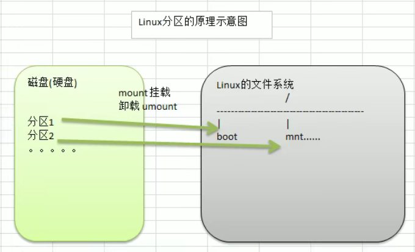

# 安装CentOS（略）

* `CentOS`
* `VMware`
* <font style="color:gray">`VMware Tools`</font>
  * 共享文件夹

# Linux目录结构

`Linux`的目录结构是树状的，有且只有一个根目录。

* <font style="color:red;font-weight:bolder">Linux中，一切皆为文件</font>

## Linux的根目录（"/"）

不同于`windows`，`Linux`只有一个根，那就是"/"，根下面有许多子目录（例如`usr`,`root`,`bin`等等），它是Linux系统下的顶级目录

## bin

* **`Binary`**，存放Linux的常用命令

## sbin

* **`Super User`**，存放系统管理员使用的应用程序

## home

* **存放普通用户的主目录**，在Linux中，每一个用户都有一个自己的目录，一般这个目录会以该用户的账号命名

## root

* **系统管理员的主目录**

## lib

* **系统启动所需的动态连接共享库**，几乎所有的应用程序都需要用到这个库

## lost+found

* 一般为空，当系统非法关机时，这里就会自动存放一些文件

## etc

* **所有的系统管理所需要的配置文件**和子目录（环境变量的配置）

## usr

* **用户的应用程序和文件都在这个目录下**

## boot

* 启动Linux时使用的一些核心文件，包括连接文件和镜像文件

## proc

* 这是一个虚拟目录，它是系统内存的映射，访问这个目录获取系统信息

## srv

* **`service`**目录，该目录存放一些服务启动后需要提取的数据

## sys

* Linux内核2.6以后新增的文件系统

<font style="color:red;font-weight:bolder">`proc`,`srv`,`sys`这三个目录涉及到Linux的内核，一般不允许轻易改动它们</font>

## tmp

* 用于存放一些临时文件

## dev

* **硬件目录**，类似于设备管理器，Linux把所有的硬件映射成文件，存储到这个目录下

## media

* **Linux识别到的U盘或光驱等媒体**，Linux会把这些设备挂载到这个目录下

## mnt

* **允许用户挂载别的文件系统的目录**，例如`VMware`的共享文件夹

## opt

* **给Linux额外安装软件存放的目录**，如`MySQL`、`Oracle`数据库

## usr/local

* **另一个给主机额外安装软件所安装的目录**，一般是通过编译源码安装的程序

## var

* **存放经常性被修改的文件**，例如日志

## selinux

**security-enhanced linux**

* `SELinux`是一种安全子系统，它能控制程序只能访问特定文件

# Linux的常用命令

* 对文件和目录的操作的一部分路径规则

  * `.`表示当前目录

  * `../`表示上级目录

  * `/`表示根目录

  * 路径的开头为`/`表示以根目录为起始

    路径的开头不为`/`表示以当前目录为起始

  * `*`表示配对一切文件及目录

## 关机重启

* `shutdown -h now/halt`：立即进行关机
* `shutdown -h 1`：1分钟后关机
* `shutdown -r now/reboot`：立即重启计算机
* `sync`：把内存的数据同步到磁盘

Tips：在关机或重启时，都应该先执行一次`sync`指令，把内存的数据写入到磁盘，防止数据丢失

## 帮助

* `man [命令或配置文件]`：获得帮助信息
* `help 命令`：获得shell内置命令的帮助信息

## 文件目录类

* `pwd`：显示当前工作目录的绝对路径

* `ls [选项] [目录或文件]`：查看当前目录的所有内容信息

  选项：

  * `-a`：显示当前目录所有的文件和目录，**包括隐藏的**
  * `-l`：以列表的方式显示信息

* `cd [参数]`：切换到指定目录

  常用参数：

  * 要定位到的**绝对路径**和**相对路径**
    * 绝对路径：从根目录开始定位的路径（`/home/zyx`）
    * 相对路径：从当前目录开始定位到需要的目录的路径（`../home/zyx`）
  * `cd ~/cd`：回到自己的**家目录**
  * `cd ..`：回到当前目录的上一级目录
  
* `mkdir [选项] 要创建的目录`：用于创建目录

  常用选项：

  * `-p`：创建多级目录

* `rmdir [选项] 要删除的目录`：删除**空**目录

  * `-rf`：删除非空目录
  
* `touch 文件名称`：创建一个空文件

* `cp [选项] 待拷贝文件 要拷贝到的目标目录`：拷贝文件到指定的目录

  常用选项：

  * `-r`：递归复制整个文件夹

  Tips：当有相同名字的文件时，Linux都会提示是否要覆盖，当我们确定要全部覆盖的时候，就可以使用`\cp`来强制执行覆盖，不再一个个文件提示

* `rm [选项] 要删除的文件或目录`：移除文件或目录

  常用选项：

  * `-r`：递归删除整个文件夹
  * `-f`：强制删除不提示

* `mv 原文件 新文件`：将文件或目录移动到对应的位置并重命名

  例：`mv /home/abc/oldFile /home/def/newFile`，这条指令则是把`/home/abc`中的`oldFile`移动到了`/home/def`下，并重命名为`newFile`

* `cat [选项] 要查看的文件`：查看文件内容

  常用选项：

  * `-n`：显示行号

  Tips：`cat`只能浏览文件，而不能修改文件，由于直接使用`cat`是将整个文件内容直接输出到控制台，这样很不便于我们浏览，所以，一般在使用`cat`的时候，会在最后加上`| more`（`|`名为管道命令符）

* `more 要查看的文件`：这是一个基于`vi`编辑器的文本过滤器，它以全屏幕的方式按页显示文本文件的内容

  `more`自带的快捷键：
  |   操作   |         功能说明         |
  | :------: | :----------------------: |
  | `Space`  |      向下翻**一页**      |
  | `Enter`  |      向下翻**一行**      |
  |   `q`    |      立即离开`more`      |
  | `Ctrl+F` |       向下滚动一屏       |
  | `Ctrl+B` |        返回上一屏        |
  |   `=`    |     输出当前行的行号     |
  |   `:f`   | 输出文件名和当前行的行号 |
  
* `less 要查看的文件`：功能与`more`类似，但却比`more`更为强大，它在显示文件内容时，**并不是一次将整个文件加载完毕后再显示，而是根据需要加载内容，提高了运行效率**，在显示大型文件时体现得更为明显

  `less`自带的快捷键：

  |     操作     |                    功能说明                    |
  | :----------: | :--------------------------------------------: |
  |   `Space`    |                  向下翻动一页                  |
  | `[pageDown]` |                  向下翻动一页                  |
  |  `[pageUp]`  |                  向上翻动一页                  |
  |   `/字串`    | 向下搜寻[字串]的功能：n：向下查找；N：向上查找 |
  |   `?字串`    | 向上搜寻[字串]的功能：n：向下查找；N：向上查找 |
  |     `q`      |                   离开`less`                   |

* `> 目标文件`：将显示的内容**重定向**到目标文件中

  例：

  * `ls -l > 文件x`：将`ls`列表的内容覆写到`文件x`中
  * `cat 文件1 > 文件2`：将`文件1`的内容覆写到`文件2`中

* `>> 目标文件`：将显示的内容**追加**到目标文件尾部

  例：

  * `ls -al >> 文件x`：将`ls`列表中的内容追加到`文件x`尾部
  * `echo "内容" >> 文件x`：将`"内容"`追加到`文件x`的尾部

* `echo [选项] 输出内容`：将输出内容输出到控制台

  Tips：这个输出内容可以直接写字符串，也可以通过写`$Path`输出环境变量这类内容

* `head [选项] 文件`：查看文件的开头部分内容，默认情况下显示文件的前10行内容

  常用选项：

  * `-n x`：输出文件的前`x`行内容（`x`为一个准确的数字）

* `tail [选项] 文件`：查看文件的结尾部分内容，默认情况下显示文件的后10行内容

  常用选项：

  * `-n x`：输出文件的后`x`行内容（`x`为一个准确的数字）
  * `-f`：实时追踪该文档的所有更新:star:

* `ln -s [原文件或目录] [软链接名]`：给`原文件或目录`创建一个软链接（软链接功能类似与`Windows`里的快捷方式，主要存放了链接其他文件的路径）

* `history [x]`：查看最近已经执行过的`x`条历史命令（如不输入`x`则默认全部输出），也可以执行历史命令

  Tips：可以通过`!x`来执行编号为`x`的指令（`x`为指令在历史记录中的编号）


## 时间日期类

* `date [选项]`：显示当前时间

  :star: `+`一定不能少

  常用选项：

  **显示当前时间：**（显示时间的格式前一定要用`+`连接）

  * `%Y`：显示当前年份
  * `%m`：显示当前月份
  * `%d`：显示当前是哪一天

  * `%H`：显示当前的时
  * `%M`：显示当前的分
  * `%S`：显示当前的秒

  Tips：若要一次性显示多个选项，需要用`""`括起来，例：`date "+%Y-%m-%d %H:%M:%S"`则显示**年月日时分秒**

  ---

  * `-s 字符串时间`：设置系统时间

* `cal [选项]`：查看日历，默认情况下查看本月日历

  常用选项：

  * `xxxx`：显示`xxxx`年的整年日历（`xxxx`为整年的年份）

## 搜索查找类

* `find [搜索范围] [选项] keyword`：从指定目录向下递归地遍历每个子目录，将满足条件的文件或目录显示在终端

  常用选项：

  * `-name`：按照指定的文件名查找模式查找文件（后跟具体的文件名）

    Tips：利用通配符`*`可以查询某一类型或名字相似的文件，如：`*.txt`可以查询文件后缀名为`txt`的文件

  * `-user`：查找属于指定用户名的所有文件（后跟用户的名称）

  * `-size`：按照指定的文件大小查找文件

    文件的大小有以下几种表达方式：
    
    * `-n`：小于`n`
    * `+n`：大于`n`
    * `n`：等于`n`
    
    Tips：另外在文件大小最后需要加计量的单位，如：`M`、`K`

* `locate 待搜索文件名`：`locate`指令能**更快速**的定位文件路径，快速地查询文件

  由于**`locate`事先在系统中建立了`locate`数据库，所以`locate`指令不需要遍历整个文件系统，因此查询速度较快**，但由于需要查询建立在`locate`数据库的数据之上，所以为了保证查询结果的准确性，`locate`指令需要**定期使用`updatedb`指令来更新`locate`数据库**

* `grep [选项] 查找内容 源文件`：过滤查找，用于查找文件内容中包含`查找内容`关键字

  常用选项

  * `-n`：显示匹配行及行号
  * `-i`：忽略字母大小写

* `|`：管道符号，表示将前一个命令的处理结果输出传递给后面的命令处理

  Tips：一般来说，`grep`指令和`|`管道符都是成对出现的，如：`cat hello.txt | grep -n yes`：查询`hello.txt`中包含yes的行并显示行号

## 压缩和解压缩

* `gzip 文件名`：将文件压缩为`*.gz`格式

* `gunzip 文件.gz`：解压缩文件

  Tips：以上两种压缩和解压方式都会清除源文件，无法保留原来的文件

----

* `zip [选项] xxx.zip 待压缩的内容`：把要`压缩的内容`压缩成`xxx.zip`

  常用选项：

  * `-r`：递归压缩，将目录里的所有内容都压缩成指定的格式

* `unzip [选项] xxx.zip`：解压缩`xxx.zip`文件

  常用选项：

  * `-d 解压后的目标目录`

---

* `tar [选项] xxx.tar.gz 打包的内容`：将`内容`**打包**，打包后的文件格式为`.tar.gz`

  Tips：`打包的内容`可以是一个文件、多个文件或一整个文件夹

* `tar [选项] 待解压的内容`：将`待解压的内容`解压

  常用选项：

  * `-c`：产生`.tar`打包文件
  * `-v`：显示详细信息
  * `-f`：指定压缩后的文件名
  * `-z`：打包同时压缩
  * `-x`：解包`.tar`文件

  如：

  `tar -zcvf a.tar.gz a1.txt a2.txt`：将`a1.txt`和`a2.txt`打包压缩成`a.tar.gz`

  `tar -zxvf a.tar.gz`：将`a.tar.gz`解压

  :star: `tar -zxvf a.tar.gz -C <目录>`：将`a.tar.gz`解压到`<目录>`下，且必须存在该目录，否则报错

# 远程登录——Linux-Xshell5

* `Xshell5`介绍：`Xshell`是目前最好的远程登录到Linux操作的软件，流畅的速度并且完美解决了中文乱码的问题，是目前程序员首选的软件

  `Xshell`是一个强大的安全终端模拟软件，它支持`SSH1`、`SSH2`以及`Microsoft Windows`平台的`Telent`协议

  `Xshell`可以在`Windows`界面下用来访问远端不同系统下的服务器，从而比较好的达到远程控制终端的目的

* `Xshell5`的使用：

  * 首次使用需要新建**会话**
    * 名称：自定义
    * **协议：SSH**
    * 主机：需要远程登录的`Linux`主机的**`IP`地址**
    * **端口号：22**
  * 首次连接会话需要输入你在该`Linux`系统下的用户名和密码
  * 连接成功以后，就可以通过命令，远程操作`Linux`，这种操作方法相当于在操作机器本身

# 远程上传、下载文件——Linux-Xftp5

* `Xftp5`介绍：

  `Xftp5`是一款基于Windows平台的功能强大的`SFTP`、`FTP`文件传输软件，使用`Xftp5`能让`Windows`用户能安全地在`Unix/Linux`和`Windows PC`之间传输文件

* `Xftp5`的配置和使用

  * 首次使用同样需要新建会话

    * 名称：自定义
    * **协议：SFTP**
    * 主机：需要远程登录的`Linux`主机的**`IP`地址**
    * **端口号：22**
    * 用户名：在`Linux`上的对应用户名

  * 乱码问题

    在属性中将使用`UTF-8`编码勾选

# Linux中vi和vim编辑器的使用

* 所有的`Linux`系统都内置了**vi文本编辑器**
* **Vim**具有程序编辑的能力，可以看作是`Vi`的增强版本，可以主动的以字体颜色辨别语法的正确性，方便程序设计。代码补完、编译及错误跳转等方便编程的功能特别丰富，在程序员中被广泛使用

## vi 和 vim 的三种模式

* 正常模式

  以`vim`打开一个档案就直接进入一般模式了（这是默认的模式）。在这个模式中，你可以使用`↑↓←→`按键来移动光标，可以使用 *删除字符* 或 *删除整行* 来处理档案内容，也可以使用 *复制、黏贴* 来处理文件数据

* 插入模式

  在插入模式下，程序员可以输入内容

  按下`i、I、o、O、a、A、r、R`等任意一个字母后才会进入编辑模式，一般使用`i`即可

* 命令行模式

  在这个模式中，可以提供相关指令，完成**读取、存盘、替换、离开`vim`、显示行号**等操作

## vi 和 vim 的常用快捷键

* 拷贝当前行：`yy`；拷贝当前行向下的5行：`5yy`
* 粘贴：`p`
* 删除当前行：dd；删除当前行向下的5行：`5dd`
* 在文件中查找某个单词：命令行模式下，`/关键字`，回车查找，输入n就是查找下一个
* 设置文件的行号，取消文件的行号：命令行模式下，`:set nu`和`:set nonu`
* 编辑某个文件，使用快捷键到文档的最底行（`G`）和最首行（`gg`）
* 在文件中输入“hello”，然后又撤销这个动作：在正常模式下`u`
* 编辑某个文件，将光标移动到20行：`shift+g`

# 用户登录和注销

* 基本介绍
  * 在登陆时应当尽量少使用`root`账号，因为它是系统管理员，有最大的权限，避免操作失误，可以利用普通用户登录，登陆后再用`su - 用户名`命令来切换成系统管理员身份
  * 在提示符下输入`logout`即可注销用户
* 使用细节
  * `logout`注销指令在图形运行级别无效，在运行级别3下有效

# 用户管理

* `Linux`是一个多用户多任务的操作系统，任何一个要使用系统资源的用户，都必须首先向系统管理员申请一个账号，然后以这个账号的身份进入系统
* `Linux`的用户至少属于一个**组**

## 基本语法

* 添加用户：`useradd [选项] 用户名`

  * 当创建用户成功后，会自动创建和用户同名的`home`目录 
  * 也可以通过`useradd -d 用户名`，给新用户指定家目录
  * 若创建用户时需要指定用户组，则可以使用`useradd -g 用户组名 用户名`

* 指定用户密码：`passwd 用户名`

* 删除用户：`userdel 用户名`

  * 在不带有任何参数时，默认删除用户，但保留家目录
  * 若要连同家目录一起删除，则需要使用`userdel -r 用户名`

  **Tips：一般来说，即使用户被删除，我们都会保留用户的家目录**

* 查询用户：`id 用户名`

  * `uid`：用户的`id`
  * `gid`：用户所在组的`id`
  * 组：用户所在组的名称
  * 若不存在该用户，则会返回“无此用户”

* 切换用户：`su - 用户名`

  * 从权限高的用户切换到权限低的用户时，不需要输入密码，反之则需要
  * 使用`exit`可以回退到原先的用户
  * 使用`whoami/who am i`指令可以查询当前自己是哪个用户

* 修改用户的组：`usermod -g 新的用户组 用户名`

* 修改用户登录的初始目录：`usermod -d 目录名 用户名`

### 用户信息的相关文件

* 用户配置文件：`/etc/passwd`

  用户（user）的配置文件，记录用户的各种信息

  每行的含义：`用户名:口令:用户标识号:组标识号:注释性描述:主目录:登录shell`

* 口令配置文件（密码和登录信息，是加密的）：`/etc/shadow`

  每行的含义：`登录名:加密口令:最后一次修改时间:最小时间间隔:最大时间间隔:警告时间:不活动时间:失效时间:标志`

# 组管理

* `Linux`中的**每个用户**必须**属于一个组**，不能独立于组外；`Linux`中每个文件都有**所有者、所在组、其他组**的概念
  * 所有者：一般为文件的创建者，谁创建了该文件，就自然成为该文件的所有者
    * `ls -ahl 文件名`：查看文件的所有者

      例：`-rw-r--r--. tom police ...... ok.txt`：指`ok.txt`这一个文件的**所有者**是`tom`，而文件的**所在组**是`police`

    * `chown [选项] 用户名 文件名`：修改文件的所有者
    * `chown newowner:newsgroup file`：改变文件的所有者和所有组

      例：`chown tom apple.txt`：将`apple.txt`的所有者更改为`tom`
      常用选项：
      * `-R`：如果修改目标是目录，递归修改该目录下的所有子目录和文件的所有者

  * 所在组：默认情况下，文件的所有者所在的组，就是文件的所在组

    * `ls -ahl 文件名`：查看文件的所在组

    * `chgrp [选项] 组名 文件名`：修改文件的所在组

      例：`chgrp police orange.txt`：将`orange.txt`的所在组修改为`police`
      常用选项：
      * `-R`：如果修改目标是目录，递归修改该目录下的所有子目录和文件的所在组

  * 其他组：除文件的所有者和所在组的用户外，系统的其他用户都是文件的其他组

## 用户组

* 类似于角色，系统可以队有共性的多个用户进行统一的管理

### 基本语法

* 新增组：`groupadd 组名`
* 删除组：`groupdel 组名`

### 用户组的相关文件

* 组配置文件：`/etc/group`

  每行含义：`组名:口令:组标识号:组内用户列表`

## 权限的基本介绍

### `ls -l`显示的内容含义

* `ls -l`显示的内容如下：

  `-rwxrw-r-- 1 root root 1213 Feb 2 09:39 abc`

  -----

  第一部分，0~9位说明：

  * 第0位确定文件类型

    不同的符号代表的意义

    * `-`：普通文件
    * `d`：目录
    * `l`：软链接
    * `c`：字符设备（*键盘、鼠标*）
    * `b`：块文件（*硬盘*）

  -----

  * 第1~3位确定文件所有者拥有该文件的权限---*User*

  * 第4~6位确定所属组拥有该文件的权限---*Group*

  * 第7~9位确定其他用户拥有该文件的权限---*Other*

    > Tips：不同符号代表的含义见 ***`rwx`权限详解***

  -----

  第二部分，第10号位的数字的意义：

  * 该文件如果是文件，那么则表示**硬连接的数目**
  * 该文件如果是目录，则表示该目录下**子目录的数目**

  -----

  第三部分，后两个单词的含义：

  * 第一个单词是文件的所有者
  * 第二个单词是文件的所在组

  -----

  第四部分，数字的含义：

  * 该文件如果是文件，则表示的为文件大小
  * 该文件如果是目录，则统一为**`4096`**

  -----

  第五部分，日期指代的是文件最后的修改时间

  -----

  第六部分，文件名

### `rwx`权限详解

不同符号代表的意义：

* 对文件来说：
  * `r`：`read`，表示可以对文件进行**读取，查看**的操作
  * `w`：`write`，代表可以对文件进行**修改**，但并不代表可以删除文件；删除文件的前提条件是**对该文件所在的目录有写权限**，才能删除该文件
  * `x`：`execute`，代表可以进入该目录
  * `-`：代表无权限

* 对目录来说：
  * `r`：`read`，表示可以对目录进行**读取**，`ls`查看目录内容
  * `w`：`write`，代表可以对目录进行**修改**，目录内**创建、删除、重命名**目录
  * `x`：`execute`，代表可以**进入该目录**
  * `-`：代表无权限

### 权限管理
* 通过`chmod`指令可以修改文件或者目录的权限
  * 第一种方式：`+、-、=`更改权限

    符号解释：u：所有者；g：所有组；o：其他人；a：所有人（即u、g、o的总和）
    
    * `chmod u=rwx,g=rx,o=x 文件目录名`：直接设置文件目录的权限
    * `chmod o+w 文件目录名`：给*所有其他人(o)***增加***w(写)*的权限
    * `chmod a-x 文件目录名`：取消（x）所有人的执行权限
    
    例：`chmod u=rwx,g+r,o-w abc`：给`abc`这个文件的所有者用户设置读写执行的所有权限；给所有组用户新增读的权限；取消其他人的用户的写入权限
    
  * 第二种方式：通过数字变更权限

    数字说明：`r=4`，`w=2`，`x=1`，`rwx=4+2+1=7`
    
    例：`chmod u=rwx,g=rx,o=x 文件目录名`相当于`chmod 751`
    
    Tips：数字方式修改权限时，数字表示的权限类别顺序为`ugo(user group other)`

# Linux的7个运行级别

* **系统的运行级别配置文件**：`/etc/inittab`，该文件指定系统的运行级别

  * `/etc/inittab`的`id:5:initdefault`中的数字指定了`Linux`的运行级别

* 运行级别

  0. 关机

  1. 单用户

     在此模式下`root`不需要密码，可以利用这个特性来找回密码

  2. 多用户无网络服务

  3. 多用户有网络服务

  4. 保留

  5. **图形界面**

  6. **重启**

* 指定运行级别：

  1. `init [0123456]`
  2. 另外，还可以在启动引导时通过修改内核配置来修改运行级别，*可以利用这个方法进入单用户模式，然后在单用户模式下修改`root`密码来打到找回`root`密码的目的*
  3. 修改`/etc/inittab`的`id:5:initdefault`中的数字指定`Linux`的运行级别

# 任务调度

## crond任务调度

* `crond`任务调度是方便我们任务调度的一个机制

  * 任务调度：指系统在某个时间执行的特定的命令或程序

  * 任务调度分类：

    * 系统工作：有一些重要的工作必须周而复始的执行

      如：病毒扫描等

    * 个别用户工作：个别用户可能希望执行某些程序

      如：`MySQL`数据库的备份

* `crontab [选项]`：进行定时任务调度的设置

  常用选项：

  * `-e`：编辑`crontab`定时任务
  * `-l`：查询`crontab`任务
  * `-r`：删除当前用户所有的`crontab`任务
  * `service crond restart`：重启任务调度

   Tips：如果只是简单的任务，可以不必要写脚本，直接在`crontab`中加入任务即可；但如果任务比较复杂，则需要编写运行脚本（`Shell`编程）

 例：`*/1 * * * * ls -l /etc/ >> /tmp//to.txt`：每小时的每分钟执行`ls -l /etc/ >> /tmp//to.txt`命令

   * 上述例子中`*`占位符的说明（括号内为取值范围）：

     * 第一个`*`：一小时当中的第几分钟（0～59）
     * 第二个`*`：一天中的第几小时（0～23）
     * 第三个`*`：一个月中的第几天（1～31）
     * 第四个`*`：一年中的第几月（1～12）
     * 第五个`*`：一周中的星期几（0～7，其中0和7都表示周日）

   * 对于特殊符号的说明：

     * `*`：代表任何时间

       如：第一个`*`就代表一小时中每分钟都执行一次的意思

     * `,`：代表不连续的时间

       如：`0 8,12,16 * * * 命令`，就代表在每天的8:00、12:00、16:00都执行一次命令

     * `-`：代表连续的时间范围

       如：`0 5 * * 1-6 命令`，代表在周一到周六的凌晨5:00执行命令

     * `*/n`：代表隔多久执行一次

       如：`*/10 * * * * 命令`，代表每隔10分钟就执行一次命令

* 调用提前编写好的脚本

  1. 先编写一个`.sh`脚本
  2. 给该脚本可执行权限
  3. `crontab -e`将需要在何时运行这个脚本输入，并在`命令`部分直接执行`.sh`脚本

# 磁盘分区、挂载

## 磁盘分区

* 分区的方式：
  * `MBR`分区
    * 最多支持四个主分区
    * 系统只能安装在主分区
    * 扩展分区要占一个主分区
    * `MBR`最大支持`2TB`，但拥有最好的兼容性
  * `GTP`分区
    * 支持无限多个主分区（但有可能收到操作系统限制，如`	Windows`下最多128个分区）
    * 最大支持**`18EB`**的容量（`1EB=1024PB、1PB=1024TB`）
    * **`Windows7 64位`**以后支持`GTP`

## Linux分区

* `Linux`分区说明
  * Linux来说无论有几个分区，分给哪一目录使用，它归根结底就只有一个根目录，一个独立且唯一的文件结构，`Linux`中每个分区都是用来组成整个文件系统的一部分
  * Linux采用了一种叫**载入**的处理方法，它的整个文件系统中包含了一整套的文件和目录，且将一个分区和一个目录联系起来，这时要载入的一个分区将使它的储存空间在一个目录下获得
  * Linux分区原理示意图：

  

* 硬盘说明

  * Linux硬盘分`IDE`硬盘和`SCSI`硬盘，目前基本上是`SCSI`硬盘

  * 对于`IDE`硬盘，驱动器标识符为`hdx~`。其中，`hd`表明分区所在设备的类型，这里是指`IDE`硬盘；`x`为盘号（*`a`为基本盘，`b`为基本从属盘，`c`为辅助主盘，`d`为辅助从属盘*）；`~`代表分区，前四个分区用数字1到4表示，他们是主分区或扩展分区，从5开始就是逻辑分区。

    例：

    `hda3`表示为第一个`IDE`硬盘上的第三个主分区或扩展分区

    `hda2`表示为第二个`IDE`硬盘上的第二个主分区或扩展分区

  * 对于`SCSI`硬盘则标识为`sdx~`。`SCSI`硬盘使用`sd`来表示分区所在设备的类型的，其余内容则和`IDE`硬盘的表示方法一样

* 磁盘情况查询相关命令
  * `df [选项]`：查询系统中整体磁盘使用情况
    
    常用选项：
    
    * `-l`：以列表形式展示磁盘分区占用情况
    
    * `-h`：带计量单位
  
  * `du [选项] 目录`：查询指定的目录的磁盘占用情况
    
    * `-s`：指定目录占用大小汇总
    
    * `-h`：待计量单位
    
    * `-a`：包含文件
    
    * `-max-depth=1`：子目录深度
    
    * `-c`：列出明细的同时，增加汇总值
  
  * `ls -l /目录 | grep “^-” | wc -l` ：统计`/目录`目录下文件的个数
  * `ls -l /目录 | grep “^d” | wc -l `：统计`/目录`目录下目录的个数
  * `ls -lR /目录 | grep “^-” | wc -l `：统计`/目录`目录下文件的个数（包括子目录里的）
  * `ls -lR /目录 | grep “^d” | wc -l `：统计`/目录`目录下目录的个数（包括子目录里的）
  * `tree`：以树状显示目录结构（需要先`yum`安装`tree`指令）

# 网络配置

* `NAT`模式：在一个局域网内，每个设备都有自己独立的`IP`地址，其中，一台主机会有一个真实的网卡，虚拟机和主机之间又会存在一个虚拟网卡来完成网络通信。而在局域网内所有设备之间都可以正常通信，而这一个局域网和广域网`Internet`之间通过一个**网关**来连接到外部网络，达到**上网**的目的
  
   存在的问题：
   * 我们的`Linux`是存在于虚拟机当中的，在每一次重启都会重新给`Linux`系统分配一个新的`IP`地址，这样不固定的`IP`不便于我们的网络通信

* 查看网络`IP`和网关
  * 查看虚拟网络编辑器：
    
    在`VMWare`中，上方工具栏 -> 编辑 -> 虚拟网络编辑器
  
  * 修改`IP`地址（修改虚拟网络的`IP`）：
    
    在虚拟网络编辑器中的子网`IP`栏可以修改虚拟网络的`IP`地址
  
  * 查看网关：
    
    虚拟网络编辑器 -> `NAT`设置 -> 网关`IP`
    
  * 查看`Windows`环境中的`VMnet8`网络配置
    * 在`cmd`中使用`ipconfig`命令可以查询网络配置
    * 网络和共享中心 -> 右键`VMnet8` -> 属性 -> `Internet`协议版本4（`TCP/IPv4`） -> 属性 -> `IP`地址
* 当配置完成以后可以使用`ping 目的主机的IP地址`可以测试当前使用的主机是否可以连接目的主机

## Linux网络环境配置

* 自动获取
    
    登陆后，通过界面来设置自动获取`IP`
    
    系统 -> 首选项 -> 网络连接 -> 选择需要设置的网卡 -> 编辑 -> 勾选自动连接 -> 应用
    
    优点：`Linux`在每次启动后会自动获取`IP`
    
    缺点：每次获取的`IP`不一定相同
    
    由于`IP`地址不固定，所以不能当作服务器使用
    
* 修改配置文件
    
    直接修改配置文件来指定`IP`，并可以连接到外网
    
    编辑`/etc/sysconfig/network-scripts/ifcfg-eth0`
    
    修改：
    
    * `ONBOOT=yes`
    
    * `BOOTPORTO=static`
    
    * `IPADDR=<一个格式规范的IP地址即可>`
    
    * `GATEWAY`和`DNS`配置一致即可
    
    Tips：上述过程完成以后需要重启一下服务：`service network restart`
    
    `if-cfg`文件说明：
    
     ```properties
     DEVICE=eth0    # 接口名（设备、网卡）
     HWADDR=xxxxxxxx    # MAC地址
     TYPE=Ethernet    # 网络类型（通常为Ethernet）
     UUID=xxxxxxxx    # 随机id号
     # 系统启动的时候网络接口是否有效（yes/no）
     ONBOOT=yes
     # IP的配置方法[none|static|bootp|dhcp]（引导式不使用协议｜静态分配IP｜BOOTP协议｜DHCP协议）
     BOOTPROTO=static
     # IP地址
     IPADDR=xxx.xxx.xxx.xxx
     # 网关
     GATEWAY=xxx.xxx.xxx.xxx
     # 域名解析器
     DNS1=xxx.xxx.xxx.xxx
     ```
     
# 进程管理

* 基本介绍：
  * 在`Linux`中，每个执行的程序都被称为一个**进程**，每一个进程都分配一个`ID`号
  * 每一个进程，都会对应一个**父进程**，而这个父进程可以复制多个子进程
  * 每个进程都可能以两种方式存在：**前台**和**后台**
    * 前台进程：用户目前的屏幕上可以进行操作的进程
    * 后台进程：屏幕上无法显示，但是一直在后台执行操作的进程
  * 一般系统的服务都是以**后台进程**的方式存在，而且都会常驻在系统中，直到关机才结束
* 显示系统执行的进程
    * `ps [选项]`：查看目前系统中，有哪些进程正在进行和它们执行的情况
      常用选项：
      * `-a`：显示当前终端的所有进程信息
      * `-u`以用户的格式显示进程信息
      * `-x`：显示后台进程运行的参数
      * `-f`：以全格式显示进程
      * `-e`：显示所有进程
    * `ps`指令详解：


      |字段|说明|
      |:---:|:---:|
      |`PID`|进程识别号|
      |`PPID`|父进程ID|
      |`C`|CPU用于计算执行用先机的因子。数值越大，表明进程是CPU密集型运算，执行优先级会降低；数值越小，表明进程是I/O密集型运算，执行优先级会提高|
      |`%CPU`|占用`CPU`的百分比情况|
      |`%MEM`|占用内存的百分比情况|
      |`VSZ`|占用的虚拟内存的情况（单位：`KB`）|
      |`RSS`|使用的物理内存的情况（单位：`KB`）|
      |`TTY`|终端机号|
      |`STAT`|进程的状态（具体说明见下表）|
      |`START`/`STIME`|启动时间|
      |`Time`|此进程占用CPU的总时间|
      |`COMMAND`|进程执行时的命令行|
      
      |进程的状态（STAT状态码）|说明|
      |:---:|:---:|
      |`s`|睡眠|
      |`S`|该进程是会话的先导进程|
      |`N`|该进程拥有比普通进程优先级更低的优先级|
      |`R`|正在运行|
      |`D`|短期等待|
      |`Z`|僵死进程|
      |`T`|被跟踪或者被停止|
      
      Tips：
      
      `ps -aux`：
      
      `ps -ef`：以全格式显示当前所有的进程，包括父进程
      
## 终止进程

* 若是某个进程执行一半需要停止时，或是已经消耗了很大的系统资源时，此时可以考虑停止该进程，使用`kill`命令来完成此项任务
* `kill [选项] 进程号`：通过进程号杀死进程
* `killall 进程名称`：通过进程名称杀死进程，也支持通配符，这在系统因负载过大而变得很慢时很有用
    
    常用选项：
    * `-9`：强制进程立即停止

## 查看进程树

* `pstree [选项]`：可以更加直观的来查看进程信息
    
    常用选项：
    
    * `-p`：显示进程的`PID`
    * `-u`：显示进程的所属用户

## 服务管理

* 服务（Service）的本质就是进程，但是是运行在后台的，通常会监听某个端口，等待其它程序的请求（如`MySQL`、`sshd`、防火墙等），因此我们又称为守护进程
* `service`管理指令：
  * `service/systemctl 服务名 [操作命令]`：对名为`服务名`的服务进行某项`操作`
    
    常用指令：
    * `start`：启用服务
    * `stop`：停止服务
    * `restart`：重启服务
    * `reload`：重新载入服务
    * `status`：显示服务状态

    以上语句对服务的修改只是临时生效，重启系统后还是会重新回到原来的状态，若要对某个服务的修改永久生效，则需要使用`chkconfig`指令
    
* 查看`Linux`已有的服务名
  * 使用 `setup` -> 系统服务 就可以看到
  * `/etc/init.d/服务名称`

    使用`ls -l /etc/init.d/`可以列出服务有哪些服务
    
* `chkconfig`指令
    
    `chkconfig`命令可以给每个运行级别设置自启动/关闭
    
    基本语法：
    
  * `chkconfig --list | grep xxx`：查看服务
  * `chkconfig 服务名 --list`：具体查看某个服务
  * `chkconfig --level n 服务名 on/off`：设置运行级别为`n`时开启`on`或关闭`off`服务

    Tips：在使用`chkconfig`修改了服务自启动参数以后，需要重启机器`reboot`才能生效
    
## 进程监控服务
* 动态监控进程（`top`命令）
  * `top [选项]`：显示正在执行的进程
  * `top`与`ps`的不同点：`top`在执行一段时间后可以更新正在进行的进程
    
    常用选项：
    * `-d 秒数`：指定`top`指令每隔几秒更新，默认3秒（在`top`命令的交互模式当中可以执行的命令）
    * `-l`：使`top`不显示任何**闲置**或者**僵死**进程
    * `-p`：通过**指定监控进程`ID`**来仅仅监控某个进程的状态
  * `top`的交互操作说明

    |操作|功能|
    |:---:|:---:|
    |`P`|以`CPU`的使用率排序（默认选项）|
    |`M`|以内存的使用率排序|
    |`N`|以`PID`排序|
    |`k`|杀死某个进程（在输入`k`并回车后，会提示输入将要结束的进程的`ID`号）|
    |`q`|退出`top`|
    
* 网络监控（`netstat`）
  * `netstat [选项]`：查看系统网络情况

    常用选项：
    * `-an`：按一定顺序排列输出
    * `-p`：显示哪个进程在调用

# `RPM`和`YUM`

## `RPM`包的管理

  * `RPM`是一种用于互联网下载包的打包及安装工具，它包含在某些`Linux`分发版中。它生成具有`.RPM`扩展名的文件。`RPM`是`RedHat Package Manager`的缩写，类似`Windows`的`setup.exe`
  * `RPM`包名的基本格式
    
    例：一个`RPM`包名为`firefox-45.0.1-1.el6.centos.x86_64.rpm`
    
    名称：`firefox`
    
    版本号：`45.0.1-1`
    
    适用操作系统：`el6.centos.x86_64`
    * 表示`centos6.x`的64位系统
    * 如果是`i686`、`i386`表示32位系统；`noarch`表示通用
  * `RPM`包的查询指令
    * `rpm -qa`：查询所安装的所有`RPM`软件包
    * `rpm -qa | more`：将查询的结果交给`more`进行展示
    * `rpm -qa | grep X`：查询是否安装了`X`关键字的软件包
    * `rpm -q X`：查询软件包`X`是否安装
    * `rpm -qi X`：查询软件包`X`的相关信息
    * `rpm -ql X`：查询软件包`X`中的文件
    * `rpm -qf d`：查询**全路径名**为d的文件所属的软件包
 * `RPM`包的卸载
   * `rpm -e X`：卸载名为`X`的`RPM`包
     
     有时候有些`RPM`包是被其他包所依赖的，那么这时候删除这个`RPM`包就会爆出错误信息，如：`removing these packages would break dependencies:foo is needed by bar-1.0.1`
     
     如果我们需要强制性删除这个包，就可以利用参数`--nodeps`：`rpm -e --nodeps foo`（不建议轻易使用）
     
 * `RPM`包的安装
   * `rpm -ivh X`：安装名为`X`的`RPM`包
     
     参数说明：
     * `i`：`install`安装
     * `v`：`verbose`提示
     * `h`：`hash`进度条

## `YUM`包

  * `YUM`是一个`Shell`前端软件包管理器。基于`RPM`包管理，**能够从指定的服务器自动下载`RPM`包并安装，可以自动处理依赖性关系，并且一次安装所有依赖的软件包**

  * `YUM`的工作逻辑
    `YUM`在工作时需要连接网络（前提），在我们查询和安装软件时，会连接到`YUM`的服务器，里面有许多的`RPM`包，获取到相关的`RPM`包以后就可以进行相关操作

### `YUM`包的基本指令
  * `yum list | grep XXXX`：查询`YUM`服务器
  * `yum install xxx`：下载安装（默认安装最新版本）
