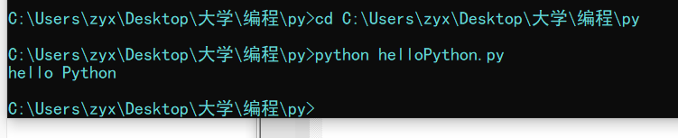

# Python简介

* `Python`是一门**简单直观**的语言
* **开源**
* 代码**像纯英语一样容易理解**
* 适用于**短期**开发的日常任务
* `Python`在解决相同问题时，**代码量相对较少**

## 解释器

* 编译器：计算机不能理解除了机器语言以外的语言，所以不同的编程语言都需要对应的**编译器**，将其他语言**翻译**成机器语言

  编译器翻译的方式有两种：一种是**编译**，另一种是**解释**。两种方式之间的区别在于**编译时间点的不同**，当编译器以解释方式进行的时候，也称之为解释器

* 编译型语言和解释型语言的区别

  * 编译型语言：编译型语言需要将一整块代码统一编译，一次性执行

    执行速度较快，在执行时没有翻译的操作

    对操作系统的兼容性较差

  * 解释型语言：解释型语言是逐行翻译，翻译一行执行一行

    执行速度较慢，在执行时需要有翻译的操作

    对操作系统的兼容性较强，只需要在不同的操作系统下安装不同的解释器

## Python的特点

* `Python`是**完全面向对象的语言**

  面向对象三大特点：封装、继承、多态

* `Python`**拥有一个强大的标准库**

* `Python`社区提供了大量的第三方模块，帮助程序员解决各种各样的问题

### Python的优缺点

* `Python`的优点
  * 简单、易学
  * 免费、开源
  * 面向对象
  * 封库的库
  * 可扩展性
    * 如果需要一段关键代码运行得更快或者希望某些算法不公开，可以把这部分程序用`C`或`C++`编写，然后再`Python`程序中使用它们
* `Python`的缺点
  * 运行速度慢
  * 国内时长较小
  * 中文资料匮乏

## 关于 Python 2.x 与 Python 3.x 版本简介

* `Python 2.x`默认**不支持中文**，`Python 3.x`**支持中文**
* 目前`Python`市场上有两个`Python`版本共存，分别是`Python 2.x`和`Python 3.x`
* `Python 2.x`的解释器名称为`python`
* `Python 3.x`的解释器名称为`python3`

> 新的Python程序建议使用`Python 3.x`

* `Python 2.x`是过去的版本
  * 解释器名称是**python**
* `Python 3.x`是现在和未来主流的版本
  * 解释器名称是**python3**
  * 相对于`Python`的早期版本，`Python3`做了较大的提升
  * `Python3`**不向下兼容**
* 为了照顾现有的程序，官方提供了一个过渡版本：**Python 2.6**
  * 基本使用了`Python 2.x`的语法和库
  * 同时考虑了向`Python 3.0`的迁移，允许使用**部分**`Python 3.0`的语法与函数
  * 2010年中推出的`Python 2.7`被锁定为最后一个`Python 2.x`版本

> Tips：如果开发时，无法立即使用Python 3.0（还有极少的第三方库不支持3.0的语法）

# 第一个Python程序：Hello Python

1. 在文件夹中新建后缀名为`.py`的文件
2. 使用编辑器在文件中输入`print("hello Python")`
3. 打开`cmd`控制台，将目录切换到存放了Python文件的文件夹中
4. 使用`python+文件名`即可运行，随后就会看到`hello python`的字样在控制台中输出

例：

## 关于BUG

* 什么是**BUG**？
  * 编写的程序不能正常执行，或者执行的结果不是我们所期望的程序，那么这个程序就存在**BUG**
* 可以通过执行`Python`程序以后，查看错误提示来帮助我们来调试程序（**Debug**）

# 交互式执行Python代码

* 在命令行中可以输入`python`或者`python3`来使用交互式执行`python`代码，这种方式常用于比较短的代码的验证和检验

  例：

  ```shell
  >python
  Python 3.9.7 (tags/v3.9.7:1016ef3, Aug 30 2021, 20:19:38) [MSC v.1929 64 bit (AMD64)] on win32
  Type "help", "copyright", "credits" or "license" for more information.
  >>>
  ```

  如以上情况，在`>>>`后面直接跟`python`代码就可以直接执行

* 退出解释器：`exit()`或热键`Ctrl+D`

## IPython

* `IPython`是一种交互式执行`python`代码的工具，它是一个`python`的交互式`shell`，比默认的`python shell`好用得多
  * 支持自动补全
  * 自动缩进
  * 支持`bash shell`命令
  * 内置了许多有用的功能和函数
* `IPython`是基于`BSD`开源的
* `IPython`可以通过在命令行中输入`ipython`或`ipython3`进入解释器

# Python的IDE——PyCharm

* 集成开发环境（`IDE`，`Integrated Development Environment`）——**继承了开发软件需要的所有工具**，一般包括以下工具
  * 图形用户界面
  * 代码编辑器（支持代码补全、自动缩进）
  * 编译器、解释器
  * 调试器
  * ……
* `PyCharm`介绍
  * `PyCharm`是`Python`的一款非常优秀的集成开发环境
  * `PyCharm`除了具有一般的`IDE`所必备的功能外，还可以在`Windows`、`Linux`、`macOS`下使用
  * `PyCharm`适合开发大型项目
    * 一个项目通常会包含**许多源文件**
    * 每个**源文件**的代码行数是有限的，通常在几百行之内
    * 每个**源文件**各司其职，共同完成复杂的业务功能

# Python基础语法

## 代码结构

* `Python`中没有语句的结束符（如C语言中的`;`）。一条`Python`语句的结束是由换行来判定的，如果你这条语句换行，那么`Python`的解释器就会认为你这条语句已经结束了，从而解释下一条句子

* `Python`中的分支、循环的嵌套关系全由**缩进**决定，如：

  ```python
  if a > b :
      print(a)
  else :
  	print(b)
  ```

## 输出语句

* 在`Python`中，可以使用`print()`函数直接输出一个语句，如：`print("Hello,python")`，直接输出`Hello,python`

  Tips：当需要输出多个对象时，用`,`分隔即可；在输出多个对象时，默认用`' '`隔开，同时，也可以指定`sep`的值来改变间隔用的符号

* `print`语句的结束符

  在`Python`中，`print`语句的结束符默认为`\n`（换行符），但是我们可以通过指定`print()`函数中的第二个参数`end`来改变它本身的结束符
  
  例：
  
  ```python
  >>> for i in 'abc':
      	print(i)
  a
  b
  c
  >>> for i in 'abc':
      	print(i, end = ' ')
  a b c
  ```
  
  

## 变量

  * 变量就像我们在生活中的名字，每一个变量都有一个名字，这个名字对应着一个数据（值），给变量**赋值**，其实就是给这个名字指定一个值。变量会存放在内存中
  * 与其他语言不同，`Python`的变量使用是不需要**声明**的，`Python`的变量更像是一个数据的名字，我们所做的只是把名字*贴*在了数据上，当我们需要用这个数据时，叫它的名字，`Python`会自动的从内存中找到它
  * `Python`中变量的使用
    
    `abc = 1`：创建了一个变量`abc`，并为其赋值为1
    
  * `Python`变量中需要注意的地方
    * 在使用变量之前，需要先对变量赋值
    * 变量名可以包括字母、数字、下划线`_`，但变量名不能由数字开头
    * 字母可以是大写或小写，但**大写和小写是不一样的**
    * 变量的命名理论上只要合法，没有其它限制要求，但为了程序的可读性，请给变量取一个直观的名字

## 变量的作用域

变量的作用域指的是变量存在的区域（一般指代码块），在一个代码块内部定义的变量（局部变量），在外部是无法访问到的，例如：在函数内部定义的变量，在函数外部是不能访问到的，出了函数体，那么这个变量就失效了。

Tips：如果试图在`Python`中修改一个全局变量（即在所有代码块外的变量），`Python`会自动创建一个同名的局部变量并对局部变量进行修改，不会影响全局变量的值（屏蔽`Shadowing`）

## 注释

* 单行注释：`# 要注释的内容`

* 多行注释：

  * 用`#`符号

      ```python
      # 要注释的内容
      # 要注释的内容
      # 要注释的内容
      # 要注释的内容
      # 要注释的内容
      ```

  * 用引号（`''`或`""`都可以）

    ```python
    '''
    要注释的内容
    '''
    ```

## 数据类型

* 在`Python`中，有不同的**数据类型**提供给我们使用，不同的数据类型有不同的用途，用于存放不同的数据。

* 关于数据类型的一些方法：

  * `type(v)`：获取某个数据的数据类型，如：

    ```python
    >>> type('520')
    <class 'str'>
    ```

  * `isinstance(v, type)`：根据`v`的变量类型和`type`是否匹配返回`True`或`False`的布尔值，如：

    ```python
    >>> isinstance('abc', str)
    True
    >>> isinstance('abc', int)
    False
    ```

  * `len(v)`：返回`v`的数据长度

### 数值

* `int`：整形

  例：`int1 = 1`、`int2 = 2`

* `float`：浮点型

  例：`float1 = 1.123`、`float2 = 3.14`
  
* `e±n`：`E`记法（科学计数法）

  例：`2.5e-8 = 0.000000025`、`3.4e4 = 34000`

  Tips：`E`记法的`e`不区分大小写，且属于浮点类型

### 布尔（bool）

布尔类型是**特殊的整形**，布尔类型可以用于计算，但一般我们不会用于计算

* `True(1)`：代表判断为真
* `False(0)`：代表判断为假

Tips：`Python`中的布尔类型都首字母大写

### 字符串（`str`）

  * `’这是一个字符串‘`：这是一个字符串

  例：

    * `'单引号括起来的是字符串‘`
    * `"双引号括起来的也是字符串“`
    * `'一单一双括起来的啥也不是" `​ :x:**一定会报错**
    
    * `Python`的字符串需要在相应的`文本`两头加上*引号*，但`Python`中没有对引号的类型作要求，无论是单引号还是双引号，都会被识别为字符串，但必须成对，不允许一边为单引号，一边为双引号
  * 字符串的访问
  
    事实上，字符串可以被看作是一个特殊的列表，我们利用列表的访问方法可以访问到字符串的每一个字符（在`Python`中事实上是一个只有一个字符的子字符串），同样的列表的分片操作对字符串也同样适用
  
    例：`str = ‘abcdefg’`
    
    访问某一字符：`str[3] == d`
    
    分片操作：`str[2:4] == ‘cd’`
    
  * 字符串的更新
  
    字符串在`Python`中是**不支持直接修改**的，但是我们可以使用分片的方法创建一个新的字符串再把这个新字符串放到原来字符串的位置（即命名）上，那么原来的字符串就会因为没有被命名而被`Pyhton`的垃圾回收机制回收


  * `Python`中关于字符串的小细节：
    * 在`Python`的字符串中如何使用单引号或双引号：使用转义字符`\`进行转义
    * 在使用转义字符转义`\`时，可以直接在

  * `Python`中字符串杂七杂八的方法汇总

    |方法|作用|
    |:---:|:---:|
    |`capitalize()`|把字符串的第一个字符改为大写|
    |`casefold()`|把整个字符串的所有字符改为小写|
    |`center(width)`|将字符串居中，并使用空格填充至长度`width`的新字符串|
    |`count(sub[, start[, end]])`|返回`sub`在字符串里边出现的次数，`start`和`end`参数表示范围，可选|
    |`encode(encoding = ‘utf-8’, errors = ‘strict’)`|以`encoding`指定的编码格式对字符串进行编码|
    |`endswith(sub[, start[, end]])`|检查字符串是否以`sub`子字符串结束，并返回`True`或`False`|
    |`expandtabs(tabsize = 8)`|把字符串中的`tab`符号（\t）转换为空格，如不指定参数，默认的空格数是`tabsize = 8`|
    |`find(sub[, start[, end]])`|检测`sub`是否包含在字符串中，如果有则返回索引值，否则返回-1，`start`和`end`参数表示范围，可选|
    |`index(sub[, start[, end]])`|跟`find`方法一样，不过如果`sub`不在`string`中则会抛出一个异常|
    |`isalnum()`|如果字符串至少有一个字符并且所有字符都是字母或数字，则返回`True`，否则返回`False`|
    |`isalpha()`|如果字符串至少有一个字符并且所有字符都是字母，则返回`True`，否则返回`False`|
    |`isdecimal()`|如果字符串只包含十进制数字，则返回`True`，否则返回`False`|
    |`isdigit()`|如果字符串只包含数字，则返回`True`，否则返回`False`|
    |`islower()`|如果字符串中至少包含一个区分大小写的字符，并且这些字符都是小写，则返回`True`，否则返回`False` |
    |`isnumeric()`|如果字符串中只包含数字字符，则返回`True`，否则返回`False` |
    |`isspace()`|如果字符串中只包含空格，则返回`True`，否则返回`False` |
    |`istitle()`|如果字符串是标题化（所有的单词都是大写开头，其余的小写），则返回`True`，否则返回`False` |
    |`isupper()`|如果一个字符中至少包含一个区分大小写的字符，并且这些字符都是大写，则返回`True`，否则返回`False` |
    |`join(sub)`|以字符串作为分隔符，插入到`sub`中所有的字符之间|
    |`ljust()`|返回一个左对齐的字符串，并使用空格填充至长度为width的新字符串|
    |`lower`|转换字符串中所有大写字符为小写|
    |`lstrip()`|去掉字符串左边的所有空格|
    |`partition(sub)`|找到子字符串`sub`，把字符串分成一个3元组（`pre_sub`,`sub`,`fol_sub`），如果字符串中不包含`sub`则返回（’原字符串’,‘’,‘’）|
    |`replace(old, new[, count])`|把字符串中的`old`子字符串替换成`new`子字符串，如果`count`指定，则替换次数不超过`count`次|
    |`rfind(sub[, start[, end]])`|类似于`find`方法，不过是从右边开始|
    |`rindex(sub[, start[, end]])`|类似于`index`方法，不过是从右边开始|
    |`rjust(width)`|返回一个右对齐的字符串，并使用空格填充至长度为`width`的新字符串|
    |`rpartition(sub)`|类似于`partition`方法，不过是从右边开始|
    |`rstrip()`|删除字符串末尾的空格|
    |`split(sep = None, maxsplit = -1)`|不带参数默认是以空格为分隔切片字符串，如果`maxsplit`参数有设置，则仅分隔`maxsplit`个子字符串，返回切片后的子字符串拼接的列表|
    |`splitlines(([keepends]))`|按照`\n`分隔，返回一个包含各行作为元素的列表，如果`keepends`参数指定，则返回前`keepends`行|
    |`startswith(prefix[, start[, end]])`|检查字符串是否以`prefix`开头，是则返回`True`，否则返回`False` ，`start`和`end`参数可以指定范围检查，可选|
    |`strip([chars])`|删除字符串前面和后面所有的空格，`chars`参数可以定制删除的字符，可选|
    |`swapcase()`|翻转字符串中的大小写|
    |`title()`|返回标题化（所有的单词都是以大写开头，其余字母小写）的字符串|
    |`translate(table)`|根据`table`的规则（可以由`str.maketrans(‘a’, ‘b’)`定制）转换字符串中的字符|
    |`upper()`|转换字符串中的所有小写字符为大写|
    |`zfill(width)`|返回长度为`width`的字符串，原字符串右对齐，前面用0填充|
    
* 字符串的格式化

  格式化的格式：

  * `"{0} {1}".format("位置参数1"，位置参数2)`，那么这个`format`方法的返回值则会是`位置参数1 位置参数2`（这个`format`方法即为字符串的格式化方法）

    例：

      ```python
      >>> "{0} love {1}.{2}".format("I", "FishC", "com")
      'I love FishC.com'
      ```
    
  * `"{a} {b}".format(a = "位置参数1"，b = "位置参数2")`，那么这个`format`方法的返回值则会是`关键字参数1 关键字参数2`

  Tips：若*位置参数*和*关键字参数*同时使用，位置参数必须在关键字参数之前；若要打印花括号则要在花括号外再套一个花括号

  格式化符号：


  * `{0:.nf}`：代表一个四舍五入保留`n`位的**定点数**

    常见的字符串格式化符号

    |  符号  |                说明                |
    | :----: | :--------------------------------: |
    |  `%c`  |      格式化字符及其`ASCII`码       |
    |  `%s`  |            格式化字符串            |
    |  `%d`  |             格式化整数             |
    |  `%o`  |        格式化无符号八进制数        |
    |  `%x`  |       格式化无符号十六进制数       |
    |  `%X`  |   格式化无符号十六进制数（大写）   |
    |  `%f`  | 格式化定点数，可指定小数点后的精度 |
    | `%e/E` |      用科学计数法格式化定点数      |
    | `%g/G` |   根据值的大小决定使用`%f`或`%e`   |

    格式化辅助指令

    | 符号  |                         说明                          |
    | :---: | :---------------------------------------------------: |
    | `m.n` |      `m`是现实的最小总宽度，`n`是小数点后的位数       |
    |  `-`  |                      用于左对齐                       |
    |  `+`  |                  在正数前面显示加号                   |
    |  `#o`/`#X`  | 在八进制数前面显示`0o`；在十六进制数前面显示`0x`或`0X` |
    |  `0`  |             显示的数字前面填充`0`取代空格             |

    

### 列表（`list`）

列表和C语言中的数组类似，但又比数组更强大，是一种十分常用的数据类型

* 列表的创建：一个列表用`[]`表示，我们可以把一堆数据用`[]`把它们括起来，然后不同数据之间用`,`隔开，这样一个列表就创建好了

  例：`family = ['a', 'b', 'c']`

  这样就创建了一个有`'a', 'b', 'c'`这样三个字符串的列表了，列表名为`family`

* 列表不同于数组，列表之中可以同时存放各种各样的数据，包括列表本身

* 获取列表中的某个元素：`列表名[元素索引]`

  例：`family[0] == 'a'`、`family[2] == 'c'`

* 列表的常用方法

  * `append(value)`：向列表中增加元素

    例：`family.append('d')`，将`d`添加到`family`这个列表中，那么此时`family == ['a', 'b', 'c', 'd']`

  * `extend(list)`：用一个列表去**扩张**另一个列表（可以用于为一个列表添加多个元素）

    例：`family.extend(['d', 'e'])`，将`['d', 'e']`这个列表扩张到`family`后面，那么此时`family == ['a', 'b', 'c', 'd', 'e']`

  * `insert(index)`：在列表中的某个位置**插入**一个元素

    例：`family.insert(1, 'd')`，在列表的1号元素前插入`d`**（Tips：元素的1号元素实际上是第二个元素，因为列表的索引是从0开始的）**，那么此时`family == ['a', 'd', 'b', 'c']`

  * `remove(value)`：在列表中删除一个元素

    例：`family.remove('a')`，在列表中删除`a`这个元素，那么此时`family == ['b', 'c']`

    Tips：`remove`方法使用时列表中必须要有相应的值，否则会抛出`ValueError`异常

  * `del list\list[index]`：可以删除列表中的元素，也可以删除整个列表

    例：`del family[0]`，删除了`family`这个列表中的0号元素

    ​		`del family`，删除了`family`这个列表

  * `pop([value = len(list) - 1])`：**弹栈（列表使用的数据结构为栈）**，默认为删除列表中的最后一个元素并返回，当然也可以通过指定索引来删除某一个索引下的值

    例：`family.pop() == 'c'`，删除`family`中的最后一号元素并返回

    ​		`family.pop(1) == 'b'`，删除`family`中的第二号元素并返回

  * `count(value)`：计算`value`在列表中出现的次数

    例：`['a', 'a', 'b'].count('a') == 2`

  * `index(value[, beg = 0][, end = len(list)])`：计算`value`从`beg`号元素到`end`号索引中**第一次出现时**的元素**在列表中的索引**并返回

    例：`['a', 'b', 'c', 'b'].index('b', 1) == 1`

  * `reverse()`：将整个列表倒序排列

    例：`['a', 'b', 'c'].reverse() == ['a', 'b', 'c']`

  * `sort(Func, key, reverse = False)`：以**某种指定的方式**对列表的元素进行排列（默认按从小到大进行排列）

    例：`[1, 3, 7, 2, 4].sort(reverse = True) == [1, 2, 3, 4, 7]`

* **列表分片（切片slice）**

  列表分片可以用于一次性获取列表中的多个值，并组成一个**新的列表**

  用法：`listName[startIndex:endIndex:stride]`，意思是从列表中从`startIndex`开始（包含，默认为0），`endIndex`截止（不包含，默认为列表长度），按照步长`stride`为间隔获取列表中的值

  Tips：用法很像循环中的`range`函数，但分片和`range`是有区别的

  * 关于分片的一些特殊用法

    * 列表的拷贝：`list[:]`

      利用以上代码可以完成列表的拷贝，在用于赋值的时候，区别`newList = list[:]`和`newList = list`，这两种方法似乎都让`newList`获取了相同的列表，但是实际上是不一样的。**利用分片是获取了一个新的列表并赋给了`newList`（传值）；而直接赋值则是将`list`的地址直接给了`newList`（传址）**，即**这两个不同名的列表实际上是同一个列表，一个的内容被修改，另一个也会随之变化**

* 列表的各种运算符

  * 列表的比较运算：两个列表的比较，是**逐位比较数值大小**，一旦出现`<`或`>`关系，则比较结束。

    例：

    列表：`a=[1,2,3,4]`，`b=[1,2,3,4,5]`，`c=[1,2,3,5]`，`d=[1,2,3,3,5]`

    则有：

    `a < b`：对于`b[4] = 5`，`a[4]`不存在；
    `a < c`：因为`a[3] < c[3]`；
    `a > d`：因为`a[3] > d[3]`，比较结束。

  * 列表的拼接运算（`+`）：多个列表之间用`+`连接，会直接将列表拼接成一个列表

    例：`['a', 'b', 'c'] + ['d', 'e'] == ['a', 'b', 'c', 'd', 'e']`

  * 列表的重复操作（`*`）：将列表中的元素重复`n`次

    例：`['a', 'b'] * 3 == ['a', 'b', 'a', 'b', 'a', 'b']`

  * 列表的元素关系操作符

    * `in`：判断某个元素是否在列表中

      例：`'a' in ['a', 'b', 'c'] == True`

      ​		`'d' in ['a', 'b'] == False`

    * 访问列表中的列表

      例：访问到`列表1`中的`列表2`的第2号元素

      先定位`列表2`在`列表1`中的元素索引（假设`列表2`是`列表1`中的第3号元素），再定位到`列表2`中的第2号元素，即：`list[3][2]`
### 元组（`tuple`）

  元组和列表是近亲关系，在使用上和列表十分相似

  * 创建和访问元组
    * 创建元组：`tuple = (1, 2, 3, 4, 5)`、`tuple = 1, 2, 3, 4, 5`
      
      Tips：
      * 创建元组的关键在于是否有`,`将数据隔开，而不在于两边的括号是什么；
      * 创建元组时，若小括号中只有一个元素，将不会创建元组，而是对应的普通数据类型，例：`tuple = (1)`，实际上是创建了一个整型的数据；
      * 若是确实需要创建一个只有一个元素的元组，可以在那一个元素后面加一个`,`

        例：`tuple = (1,)`或`tuple = 1,`
      * `tuple = ()`为创建一个空元组；
    * 访问元组：`tuple[1] == 2`（下标直接访问元素）、`tuple[3::] == (4, 5)`（分片获取部分元组）
      
      Tips：元组不允许修改元素的内容
      
    * 更新元组
      
      元组在原理上来说是不允许被修改的，但是我们可以用其它方法来达到修改元组的目的
      
        ```python
        temp = (‘abc’, ‘def’, ‘jkl’)
        # 将’ghi’插入到‘jkl’之前
        temp = temp[:2] + (‘ghi’,) + temp[2:]
        ```

        Tips：这种方式更新元组，会使得原先的元组没有命名，那么`Python`的**垃圾回收机制**在检测到以后就会自动将这个元组清理掉

    * 删除一个元组：`del tuple`（较少用）

### 序列

  **列表、元组、和字符串**的共同点：
  * 都可以通过索引得到每一个元素
  * 默认索引值总是从0开始
  * 可以通过分片的方法得到一个范围内的元素的集合
  * 有很多共同的操作符（重复操作符、拼接操作符、成员关系操作符）

    那么以上三种数据类型统称为**序列**

  序列的常用BIF：
  * `list([iterable])`：把一个**可迭代对象**转换为列表并返回
    * 无参：生成一个空的列表
    * 带参：参数为一个**可迭代对象**，用于把该对象转换成列表

      例：
      
      ```python
      # 生成一个空列表
      >>> a = list()
      >>> a
      []
      
      # 将字符串b转化为列表
      >>> b = ‘abcde’
      >>> b = list(b)
      >>> b
      [‘a’, ‘b’, ‘c’, ‘d’, ‘e’]
      ```
      
      Tips：迭代：重复反馈过程的活动，其目的通常是为了接近并达到所需的目标或结果，每一次过程重复称为一次迭代，每一次迭代的结果会被作为下一次迭代的初始值
    
  * `tuple([iterable])`：把一个可迭代对象转化为元组并返回（用法同`list()`）

  * `str([obj])`：把一个对象转化为字符串并返回（用法同`list()`）

  * `len()`：返回序列的长度
    
    例：
    ```python
    >>> a = (1, 2, 3, 4)
    >>> len(a)
    4
    ```
    
  * `max/min(iterable)`：返回序列或者参数集合中的最大值/最小值

    例：
    ```python
    # 返回参数集合中的最大值
    >>> max(1, 2, 3, 4, 5)
    5
    # 返回序列中的最大值
    >>> max(‘abcdefg’)
    g
    # 返回参数集合中的最小值
    >>> min(1, 2, 3, 4)
    4
    ```
  
    * 实现原理
    
    通过迭代序列中的每一个元素的`ASCII`码的大小，最后返回
    
    例：
    ```python
    # 把待比较的序列的首个元素赋值给max
    max = tuple[0]
    # 迭代比较每个元素和max的大小，若元素的ASCII码大于max，则将这个元素赋值给max
    for each in tuple:
        if each > max:
            max = each
    # 最后将max值返回
    return max
    ```

    Tips：一般比较字符的大小都是比较`ASCII`码，不能比较字符串，会报错
    
  * `sum(iterable[, start = 0])`：返回序列和可选参数`start`的总和

    例：
    ```python
    >>> sum([1, 3, 6])
    10
    # start参数是用于加上start参数，并不是用于指定序列中的起始索引
    >>> sum([1, 3, 6], 8)
    18
    ```
    
    Tips：要使用`sum()`方法，需要序列中的元素都支持求和否则会报错
    
* `sorted(obj)`：将`obj`序列中的元素进行排序
* `reversed(obj)`：返回一个用于反转`obj`序列顺序的对象，可以直接传给`list(obj)`来达到反转序列的目的，最后获得到的是一个列表
* `enumerate(obj)`：返回一个用于枚举`obj`序列的对象，可以直接传给`list(obj)`来获取一组存放了所有元素的**元组序列**
  
    例：
    ```python
    >>> nums = [1, 2, 4, 37]
    >>> list(enumerate(nums))
    [(0, 1), (1, 2), (2, 4), (3, 37)]
    ```
    
  * `zip(obj1, obj2)`：将`obj1`和`obj2`序列按顺序打包为一个元组列表，若两个序列长度不一致，则声称的列表长度取较短的那一个，多出来的部分将会被舍去，同样，返回值是一个对象，可以传给`list(obj)`来构造列表

    例：
    ```python
    >>> a = [1, 2, 3, 4, 5]
    >>> b = [6, 7, 8]
    >>> list(zip(a, b))
    [(1, 6), (2, 7), (3, 8)]
    ```
### 集合（`set`）


### 字典（`dict`）

## 输入与数据类型转换

## 数据类型的转换

数据类型的转换一般我们会使用`Python`内置的`BIF`来完成

* `obj` ==> 字符串：`str()`

* `obj` ==> 浮点型：`float()`

* `obj` ==> 整形：`int()`（浮点型转化为整形时会**去尾取值，而不是四舍五入**）

  Tips：虽然`Python`提供了一系列`BIF`供我们进行类型转换，但不允许进行错误的类型转换，例如：`int('abc')`、`float('bif')`这些一定会报错

## 运算符

* 比较操作符

  | 符号 |                 作用                 |
  | :--: | :----------------------------------: |
  | `>`  |    左边**大于**右边时，返回`True`    |
  | `>=` | 左边**大于或等于**右边时，返回`True` |
  | `<`  |    左边**小于**右边时，返回`True`    |
  | `<=` | 左边**小于或等于**右边时，返回`True` |
  | `==` |    左边**等于**右边时，返回`True`    |
  | `!=` |   左边**不等于**右边时，返回`True`   |
  
* 逻辑运算符

  | 符号  |                             作用                             |
  | :---: | :----------------------------------------------------------: |
  | `and` |         表并且，两边的值都为`True`时，结果才为`True`         |
  | `or`  |      表或者，两边的值其中一个值为`True`时，结果就为True      |
  | `not` | 表相反（这里的相反特指布尔类型），当结果为`0`或`False`时，结果为`True`，其他均为`False` |

* 算数运算符

  | 符号 |                     作用                     |
  | :--: | :------------------------------------------: |
  | `+`  |                     求和                     |
  | `-`  |                     求差                     |
  | `*`  |                     求积                     |
  | `/`  |   求商（真实的求商，不对结果进行去尾处理）   |
  | `%`  | 求余，即结果为左边的数除以右边的数以后的余数 |
  | `**` |                     求幂                     |
  | `//` |         求商（会对结果进行去尾处理）         |


# 条件分支

## `Python`的条件分支

* 语法

    ```python
    # 单分支结构
    if 条件:
        # 条件为 True 时，执行的操作
    ================================
    # 双分支结构
    if 条件:
        # 条件为 True 时，执行的操作
    else:
        # 条件为 False 时，执行的操作
    ================================
    # 多分支结构
    if 条件1:
        # 条件1为 True 时，执行的操作
    elif 条件2:
        # 条件2为 True 时，执行的操作
    elif 条件3:
        # 条件3为 True 时，执行的操作
    ```

* 三目操作符

  `x = a if 条件 else b`，意思是当条件为`True`的时候`x = a`，当条件为`False`的时候`x = b`

* 断言（`assert`）：`assert`关键字后面的条件为`False`时，程序将会抛出`AssertionError`的异常，有利于我们对代码的调试

  例：

  ```python
  >>> assert 3 > 4
  Traceback (most recent call last):
      File "<pyshell#0>", line1, in <module>
      	assert 3 > 4
  AssertionError
  ```

  

# 循环

* 在开发过程中，我们难免会遇到需要重复执行某一段代码的情况，例如：我们需要让用户输入密码并且验证，**直到密码正确或者输入密码错误次数大于3时，程序就会进行下一步操作*（条件）***。那么在重复输入密码这一段代码，就是我们需要用户重复进行的操作，完成这样的操作，一般我们就会使用**循环**来完成

## while循环

* 语法

  ```python
  # 普通的While循环
  while 条件:
      # 条件为 True 时执行的操作
      # ↑ 循环体
  # do-while循环
  ```

## for循环

* 语法

  ```python
  for 目标 in 表达式:
      # 条件为 True 时执行的操作
      # 循环体
  ```

* `range`函数

  * 语法：`range([start = 0,] stop[, step = 1])`

    用法：生成一个从`start`参数的值开始到`stop`参数的值结束的**数字序列**

    参数说明

    * `start`（可选）：数字序列的首项
    * `stop`：数字序列的截止值（不包括`stop`）
    * `step`：数字序列的**步长（即为两个取值之间的间隔）**

## break和continue

`break`和`continue`都是用于结束循环，但是它们对于**结束的方式并不一样**

* `break`为结束**整个循环**，即跳出**整个循环体**向下执行
* `continue`为结束**当前循环**，即忽**略当前这一次循环后部分的待执行内容，直接进行下一个循环**

# 导入模块

例：在开发过程中，我们常常可能需要一些随机的数据，而这个功能已经被前人写好封装到了一个叫做`random`的**模块**当中，那么我们只需要导入这个模块，就可以直接调用其中的函数，而不需要自己去编写

* 在上例中，我们需要导入生成随机数据这个函数所在的模块，那么我们可以使用`import`关键字来进行导入

  ```python
  import random
  
  #
  # 代码
  #
  ```

  在导入完成以后，就可以直接调用之中的`randint()`函数来获取一个随机的整数
#  函数

  在开发过程中，我们可能会遇到许多需要代码复用（即某段相同的代码需要重复使用）的情况，为了减少重复编写相同的代码，`Python`提供了一个封装代码的方案——**函数**，函数在编写完成后并不会立即运行，而是在程序员对这个函数进行**调用**以后，才会执行其中的代码
  * 函数：函数可以视为是一个**具有某种特定功能的代码块**
    
    例如：`sorted(list)`可以对list从小到大进行排序
  - 函数的结构：函数主要有3部分需要我们注意
    - 参数列表：函数的参数列表是用于在调用函数的时候，方便我们将调用函数相关的数据传入函数内部，**参数列表的多个参数用`,`分隔开**，*如：传入一个列表给`sum`函数，以便于我们对列表中的元素求和*
    - 函数名：函数的函数名是区分大小写的，所以`Sum`和`sum`实际上是两个不同的函数
    - 返回值：有些函数具有**返回值**，即函数本身在调用过后会等于某一个值，可以直接用一个变量接收函数的返回值
      
      例如：`result = sum(list)`，对`list`列表的元素进行求和并将结果赋值给`result`
    
  - 自定义函数：`def 函数名(参数):`，这样就成功的定义了一个自定义功能的函数

    例如：我们可以定义一个用于对列表求和的函数，
    
    ```python
    # 定义一个sum函数
    def sum(list1, list2): # list1，list2即为sum函数的参数列表
        result = 0
        for num in list:
            result += num
        # return 后跟的即为函数的返回值，这个返回值可以是任何数据类型
        return result;
    ```
    
  - 调用函数：`函数名(参数列表)`，这样就完成了函数的一次调用
    
    Tips：函数名严格区分大小写，所以调用函数的函数名一定要和定义函数时严格一致
    
    如：
    
    ```python
    >>> sum([1, 2, 3], [2, 3, 4])
    15
    ```
## 函数的参数
  - 函数的参数在不同的位置有不同的名字，自然，它们的本质也是不一样的
    - **在函数定义的过程中**，函数通常需要有一个变量放在函数名后面的括号之中，代表着这里需要有一个参数，这时这个参数是形式参数，简称形参。形参仅仅代表需要一个这样的参数，相当于一个占位符，实际上并没有在内存中划出一块内存空间，也就是说它仅仅是形式上的参数，其实它并不存在
    - **在函数调用的过程中**，函数通常需要一个实际的变量传入函数体，来代替形参进行一系列的运算，这时这个参数是实际参数，简称实参。实参是真正存在于内存中的变量，需要占据内存空间

### 关键字参数

- 关键字参数即为给函数的指定函数名的参数传参，而不需要理会参数列表的顺序

  例：

  ```python
  >>> def Say(name, saying):
  >>>     print(name + '说:' + saying)
  >>> Say(saying='我叫小明', name='xiaoming')
  '小明说:我叫小明'
  ```

### 默认参数

- 默认参数即为在函数定义时就给出了一个默认值，则在调用时如果没有给这个参数传参，那么函数会使用默认的值来进行调用

  例：

  ```python
  >>> def Say(name='name', saying='saying'):
      	print(name + ':' + saying)
  >>> Say()
  'name:saying'
  ```

### 可变参数

- 可变参数用于在函数定义时，定义者也不知道它需要多少个参数，就可以用一个`*`在参数前面标注，代表这是一个数量可变的参数

  Tips：可变参数建议放在参数列表的最后，否则需要使用关键字参数来标注参数列表

  例：

  ```python
  >>> def Say(name, *Sayings):
      	print(name + ‘说过:’)
          for saying in sayings:
              print(saying)
  >>> Say('xiaoming', '我是小明', '我爱Python')
  'xiaoming说过：'
  '我是小明'
  '我爱Python'
  ```

## 函数文档

  函数文档相当于函数的说明书，我们自定义的函数写清楚函数文档可以有利于别人理解我们的函数，更方便的调用我们定义的函数
  - 函数文档的格式
    
    在函数体的开头用一个字符串`''`将我们的函数文档括起来，在实际执行的时候不会影响到我们的程序，但是在调用函数本身的`__doc__`或`help`方法时则会把函数文档打印出来
    
    例如：
    ```python
    >>> def myFunc():
        '这是myFunc的函数文档'
        print('这是myFunc的函数体')
        
    >>> myFunc()
    '这是myFunc的函数体'
    
    >>> myFunc.__doc__
    '这是myFunc的函数文档'
    
    >>> help(myFunc)
    '这是myFunc的函数文档'
    ```

