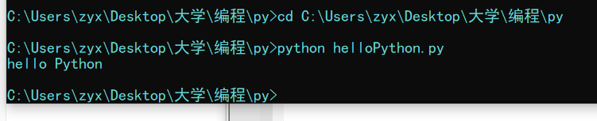

# Python简介

* `Python`是一门**简单直观**的语言
* **开源**
* 代码**像纯英语一样容易理解**
* 适用于**短期**开发的日常任务
* `Python`在解决相同问题时，**代码量相对较少**

## 解释器

* 编译器：计算机不能理解除了机器语言以外的语言，所以不同的编程语言都需要对应的**编译器**，将其他语言**翻译**成机器语言

  编译器翻译的方式有两种：一种是**编译**，另一种是**解释**。两种方式之间的区别在于**编译时间点的不同**，当编译器以解释方式进行的时候，也称之为解释器

* 编译型语言和解释型语言的区别

  * 编译型语言：编译型语言需要将一整块代码统一编译，一次性执行

    执行速度较快，在执行时没有翻译的操作

    对操作系统的兼容性较差

  * 解释型语言：解释型语言是逐行翻译，翻译一行执行一行

    执行速度较慢，在执行时需要有翻译的操作

    对操作系统的兼容性较强，只需要在不同的操作系统下安装不同的解释器

## Python的特点

* `Python`是**完全面向对象的语言**

  面向对象三大特点：封装、继承、多态

* `Python`**拥有一个强大的标准库**

* `Python`社区提供了大量的第三方模块，帮助程序员解决各种各样的问题

### Python的优缺点

* `Python`的优点
  * 简单、易学
  * 免费、开源
  * 面向对象
  * 封库的库
  * 可扩展性
    * 如果需要一段关键代码运行得更快或者希望某些算法不公开，可以把这部分程序用`C`或`C++`编写，然后再`Python`程序中使用它们
* `Python`的缺点
  * 运行速度慢
  * 国内时长较小
  * 中文资料匮乏

## 关于 Python 2.x 与 Python 3.x 版本简介

* `Python 2.x`默认**不支持中文**，`Python 3.x`**支持中文**
* 目前`Python`市场上有两个`Python`版本共存，分别是`Python 2.x`和`Python 3.x`
* `Python 2.x`的解释器名称为`python`
* `Python 3.x`的解释器名称为`python3`

> 新的Python程序建议使用`Python 3.x`

* `Python 2.x`是过去的版本
  * 解释器名称是**python**
* `Python 3.x`是现在和未来主流的版本
  * 解释器名称是**python3**
  * 相对于`Python`的早期版本，`Python3`做了较大的提升
  * `Python3`**不向下兼容**
* 为了照顾现有的程序，官方提供了一个过渡版本：**Python 2.6**
  * 基本使用了`Python 2.x`的语法和库
  * 同时考虑了向`Python 3.0`的迁移，允许使用**部分**`Python 3.0`的语法与函数
  * 2010年中推出的`Python 2.7`被锁定为最后一个`Python 2.x`版本

> Tips：如果开发时，无法立即使用Python 3.0（还有极少的第三方库不支持3.0的语法）

# 第一个Python程序：Hello Python

1. 在文件夹中新建后缀名为`.py`的文件
2. 使用编辑器在文件中输入`print("hello Python")`
3. 打开`cmd`控制台，将目录切换到存放了Python文件的文件夹中
4. 使用`python+文件名`即可运行，随后就会看到`hello python`的字样在控制台中输出

例：

## 关于BUG

* 什么是**BUG**？
  * 编写的程序不能正常执行，或者执行的结果不是我们所期望的程序，那么这个程序就存在**BUG**
* 可以通过执行`Python`程序以后，查看错误提示来帮助我们来调试程序（**Debug**）

# 交互式执行Python代码

* 在命令行中可以输入`python`或者`python3`来使用交互式执行`python`代码，这种方式常用于比较短的代码的验证和检验

  例：

  ```shell
  >python
  Python 3.9.7 (tags/v3.9.7:1016ef3, Aug 30 2021, 20:19:38) [MSC v.1929 64 bit (AMD64)] on win32
  Type "help", "copyright", "credits" or "license" for more information.
  >>>
  ```

  如以上情况，在`>>>`后面直接跟`python`代码就可以直接执行

* 退出解释器：`exit()`或热键`Ctrl+D`

## IPython

* `IPython`是一种交互式执行`python`代码的工具，它是一个`python`的交互式`shell`，比默认的`python shell`好用得多
  * 支持自动补全
  * 自动缩进
  * 支持`bash shell`命令
  * 内置了许多有用的功能和函数
* `IPython`是基于`BSD`开源的
* `IPython`可以通过在命令行中输入`ipython`或`ipython3`进入解释器

# Python的IDE——PyCharm

* 集成开发环境（`IDE`，`Integrated Development Environment`）——**继承了开发软件需要的所有工具**，一般包括以下工具
  * 图形用户界面
  * 代码编辑器（支持代码补全、自动缩进）
  * 编译器、解释器
  * 调试器
  * ……
* `PyCharm`介绍
  * `PyCharm`是`Python`的一款非常优秀的集成开发环境
  * `PyCharm`除了具有一般的`IDE`所必备的功能外，还可以在`Windows`、`Linux`、`macOS`下使用
  * `PyCharm`适合开发大型项目
    * 一个项目通常会包含**许多源文件**
    * 每个**源文件**的代码行数是有限的，通常在几百行之内
    * 每个**源文件**各司其职，共同完成复杂的业务功能


