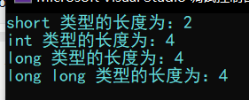
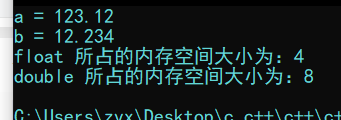

[TOC]

# c++的第一个程序

```c++
#include <iostream>
using namespace std;

int main() 
{
	cout << "hello world" << endl;

	system("pause");
	return 0;
}
```

# 变量

## 创建变量的语法

* 数据类型 变量名 = 变量初始化值；	例：`int a = 0;`

```c++
#include <iostream>
using namespace std;

int main()
{
	int a = 10;
	cout << "a = " << a << endl;

	return 0;
}
```

# 常量

## 宏常量

* #define 常量名 常量值;	例：`#define DAY 7`

## `const`修饰的变量

* `const` 变量类型 变量名 = 变量值；	例：`const int MONTH = 12;`

```c++
#include <iostream>
using namespace std;

// 定义一个宏常量
#define DAY 7

int main()
{
	// 定义一个const修饰的变量
	const int MONTH = 12;
	cout << "一周有：" << DAY << "天" << endl;
	cout << "一年有：" << MONTH << "月" << endl;
	return 0;
}
```

# 标识符

* 标识符不得与关键字相同
* 标识符只能由字母、下划线"`_`"、数字组成
* 第一个字符必须是字母或下划线
* 区分大小写

<font style="color:gray">Tips：在取名时，要尽量做到见名知意，避免`a = 123;`这种让人不能一下子知道它是什么的变量名</font>

# 数据类型

## sizeof关键字

* 作用：统计变量/变量类型所占的内存空间的大小
* 语法：`sizeof(变量名/变量类型)`

<font style="color:gray">Tips具体例子在具体使用时会体现</font>

## 整型

| 数据类型  |                          占用空间                          |
| :-------: | :--------------------------------------------------------: |
|   short   |                           2 byte                           |
|    int    |                           4 byte                           |
|   long    | windows下为4 byte，Linux中为4 byte（32位）或8 byte（64位） |
| long long |                           8 byte                           |

* 以下为测试c++中各整型的长度（利用`sizeof`关键字）

```c++
#include <iostream>
using namespace std;

int main()
{
	// 短整型
	short a = 0;
	// 整型
	int b = 0;
	// 长整型
	long c = 0;
	// 长长整型
	long d = 0;

	cout << "short 类型的长度为：" << sizeof(a) << endl;
	cout << "int 类型的长度为：" << sizeof(b) << endl;
	cout << "long 类型的长度为：" << sizeof(c) << endl;
	cout << "long long 类型的长度为：" << sizeof(d) << endl;

	return 0;
}
```




## 浮点型（实型）

* 浮点型可以用于表示小数

| 数据类型 | 占用空间 | 有效数字范围 |
| :------: | :------: | :----------: |
|  float   |  4 byte  |     7位      |
|  double  |  8 byte  |   15~16位    |

* 以下为c++中各浮点型的使用以及所占内存空间的测试

``` c++
#include <iostream>
using namespace std;

int main()
{
	// 单精度浮点型
	float a = 123.12;
	// 双精度浮点型
	double b = 12.234;

	cout << "a = " << a << endl;
	cout << "b = " << b << endl;
	cout << "float 所占的内存空间大小为：" << sizeof(float) << endl;
	cout << "double 所占的内存空间大小为：" << sizeof(double) << endl;

	return 0;
}
```



-----

后面部分跳过

-----

# 指针

- 指针是一个存放了地址的变量，我们可以通过指针间接访问内存

- 定义一个指针

  `数据类型 * 变量名 = &另一个变量a`（`&`为取址符号，用于获取变量`a`的地址）

- 解引用

  解引用的意思是解开指针对地址的引用，这里解开指取得该地址的值，格式如下

  `*变量名 = 值`

  例：

    ```c++
    // 定义一个指针并将a的地址赋值给它
    int a = 1243;
    int * p = &a;
    // 对指针进行解引用
    *p = 1234;
    cout << "*p = " << *p << endl
    ```

- 指针对内存的占用

  - 32位操作系统下，指针占用4个字节
  - 64位操作系统下，指针占用8个字节

### 空指针、野指针

- 空指针：指向内存中内存编号为0的空间的指针

  作用：初始化指针变量

  Tips：编号`0~255`的指针都是不允许访问的

- 野指针：指向内存中非法内存空间的指针

  一般来说，我们新建或者说定义一个变量的过程，就是向系统申请内存空间的过程，未经系统允许，我们是不允许随意操作系统中的内存的。所以如果我们将一个指针指向了一个未经允许的地址，那么这个指针就会被判定为野指针，并且系统会报错，不允许我们对该地址进行操作

## 常量和指针

`const`修饰指针的三种情况

- `const`修饰指针：常量指针

  **指针的指向可变，指向的值不可变**

  `const 数据类型 * 变量名 = &a;`

- `const`修饰常量：指针常量

  **指针的指向不可边，指向的值可变**

  `数据类型 * const 变量名 = &a;`

- `const`既修饰指针，又修饰常量

  **指针的指向和值都不可变**

  `const 数据类型 * const 变量名 = &a;`

## 指针和数组

- 数组：数组是一段连续的空间中存放的相同类型的数据元素

  数组名代表的就是数组的第一个元素的地址

  - 因此，我们只需要先将指针指向数组首地址：`int * p = arr;`

  - 然后每一次读取完元素以后让指针往后偏移**一个单位长度（如int类型往后偏移4个字节）**：`p ++;`

  - 然后再进行读取：`*p;`

    *那么依照以上步骤进行下去，指针就能把整个数组遍历完*

## 指针和函数

- 传值

  ```c++
  void swap(int a, int b)
  {
      a = a + b;
      b = a - b;
      a = a - b;
      cout << a << b << endl;
  }
  ```

  以上`swap`函数只是将传入的形参做了一个拷贝，交换的并不是真正的变量，而是原变量的**副本**，**这种传递方式为传值**

- 传引用

  ```c++
  void swap(int * a, int * b)
  {
      *a = *a + *b;
      *b = *a - *b;
      *a = *a - *b;
      cout << *a << *b << endl;
  }
  ```

  而以上`swap`函数则是将地址作为参数传进了函数体，操作的是我们真正想要交换的变量，**这种传递方式则为传引用**

# 结构体

结构体属于**用户自定义的数据类型**，允许用户存储不同的数据类型

## 结构体的定义和使用

- 结构体的定义

  `struct 结构体名{结构体成员};`

- 通过结构体创建变量的方式

  - `struct 结构体名 变量名;` 

  - `struct 结构体名 变量名 = {成员1, 成员2......};`

  - 在定义结构体的时候，就将变量创建好，后续可以直接调用

    ```c++
    // 定义结构体
    struct Student
    {
        // 成员列表
        string name;
        int age;
        float score;
    }stu3; // 创建结构体变量的第3种方式
    
    // 创建结构体变量的第1种方式
    struct stu1;
    // 创建结构体变量的第2种方式
    struct stu2 = {"abc", 12, 99};
    ```

    Tips：在结构体变量**创建**时，

- 访问结构体成员：`结构体名.成员名`

## 结构体数组

- 作用：将自定义的结构体存放到数组种方便维护

