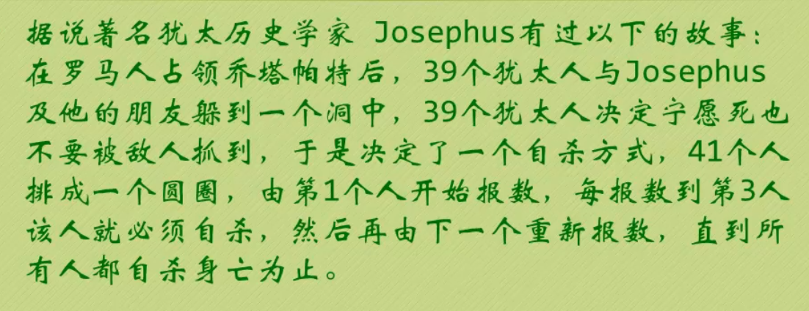

[TOC]
# 简单聊聊数据结构
  - ~~数据结构是一门研究非数值计算的程序设计问题中的操作对象，以及它们之间的关系和操作等相关问题的学科~~
    
    以上解释又臭又长，还难以理解，事实上，数据结构就是**数据元素相互之间存在的一种或多种特定关系的集合**
## 逻辑结构和物理结构
  - **逻辑结构：是指数据对象中数据元素之间的关系**
  - 物理结构：是指数据的逻辑结构在计算机中的储存形式

### 逻辑结构
  - 集合结构：同属于一个集合之中的数据元素之间的关系，且它们之间没有其它的关系
  - 线性结构：数据元素之间的关系是一对一的关系
  - 树形结构：数据元素之间存在一种一对多的**层次**关系
  - 图形结构：数据元素之间是多对多的关系
### 物理结构
  - 物理结构研究的就是数据元素是如何存储到计算机的存储器之中
    - 这里的*存储器*主要针对内存而言，像硬盘这样的外部存储器通常以**文件结构**来描述
  - 数据元素的存储结构形式有两种
    - 顺序存储
      
      顺序存储是把数据元素存放在地址连续的存储单元里，其数据之间的逻辑关系和物理关系是一致的，如数组
    - 链式存储
      
      把数据元素存放在任意的存储单元里，这些存储单元可以连续也可以不连续
      
      但这样的结构的存储关系不能反映它们的逻辑关系，那么就需要每一个元素用一个指针来存储数据元素的地址，这样就可以通过地址找到相关数据元素的位置
# 简单聊聊算法
  - ~~算法是解决特定问题求解步骤的描述，在计算机中表现为指令的有限序列，并且每条指令表示一个或多个操作~~

    算法是指给定的问题，用于解决该问题的方法，一般来说每个问题都有多种算法可以解决，一种算法也不可能解决所有问题

- 算法的**五个基本特征**

  - 输入：算法具有零个或多个输入
  - 输出：算法至少有一个或多个输出
  - 有穷性：算法在执行有限的步骤之后，自动结束而不会无限循环
  - 确定性
    - 算法的每一个步骤都确定的含义，不会出现二义性
    - 算法在一定条件下，只有一条执行路径，相同的输入只能有唯一的输出结果
    - 算法的每一个步骤都应该被精确定义而无歧义
  - 可行性：算法的每一步都必须是可行的，也就是说，每一步都能通过执行有限次数完成

- 算法设计的要求

  算法不是唯一的，也不是万能的，所以我们需要掌握一些好的算法，这样对我们解决问题是很有帮助的

  - 正确性：算法的正确性指算法至少应该具有输入、输出和加工处理无歧义性、能正确反映问题的需求、能够得到问题的正确答案

    大体分为以下四个层次

    - 算法程序没有语法错误
    - 算法程序对于合法输入能够产生满足要求的输出
    - 算法程序对于非法输入能够产生满足规格的说明
    - 算法程序对于故意刁难的测试输入都有 满足要求的输出结果

  - 可读性：算法设计的目的一方面是为了计算机执行，而另一方面则是方便人与人之间的交流，阅读以及自己修改

  - 健壮性：当输入数据不合法，算法也能做出相关处理，而不是产生异常、崩溃等莫名其妙的结果

  - 时间效率高和存储量低：好的算法应该兼具效率高，存储量占用低两方面优点

  

## 算法效率

- 算法的效率要尽可能高，执行速度快，才是一个好的算法

  一个算法的执行时间受到以下几点影响

  - 算法采用的策略和方案
  - 编译产生的代码质量
  - 问题的输入规模
  - 机器执行指令的速度

- 分析一个算法的运行时间时，重要的是把基本操作的数量和输入模式关联起来，而不关心程序所用的语言，运行环境等
- 经过一系列分析，最影响一个算法的速度的实际上是主项的阶数（即为最高次项的次数），并且不用判断主项的系数，它对主项影响很小

## 时间复杂度
  - 时间复杂度的定义：在进行算法分析时，语句总的执行次数`T(n)`是关于问题规模`n`的函数，进而分析`T(n)`随`n`的变化情况并确定`T(n)`的数量级
    
    算法的时间复杂度，也就是算法的时间量度，记作：`T(n) = O(f(n))`
    
    它表示随问题规模`n`的增大，**算法执行时间的增长率**和`f(n)`的增长率相同，称作算法的渐进时间复杂度，简称为**时间复杂度**（其中`f(n)`是问题规模`n`的某个函数）
    
    上述用大写`O(f(n))`来体现算法时间复杂度的算法，称为大O记法
    
    一般情况下，随着输入规模`n`的增大，`T(n)`的增长越慢，则算法越为优秀
### 分析时间复杂度
  分析时间复杂度，即推导大O阶的方法可以有以下攻略
  - 用常数1取代运行时间中的所有加法常数
  - 在修改后的运行次数函数中，只保留最高阶项
  - 如果最高阶项存在且不是1，则去除与这个项相乘的常数
    
    经过上述步骤以后，得到的最后结果就是大O阶
### 常见的几个时间复杂度

  - 常数阶：不存在循环，只有一系列一次操作的，时间复杂度为`O(1)`

  - 线性阶：一般含有**非嵌套循环**都是线性阶，线性阶就是随着问题规模`n`的扩大，计算次数呈直线增长，其时间复杂度为`O(n)`

  - 平方阶：两个循环嵌套时，外层循环执行一次，内层循环执行`n`次，则易知时间复杂度为`O(n)`，`n`个需要执行`m`次的循环嵌套时，则该循环的时间复杂度为**循环体的复杂度乘以循环的运行次数(O($m^n$))**

  - 对数阶：设循环的次数为`x`，当循环的次数`x`满足 $2^x = n$ 时，会出现 $x = log_2 n的结果，则该循环的时间复杂度为`O(log n)`

    常见的时间复杂度所耗时间从小到大依次是
    $$
    O(1) < O(\log n) < O(n) < O(n\log n) < O(n^2) < O(n^3) < O(2^n) < O(n!) < O(n^n)
    $$


### 最坏情况和平均情况

- 平均运行时间：平均运行时间是期望的运行时间

- 最坏运行时间是一种保证。

  在应用中，这是一种最重要的需求，通常除非特别指定，我们提到的运行时间都是最坏情况的运行时间

## 空间复杂度

- 空间复杂度的计算

  $S(n) = O(f(n))$，其中`n`为问题的规模，`f(n)`为语句关于`n`所占储存空间的函数

  Tips：一般来说，直接问**复杂度**时，默认指代时间复杂度

# 线性表

- 线性表（`List`）：由**零个或多个**数据元素组成的有限序列

  线性表具有线一样性质的结构

- 线性表的特性

  - 线性表是一个**序列**，也就是说元素之间有先来后到的区别

  - 线性表若存在多个元素，则**第一个元素无前驱**，**最后一个元素无后继**

    **其他元素有且只有一个前驱和一个后继**

  - 线性表是**有限**的

- 若将线性表记为：$(a_1, a_2, \cdots \cdots, a_{i-1}, a_{i}, a_{i+1}, \cdots\cdots, a_n)$

  则 $a_{i-1}$ 为 $a_{i}$ 的**直接前驱元素**，$a_{i+1}$为$a_i$的**直接后继元素**

- 线性表的元素个数`n`又称为线性表的长度，当线性表的长度为 0 时，则该线性表为空表

## 抽象数据类型

- 抽象：抽取出事物具有的普遍性的本质，它要求抽取出问题的特征而忽略本质的细节

- 数据类型：数据类型是指**一组性质相同的值的集合**以及**定义在此集合上的一些操作**的总称

  数据类型是用于在不同场景下，为数据划分不同大小的内存空间而设定的，如：

  - 当我们需要一个整数时，那我们只需要一个整形（4个字节）

  - 当我们需要一个`bool`类型时，我们需要一个`bool`型（1个字节）

    ……

    因此可以看出，数据类型是为了节省内存，根据不同的数据类型划分**需要的**内存而诞生的

- 数据类型的种类

  - 原子类型：不可再分的基本类型——基本数据类型，如`int, float......`
  - 结构类型：又若干个类型组合而成，是可以再分解的，如：整型数组可再分为若干个整形

- 抽象数据类型`(Abstract Data Type, 简称ADT)`
  抽象数据类型指的是一个数学模型及定义在该模型上的一组操作

  抽象数据类型的定义仅取决于它的一组逻辑特性，与其在计算机内部如何表示和实现无关

- 抽象数据类型的描述标准格式：

  ```
  ADT 抽象数据类型名
  Data
  	数据元素之间逻辑关系的定义
  Operation
  	操作
  endADT
  ```
##  线性表的抽象类型定义

  - 定义
    - ADT 

      线性表(List)
      
    - Data

      线性表的数据对象集合为{a1, a2,...,an}，每个元素的类型均为DataType。其中，除第一个元素a1外，每一个元素有且只有一个直接前驱元素，除了最后一个元素an外，每个元素有且只有一个直接后继元素。数据元素之间的关系是一对一的关系
    
    - Operation
      
      - `InitList(*L)`：初始化操作，建立一个空的线性表
      - `ListEmpty(L)`：判断线性表是否为空，若线性表为空，返回`true`，否则返回`false`
      - `ClearList(*L)`：将线性表清空
      - `GetElem(L, i, *e)`：将线性表`L`中的第`i`个位置元素值返回给`e`
      - `LocateElem(L, e)`：在线性表`L`中查找与给定值`e`相等的元素，如果查找成功，返回该元素在表中的索引表示查找成功；否则返回0表示失败
      - `ListInsert(*L, i, e)`：在线性表`L`中第`i`个位置插入新元素`e`
      - `ListDelete(*L, i, *e)`：删除线性表`L`中第`i`个位置元素，并用`e`返回其值
      - `ListLength(L)`：返回线性表`L`的元素个数
    - endADT
    - 对于不同的应用，线性表的基本操作不同，上述操作都是基本操作。实际问题中，我们可以根据实际需求通过组合上述操作，完成较复杂的操作
      
      如：实现`A`、`B`两个表的并集操作
      
      要求`A`和`B`的并集，把B中不存在的元素插入A中即可
## 顺序存储结构
  - 顺序存储结构指用一段地址连续的存储单元依次存储线性表的数据元素，例：数组
  - 顺序存储结构事实上就是在内存中找个初始地址（数组首个元素的地址），然后通过占位的形式，把一定的内存空间给占了，然后把相同数据类型的数据元素依次放在这块空间中
  - 顺序存储结构封装需要三个属性
    - 存储空间的起始位置，数组`data`，它的存储位置就是线性表存储空间的存储位置
    - 线性表的最大存储容量：数组的长度`MaxSize`
    - 线性表的当前长度：`length`
  - 线性表的地址计算方法
    - 线性表的地址定义方法和数组不同，线性表的初始索引是从1开始的
    
    - 假设`ElemTypes`占用的是`c`个存储单元，那么$LOC(a_{i+1}) = LOC(a_i) + c$（`LOC`指储存位置） 
      
      通过上述公式，我们可以随时计算出线性表任意一个位置的地址，所以他的储存时间性能就是$O(1)$，这种结构我们通常称之为随机存储结构
      
      

### 顺序存储结构相关操作

- 读取操作
  1. 如果索引不合理，则抛出异常
  2. 根据索引快速定位到线性表的位置
  3. 获取元素

- 插入操作
  1. 如果插入位置不合理，则抛出异常
  2. 如果线性表长度大于或等于数组长度，则抛出异常，或动态扩容
  3. 将线性表从最后一个元素开始遍历到待插入元素的位置，分别将它们向后移动一个位置
- 删除操作
  1. 如果删除位置不合理，则抛出异常
  2. 取出并删除元素
  3. 从删除元素位置开始遍历到最后一个元素，将它们都向前移动一个位置
  4. 表长`-1`

由上述操作容易知道，查询操作比较迅速，时间复杂度为 $O(1)$ ；但增删操作较复杂，时间复杂度为 $O(n)$

### 顺序存储结构的优缺点

优点：

- 无需为表中的元素之间的逻辑关系而增加额外的存储空间
- 可以快速地定位表中任意位置的元素

缺点：

- 插入和删除需要移动大量的元素
- 线性表长度不一定时，难以确定空间的容量
- 容易造成存储空间的浪费

## 链式存储结构

- 链式存储结构是利用一组任意在内存中未使用的存储单元存储线性表的数据元素，除数据元素之外，每一组元素还需要一个位置存储下一个元素的地址（即指针）

  我们把存放数据和地址的两个部分分别称为**数据域**和**指针域**，指针域中存放的信息称为指针或链。这两部分组成的数据元素被称为存储映像，又称为**结点（Node）**

- `n`个结点连接称为一个**链表**，即为**线性表的链式存储结构**

  上述链表中每个结点只包含一个指针域，所以叫做**单链表**

- 对于链表来说，由于最后一个结点没有下一个结点，所以该结点的指针指向空（`NULL`），而第一个结点的存储位置称为**头指针**，若该链表存在**头结点**，则头指针指向头结点

  关于开始结点、头结点、头指针的一些区别

  - 开始结点：

  	- 链表中的**第一个结点**，它没有直接前驱

  - 头指针：

  	- **指向开始结点的指针**（有头结点时头指针指向头结点）

  	- **一个单链表可以由其头指针唯一确定**，一般用其头指针来命名单链表

  	- 不论链表是否为空，头指针总是非空

  - 头结点：

  	- **在链表的开始结点之前附加的一个结点**。不是链表的必须要素。

  	- **有了头结点之后头指针指向头结点**，而且头结点的设置使得对链表的第一个位置上的操作与在表中其它位置上的操作一致

  - 注:

  	- **单链表的头指针指向头结点**
  - **头结点的指针域存储指向第一结点的指针**（即第一个元素结点的存储位置）
  	- **头结点的数据域可以不存储任何信息**，也可以存储如线性表的长度等类的附加信息
  - 若线性表为空表，则头结点的指针域为空
  
- 链表的核心为**工作指针后移**

### 链式存储结构相关操作

- 获得链表第`i`个元素的算法思路
  1. 声明一个结点`p`指向第一个结点，初始化`j`从`1`开始
  2. 当`j < i`时，遍历链表，让`p`不断指向下一个结点，并且每一次循环`j++`
  3. 当`j == i`时，返回结点`p`的数据
  4. 若到链表末尾（即`p`为`NULL`）则说明该链表不存在第`i`个元素
- 单链表第`i`个数据插入结点的算法思路
  1. 声明一个结点`p`指向链表头结点，初始化`j`从`1`开始
  2. 当`j < 1`时，就遍历链表，让`p`不断指向下一结点，每轮循环`j++`
  3. 若到链表末尾`p`为空，则说明第`i`个元素不存在
  4. 否则查找成功，并且在系统中生成一个空结点`s`
  5. 将待插入的数据赋值给`s`的数据域中
  6. 让`s`的下一结点指向当前`p`的下一结点
  7. 再让`p`的下一结点指向`s`
  8. 返回成功
- 单链表删除第`i`个结点的算法思路
  1. 声明结点`p`指向链表第一个结点，初始化`j`从`1`开始
  2. 当`j < 1`时，就遍历链表，让`p`不断指向下一个结点，每轮循环`j++`
  3. 若到链表末尾`p`为空，则说明第`i`个元素不存在
  4. 否则查找成功，**将`p`的下一结点指向当前下一结点的下一结点**
  5. 将`p`的下一结点的数据返回，并释放该结点

由上述操作易知，链表的查询较慢，时间复杂度为$O(n)$，插入和删除的时间复杂度也是$O(n)$，但在进行多次插入和删除时，链表的效率会比顺序表更高效一些

### 链式存储结构的优缺点

优点：

- 在进行插入删除比较频繁的操作时，效率较高
- 内存空间是任意分配的，不存在浪费

缺点：

- 每一个结点都需要多出一个空间存放一个指针
- 相对顺序表来说，链表的查询较慢，需要不断往下找第`n`个元素

### 单链表的整表创建

头插法

- 声明一个结点`p`和计数器变量`i`

- 初始化一个空链表`L`

- 让`L`的头结点指向`Null`，即建立一个带头结点的单链表

- 循环实现后继节点的赋值和插入

  1. 让新节点的`next`指向头结点的`next`
  2. 然后用头结点的`next`指向新节点

  Tips：这种方法创建的单链表是倒叙的，即若我们给出的元素集为`"abcd"`，到单链表中的顺序会变成`dcba`

尾插法

- 声明两个结点`p、q`和计数器变量`i`（`p`指向新节点，`q`指向上一结点）
- 初始化一个空链表`L`
- 让`L`的头结点指向`p`，即建立一个带头结点的单链表
- 循环实现后继节点的赋值和插入
  1. 让`q`指向的结点指向`p`
  2. 让`q`指向`p`
  3. `p`去创建下一结点

### 单链表的整表删除

当一个链表我们不需要再使用它时，可以**整表删除**，即在内存空间中释放掉它，以便于将空间留出来给其他程序或软件使用

思路

- 声明结点`p`和`q`
- 将第一个结点赋值给`p`，下一结点赋值给`q`
- 循环执行释放操作
  1. 释放`p`
  2. 将`p`指向`q`
  3. `q`指向下一结点

### 静态链表

  - 在以前没有像`C`、`Java`这类高级语言的时候，那个时候的人们是没有指针这个概念的，那么没有指针怎么操作一个链表呢？此时，他们想到了利用数组来描述一个链表，这种以数组为基础的链表被称为静态链表，而这种实现的方法被称为游标实现法
  
    Tips：
    - 利用一个数组存储一个结构体，结构体中存放有元素和游标，则可以通过游标指向数组的索引来定位到每一个元素（默认情况下数组的首尾结点不存放元素，而是用于存放该链表的一些信息，如数组首个结点（**是数组索引的第一号元素，不是头结点**）用于存放数组中第一个没有数据的元素索引（即链表主体后紧跟着的元素），数组的最后一个结点（`array[maxSize - 1]`）用于存放数组的头结点的位置）

    - 未使用的数组元素被称为备用链表
  - 静态链表的插入和删除操作需要模拟动态链表中动态申请内存空间的操作，则需要自行实现`free`和`malloc`两个函数
    
    而为了辨明哪些数组中哪些元素是未被使用的，我们应该把所有未被使用的结点连成一个备用链表，在需要的时候在备用链表中提取元素即可
    
  - 静态链表的插入
    
    1. 在未使用的备用链表中抽取第一个结点，并将第一个元素的游标后移
    2. 在取得的结点中存放需要插入的数据，并将该结点的游标指向插入位置的下一个结点
    3. 将上一个结点的游标指向该结点

  - 静态链表的删除

    1. 将需要删除的结点的上一个元素的游标指向该结点所指向的元素
    2. 删除该结点的结点内容，并将该结点的游标指向数组第一个元素指向的结点（即第一个没有存放内容的结点）
    3. 将数组第一个元素的结点的游标指向该元素的结点，则此时该结点又连回了备用链表

  - 静态链表的优缺点
    
    优点
    - 在插入和删除操作时，只需要修改游标，而不需要移动元素，从而改进了在顺序存储结构中的插入和删除操作需要移动大量元素的缺点
    
    缺点
    - 不能解决连续存储结构表长难以确定的问题
    - 失去了顺序存储结构随机存取的特性

  - 总结：
    - 静态链表是为了给没有指针的编程语言设计的一种实现单链表的方式
    - 尽管我们平时不需要使用它，但也要理解它的思考方式，以备不时之需

### 循环链表

  原本的单链表是不可逆的，这导致我们如果不从头结点出发就无法访问到所有的结点。所以为了避免这个情况，我们可以将终端结点`real`的指针由空指针改为指向头结点`head`就可以了，那么这种链表被称为循环链表

  - 将单链表中终端结点的指针指向头结点的环状链表被称为单循环链表

    Tips
    - 循环链表不一定要有头结点
    - 循环链表的判空条件为`head`指向`head`，即`head.next -> head`

- 循环链表的特点：无需增加存储量，仅对**链接方式稍作改变，即可使得表的处理方式更加的灵活**

  例如：

  由于循环链表的环状结构，我们可以抛弃头指针的概念，而改用尾指针指向的终端结点的指向代表头结点（`head == real -> next -> next`），这样不论是寻找头结点还是终端结点，其复杂度都会至降$O(1)$

  这样修改以后，就可以用`real == real -> next`是否成立作为链表是否为空的判据

  - **单链表和循环链表的比较**：将两个线性表 $(a_1,a_2,\dots,a_n)$ 和 $(b_1,b_2,\dots,b_n)$ 连接成 $(a_1,a_2,\dots,a_n,b_1,b_2,\dots,b_n)$

    - <font color="lightblue">单链表：我们需要遍历第一个链表，将它的尾结点指向另一个链表头结点指向的结点，无论如何时间复杂度至少为$O(n)$</font>

    - <font color="lightblue">循环链表：由于循环链表我们使用尾结点来定位一个链表，它的头结点即为`real -> next`，所以只要将一个链表的尾结点指向另一个链表的尾结点所指向结点的指向，再将另一个链表的尾结点指向的结点指向该链表的头结点，就完成了两个链表的连接，其复杂度为$O(1)$</font>

        例：

        ```c++
        // 第一个链表的尾结点：real_1
        // 第二个链表的尾结点：real_2
        void catTwoList()
        {
            // 存储list_1的头结点
            Node * temp = real_1 -> next;
            // 将list_1的尾结点指向list_2的头结点
            real_1 -> next = real_2 -> next;
            // 将list_2的尾结点指向list_1的头结点
            real_2 -> next = temp;
            // 释放list_1的尾结点
            delete real_1;
        }
        ```


#### 循环链表的特点

由于循环链表可以从尾指针指向头结点，那么我们可以不取头指针，只采用一个尾指针

那么这么做有什么好处？

- 普通的单链表只有头指针，那么想要获取到终端结点就需要从头指针指向的结点一直访问下一结点，直到下一结点为空，则指向了终端结点

  这么做的话我们访问终端结点的复杂度为$O(n)$，复杂度较高，那么如果我们利用循环链表的特性呢？

- 我们只需要一个尾指针`rear`指向终端结点，然后获取头结点只需要指向终端结点的下一结点，并且可以直接获取到终端结点，复杂度降低到了$O(1)$

  所以，需要频繁获取头尾两个结点的链表，我们更倾向于使用循环链表

### 链表题

  - 如何快速找到未知长度的单链表的中间结点

    - <font color="lightblue">普通方法：先遍历一次单链表，以确定表长L，第二次从头结点出发循环L/2次的时候就能找到单链表的中间结点（$O(\frac{3L}{2})$）</font>
    - <font color="lightblue">快慢指针：设置两个指针，其中，一个指针往下一个结点移动时，另一个结点后移两个结点，则在快指针抵达结点末尾时，较慢的指针正好指向链表的中间结点</font>

  - 约瑟夫问题

    

    但`Josephus`和他的朋友并不想遵从，于是他们安排到了第16和第31个位置，逃过了这场死亡游戏

    - <font color="lightblue">模拟思路：构建一个**循环链表**，链表记录了每个人的序号，循环指向下一结点，每三次循环就删除一个结点（自杀）并打印序号，最终当链表为空（尾指针指向头结点）时结束循环并打印序号</font>

    进阶：序号为`1~N`的`N`个 人按顺时针围坐一圈，每个人手里持有一个密码，（正整数，可以自由输入），开始人选择一个正整数`M`，然后从`1`开始报数，当报到`M`时，报`M`的人出列，然后将他的密码作为新的`M`值按顺序报数，他的下一个人作为`M`进行报数，直到所有人出列

## 链表和顺序表的优缺点比较

- 存储分配

  - 顺序表用一段连续的存储单元一次存储线性表中的单元
  - 链表采用链式存储结构，用一组任意的存储单元存放线性表的元素

- 时间性能

  查找数据

  - 顺序表：$O(1)$
  - 链表：$O(n)$

  更新数据

  - 顺序表需要平均移动表长一半的元素，时间为 $O(n)$ 
  - 链表只要计算出某位置的指针后（该过程为 $O(n)$ ），插入和删除时间仅为 $O(1)$ 

- 空间性能

  - 顺序表需要预分配存储空间，分大了容易造成空间浪费；分小了容易发生溢出
  - 链表不需要分配存储空间，存储空间的分配是十分灵活的，元素个数也是随需求而变

综上，关于线性表的使用，我们可以总结出以下几条

- 若线性表需要**频繁查找，较少更新**，则宜使用顺序存储结构
- 若线性表需要**频繁更新**，则宜使用链式存储结构
- 若线性表中的**元素个数不确定或变化较大**时，最好使用链式存储结构，这样可以不需要考虑存储空间的问题
- 若线性表的**长度稳定且已知**，则使用顺序存储结构，会显著提高执行效率

