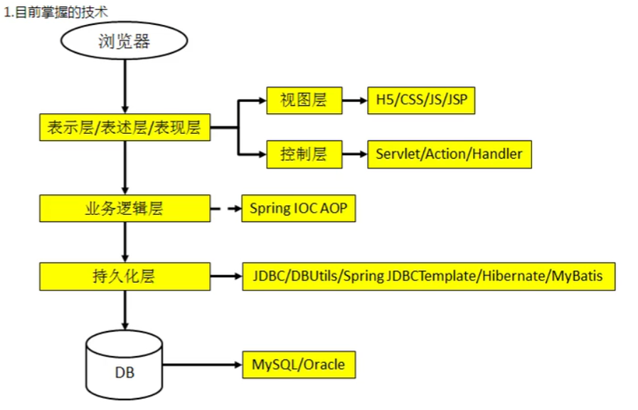

[TOC]

# 技术结构



# 目前的开发存在的主要问题

* 一个项目就是一个工程
  * 当一个项目比较庞大，就不再适合用`package`来划分模块，最好一个模块对应一个工程，利于分工协作
  * **利用`Maven`可以将一个项目拆分成多个工程**
* 项目中的`jar`包需要手动去“复制”，“粘贴”到`WEB-INF/lib`目录下
  * 同样的`jar`包重复出现在不同的项目工程中，浪费存储空间，也让工程比较臃肿
  * **利用`Maven`可以把`jar`包存储在仓库中，需要的工程引用这个jar包即可，不需要真正复制过来**
* `jar`包需要别人替我们准备好，或者自己到官网下载
  * 不同技术的官网提供的`jar`包下载的形式是五花八门的
  * 有些技术的官网是通过`Maven`或`svn`等专门工具来提供下载的
  * 如果以不规范的方式下载的`jar`包，其中的内容很可能是不规范的
  * **借助`Maven`可以以一种规范的方式下载`jar`包，因为所有知名的框架或者第三方工具的`jar`包按照一定的规范放在了`Maven`的中央仓库中，以`Maven`的方式下载`jar`包，获取的内容也一定是可靠的**
* 一个`jar`包依赖的其他`jar`包需要自己手动加入到项目中
  * 一个技术需要的`jar`包很可能需要依赖多个其他`jar`包，如果所有的技术的`jar`包的依赖关系都需要程序员来学习并清楚知道，将极大的提高程序员的学习成本，不利于开发
  * **而`Maven`会自动将被依赖的`jar`包导入进来，简化开发**

# 什么是Maven

* `Maven`是一款服务于**`Java`**平台的自动化构建工具

  ​		`Make`-->`Ant`-->`Maven`-->`Gradle`

* 构建是什么

  * 以**`Java`源文件**、**框架配置文件**、**`JSP`**、**`HTML`**、**图片**等资源为*原材料*，去**生产**一个可以运行的项目的过程
    * 编译
      * `Java`源文件-->编译-->`Class`字节码文件-->交给`jvm`执行
    * 部署
      * 一个`B/S`项目最终运行的并不是动态`Web`工程本身，而是这个工程经过编译后的结果
      * 动态`Web`工程-->编译、部署-->编译结果
    * 搭建

* 构建过程中的各个环节
  1. 清理：将以前编译得到的旧的`class`字节码文件删除，为下一次编译做准备
  2. 编译：将`Java`源程序编译成`class`字节码文件
  3. 测试：`Maven`自动调用`JUnit`程序自动测试
  4. 报告：测试程序执行的结果
  5. 打包：动态`Web`工程打`war`包，`Java`工程打`jar`包
  6. 安装：**`Maven`特定的概念**——将打包得到的文件复制到“仓库”中的指定位置
  7. 部署：将动态`Web`工程生成的`war`包复制到`Servlet`容器的指定目录下，使其可以运行

* 利用`Maven`可以实现**自动化构建**

# Maven核心程序的安装

* 配置`JAVA_HOME`环境变量
* `Maven`核心程序，路径需要非中文、无空格
* 配置`Maven`相关的环境变量
  * `MAVEN_HOME`或者`M2_HOME`
  * `path`

* 验证配置是否完成
  * 在`cmd`窗口中运行`mvn -v`查看`Maven`的版本，如成功查询出`Maven`的版本，则配置成功

# Maven的核心概念

* **目录结构**
  * 根目录：工程名
  * `src`目录：源码
  * `pom.xml`文件：`Maven`工程的核心配置文件
  * `main`目录：存放主程序
  * `test`目录：存放测试程序
  * `Java`目录：存放Java源文件
  * `resources`目录：存放框架或其他工具的配置文件

**只有遵守`Maven`约定的目录结构，`Maven`才能正确获取到`Java`的源文件的准确路径**

**如果有自定义的目录或文件需要让框架或工具知道，还可以以配置文件的形式告诉框架你要求的目录或文件或遵守框架内部已经存在的约定**

*Tips：**约定>配置>编码***

* **`POM`**
* **坐标**
* ***依赖***
* 仓库
* 生命周期/插件/目标
* 继承
* 聚合

## POM

* `Project Object Model`：项目对象模型

### pom.xml

* `pom.xml`对于`Maven`工程是核心配置文件，与构建过程相关的一切设置都在这个文件中进行设置。

  **其重要程度相当于`web.xml`对于动态`Web`工程**

## 坐标

* `Maven`坐标可以用于唯一定位一个`Maven`工程

  格式：

  ```xml
  <!--公司或组织的域名倒序 + 项目名-->
  <!--这里以zyx.com和McDonald这个工程举例-->
  <groupid>com.zyx.McDonald</groupid>
  <!--模块名-->
  <artifactid>abc</artifactid>
  <!--版本-->
  <version>1.0.0</version>
  ```

* `Maven`仓库中的坐标和路径是**一致**的

  如上述例子在仓库中的路径为：`com/zyx/McDonald/abc/1.0.0/abc-1.0.0`

## 仓库

* 仓库的分类
  * 本地仓库：为当前本机电脑中的所有`Maven`工程提供服务
  * 远程仓库
    * 私服（`Nexus`）：搭建在局域网范围内，为局域网内所有`Maven`工程服务
    * 中央仓库：架设在`Internet`上，为全世界所有的`Maven`工程提供服务
    * 中央仓库镜像：假设在各个大洲，为中央仓库分担流量，减轻中央仓库的压力，同时可以更快的响应用户的请求
* 仓库的内容：`Maven`工程
  * `Maven`自身所需要的插件
  * 第三方框架或工具的`jar`包
  * 我们自己开发的`Maven`工程

## 依赖

* `Maven`解析依赖信息时会到本地仓库中查找被依赖的`jar`包

  ​		对于我们自己开发的`Maven`工程，使用`mvn install`命令安装后就可以装载到仓库中

* 在`pom.xml`中，依赖的配置信息格式如下：

```xml 
<dependencies>
    <dependency>
        <groupid>com.zyx.McDonald</groupid>
		<artifactid>abc</artifactid>
		<version>1.0.0-SNAPSHOT</version>
        <!-- 依赖的范围 -->
        <scope>compile</scope>
    </dependency>
</dependencies>
```


### 依赖的范围

* 依赖的范围我们需要从三个方面去了解：
  * 对主程序是否有效
  * 对测试程序是否有效
  * 是否参与打包
  * 是否参与部署

----

`Maven`依赖的常用范围主要有以下三种：

* `compile`

  * 对主程序有效
  * 对测试程序有效
  * 参与打包
  * 参与部署

* `test`

  * 对主程序无效
  * 对测试程序有效
  * 不参与打包
  * 不参与部署

* `provided`

  * 对主程序有效
  * 对测试程序有效
  * 不参与打包
  * 不参与部署

  *一般是服务器容器可以提供的`jar`包，如：`servlet-api.jar`*

### 依赖的传递性

* 依赖可以传递，即依赖不必在每个模块工程中重复生命，在**需要的工程**中**依赖一次**即可
* 非`compile`范围依赖不能传递，如需要就要重复声明

### 依赖的排除

* 当一个工程依赖与另一个工程，但又不希望被依赖的工程中的某一个依赖加入当前工程时，则需要使用依赖的排除，例如：

  当我们工程依赖于`spring-core`时，由于依赖的传递性，`commons-logging`会自动被当前工程所依赖。那么如果我们不希望`commons-logging`被当前工程所依赖，就需要用到依赖的排除

* 依赖的排除的设置方式

  在当前工程的`pom.xml`中添加以下配置信息

  ```xml
  <exclusions>
      <exclusion>
          <groupId>commons-logging</groupId>
          <artifactId>commons-logging</artifactId>
      </exclusion>
  </exclusions>
  ```

### 依赖的原则

* 依赖的原则用于解决模块工程之间的`jar`包的冲突问题
* **验证路径最短者优先**：当工程中依赖的另一个工程中还存在一层依赖，并且这层依赖的`jar`包由于依赖的传递和这一工程的`jar`包存在冲突，则优先依赖路径更短的`jar`包
* **路径先声明者优先**：当`jar`发生冲突，且路径长短相同时，则根据在`pom.xml`中依赖的先后顺序，先声明的依赖优先

### 依赖的版本

* 如果需要对某一组`jar`包的依赖版本进行升级，则需要用到依赖的版本统一升级，防止手动逐一修改导致的遗漏

* 配置方式

  * 使用`properties`标签内的自定义标签统一声明版本号

  * 在需要统一版本的位置，使用`${自定义标签名}`引用声明的版本号，例：

    ```xml
    <!-- 统一版本号的定义 -->
    <properties>
    	<自定义标签名>统一的版本号</自定义标签名>
    </properties>
    <!-- 同一版本号的引用 -->
    <dependency>
            <groupid>com.zyx.McDonald</groupid>
    		<artifactid>abc</artifactid>
    		<version>${自定义标签名}</version>
            <!-- 依赖的范围 -->
            <scope>compile</scope>
    </dependency>
    ```

* 事实上，`properties`标签配合自定义标签声明数据的配置形式并不是只适用于`jar`包的版本号的引用，所有在`pom.xml`中需要统一声明数据的地方都可以用这个方法

## 生命周期

* 各个构建环节的执行顺序：不能打乱顺序，必须按照既定的顺序来执行
* `Maven`的核心程序中定义了抽象的生命周期，生命周期中各个阶段的具体任务是由插件来完成的
* `Maven`核心程序为了更好的实现自动化构建，不论现在要执行生命周期的哪一阶段，都需要从这个生命周期最初的位置开始执行

## 插件和目标

* 生命周期的各个阶段仅仅定义了要执行的任务是什么，各个阶段和插件的目标是对应的，相似的目标有特定的插件来完成

例：

|  生命周期阶段  |   插件目标    |          插件           |
| :------------: | :-----------: | :---------------------: |
|   `compile`    |   `compile`   | `maven-compiler-plugin` |
| `test-compile` | `testCompile` | `maven-compiler-plugin` |

## 继承

* 由于部分依赖的范围是无法传递的，所以分散在各个模块工程中的依赖信息很容易出现版本不一致的情况，那么这时我们就需要用到`Maven`的继承

* 操作步骤（以统一管理`junit`为例）

  1. 创建一个Maven工程作为**父**工程*（Tips：打包的方式为`pom`）*

     例：

     ```xml
     <!-- 父工程的坐标信息 -->
     <groupId>com.atguigu.maven</groupId>
     <artifactId>Parent</artifactId>
     <version>0.0.1-SNAPSHOT</version>
     <packaging>pom</packaging>
     ```

  2. 在**子**工程中声明对**父**工程的引用

     例：

     ```xml
     <!-- 子工程对父工程的声明 -->
     <parent>
     	<groupId>com.atguigu.maven</groupId>
     	<artifactId>Parent</artifactId>
     	<version>0.0.1-SNAPSHOT</version>
     	<!-- 
     		以当前工程的pom.xml为基准的的父工程的pom.xml的相对路径
     	 -->
         <relativePath>../Parent/pom.xml</relativePath>
     </parent>
     ```

  3. 在子工程的坐标中与父工程**重复**的部分删除（重复的`groupId`）

  4. 在父工程中统一`junit`的依赖

     ```xml
     <!-- 配置依赖的管理 -->
     <dependencyManagement>
     	<dependencies>
         	<dependency>
             	<groupId>junit</groupId>
                 <artifactId>junit</artifactId>
                 <version>4.0</version>
                 <scope>test</scope>
             </dependency>
         </dependencies>
     </dependencyManagement>
     ```

  5. 在子工程中删除`junit`依赖的版本号信息

     *Tips：如果确定子工程中的`junit`版本确实要与父工程不一致，那么可以保留子工程中的版本信息*

* Tips：配置了继承关系后，安装需要先安装父工程，再安装子工程

## 聚合

* 可以一键安装各个模块工程，不需要一个个工程去安装，简化开发

* 配置方式：在一个**总的聚合工程**中配置各个参与聚合的模块

  ```xml
  <!-- 配置聚合 -->
  <modules>
      <!-- 指定各个子工程的相对路径 -->
  	<module>...</module>
     	<module>...</module>
     	<module>...</module>
  </modules>
  ```

* 在需要安装时，在**聚合工程**中`install`即可

# Maven的联网

* 由于`Maven`的核心程序中仅仅定义了抽象的声明周期，具体的工作必须有特定的插件来完成，而插件本身并不存在于`Maven`的核心程序中，所以，当我们使用`Maven`命令来使用这些插件时，`Maven`核心程序会先到本地仓库中查找。

  *本地仓库的默认位置：当前用户的 `Home` 目录：`\.m2\repository`*

  若`Maven`在本地仓库中找不到需要的插件，那么`Maven`会**自动连接外网**到`Maven`中央仓库下载，若联网失败，则构建失败

* 我们可以通过修改`Maven`默认的本地仓库路径，来让`Maven`核心程序找到我们所需要的插件

  * 找到`Maven解压目录\conf\settings.xml`
  * 将`<localRepository>...</localRepository>`标签体中的目录修改为我们需要`Maven`去识别的默认本地仓库

# Maven的常用命令

* **执行与构建过程相关的`Maven`命令，必须进入`pom.xml`所在的目录**

  ​			与构建相关：编译、测试、打包……

* `Maven`常用命令

  * `mvn clean`：清理程序
  * `mvn compile`：编译主程序
  * `mvn test-compile`：编译测试程序
  * `mvn test`：执行测试程序
  * `mvn package`：打包
  * `mvn install`：安装
  * `mvn site`：生成站点

# Maven插件的设置

* `installations/MavenHomePath`：指定`Maven`核心程序的位置，不建议使用IDE自带的Maven程序，而应该使用我们自己到官网下载解压的核心程序

* `user setting(file)`：指定`conf/setting.xml`的位置，进而获取本地仓库的位置

  ​		直接设置成核心程序目录下的`conf/setting.xml`即可

# 导入Maven工程

* 目录下存在`pom.xml`的工程，会被识别为`Maven`工程，在导入过一次以后，IDE会给工程添加IDE所需的配置文件，那么以后导入直接导入普通工程即可
  

