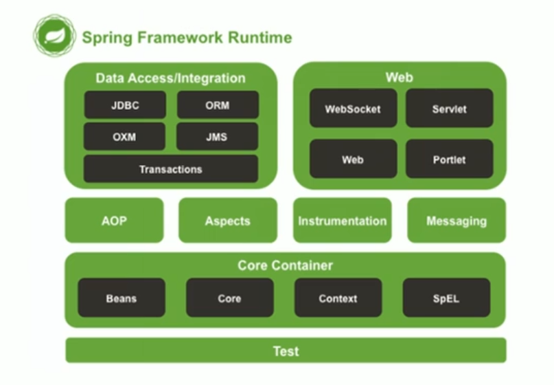
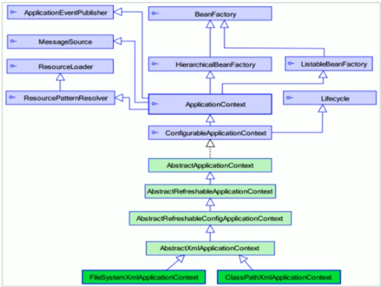

[TOC]

# Spring简介

## Spring是什么？

**Spring**是分层的`Java SE/EE`应用`full-stack`轻量级开源框架，以**Ioc**（`Inverse Of Control`：反转控制）和**AOP**（`Aspect Oriented Programming`：面向切面编程）为内核

提供了展现层**SpringMVC**和持久层**Spring JDBCTemplate**以及业务层事务管理等众多的企业级应用技术，还能整合开源世界众多著名的第三方框架和类库，逐渐成为使用最多的`Java EE`企业应用开源框架

## Spring的优势

* **方便解耦，简化开发**

  通过`Spring`提供的`Ioc`容器，可以将对象间的依赖关系交由`Spring`进行控制，避免硬编码所造成的过渡耦合。

  用户也不必再为单例模式类、属性文件解析等这些很底层的需求编写代码，可以更专注与上层的应用

* AOP编程的支持

  通过`Spring`的`AOP`功能，方便进行面向切面编程，许多不容易用传统`OOP`实现的功能可以通过`AOP`轻松实现

* 声明式事务的支持

  可以将我们从单调烦闷的事务管理代码中解脱出来，通过声明方式灵活的进行事务管理，提高开发效率和质量

* 方便程序的测试

  可以用非容器依赖的编程方式进行几乎所有的测试工作，测试不再是昂贵的操作，而是随手可做的事情

* 方便集成各种优秀框架

  `Spring`对各种优秀框架（如：`Struts`，`Hibermate`，`Hessian`，`Quartz`等）的支持

* 降低`JavaEE`API的使用难度

  `Spring`对`JavaEE`API（如：`JDBC`、`JavaMail`、远程调用等）进行了薄薄的封装层，使这些API的使用难度大为降低

* Java源码是经典学习典范

  `Spring`的源代码设计精妙、结构清晰，它的源代码无疑是`Java`技术的最佳实践的范例

## Spring的体系结构



* 其中最重要的是Spring的核心容器（Core Container）
  * **Beans**：`Spring`用于产出对象（`Bean`）的容器
  * **Core**：`Spring`核心
  * **Context**：`Spring`的上下文
  * **SpEL**：`Spring`的表达式语言（Spring Expression Language）

# Spring快速入门

## Spring开发步骤

1. 导入`Spring`开发的基本包坐标

2. 编写`DAO`接口和实现类

3. 创建`Spring`核心配置文件

   在`resources`包中添加`applicationContext.xml`文件

4. 在`Spring`配置文件中配置实现类

   在`applicationContext.xml`文件中配置相应的类

   ​		例如：`<bean id="userDao" class="com.xxx.UserDaoImpl"></bean>`

5. 使用`Spring`的API获得`Bean`实例

   `ApplicationContext app = new ClassPathXmlApplicationContext("applicationContext.xml");`

   `UserDao userDao = app.getBean("UserDao");`

# Spring配置文件

## Bean标签的基本配置

* 用于配置对象交由`Spring`来创建
* 默认情况下它调用类中的无参构造初始化对象，如果没有无参构造器则对象不能被成功创建
* 基本属性
  * **id**：`Bean`实例在`Spring`容器中的唯一标识
  * **class**：`Bean`的全限定名称（全包名）

## Bean标签的范围配置

* **scope**：指对象的作用范围，取值如下：

|    取值范围    |                             说明                             |
| :------------: | :----------------------------------------------------------: |
| **singleton**  |                      **默认值**，单例的                      |
| **prototype**  |                            多例的                            |
|    request     | **Web项目中**，`Spring`创建一个`Bean`的对象，将对象存入到`request`域中 |
|    session     | **Web项目中**，`Spring`创建一个`Bean`的对象，将对象存入到`session`域中 |
| global session | **Web项目中**，应用在`Portlet`环境，如果没有`Portlet`环境那么等价于`session` |

* **singleton（单例）**
  * `Bean`实例化个数：1个
  * `Bean`的实例化时机：当`Spring`核心配置文件被加载时，实例化配置的Bean实例
  * `Bean`的生命周期
    * 对象创建：当应用加载，创建容器时，对象就被创建了
    * 对象运行：只要容器在，对象一直活着
    * 对象销毁：当应用卸载，销毁容器时，对象就被销毁了
* **prototype（多例）**
  * `Bean`实例化个数：多个
  * `Bean`的实例化时机：当调用相应的`getBean()`方法时，对象才会被实例化
  * `Bean`的生命周期
    * 对象创建：当使用对象时，创建新的对象实例
    * 对象运行：只要对象在使用中，就一直活着
    * 对象销毁：当对象长时间不用时，被`Java`的垃圾回收器回收了

## Bean生命周期的配置

* `init-method`：指定类中的初始化方法名称
* `destroy-method`：指定类中销毁方法名称

## Bean实例化的三种方式

* 无参构造方法实例化

  直接通过最原始的`bean`标签来得到对象的方法就是**无参构造方法实例化**

* 工厂静态方法实例化

  1. 创建工厂类，创建相应的方法得到实例对象

     例：工厂类`StaticFactory`里有一个`getUserDao()`方法来返回一个新的`UserDao`对象

  2. 配置`applicationContext.xml`让`Spring`知道`UserDao`这个对象需要通过`StaticFactory`这个工厂里的`getUserDao()`方法创建

     例：`<bean id="userDao" class="com.xxx.factory.StaticFactory" factory-method="getUserDao"></bean>`

  3. 正常使用`Spring`的`applicationContext`对象得到`UserDao`对象

* 工厂实例方法实例化

  1. 创建工厂类，创建相应的方法得到实例对象

     例：工厂类`StaticFactory`里有一个`getUserDao()`方法来返回一个新的`UserDao`对象

  2. 配置`applicationContext.xml`让`Spring`知道`UserDao`这个对象需要通过`StaticFactory`这个工厂的对象的`getUserDao()`方法创建

     例：

     `<bean id="factory" class="com.xxx.factory.StaticFactory"></bean>`

     `<bean id="userDao" factroy-bean="factory" factory-method="getUserDao">`

  3. 正常使用`Spring`的`applicationContext`对象得到`UserDao`对象

## Bean的依赖注入

* 目前业务层的实例和持久层的实例都在`Spring`容器中，当前的做法是在容器外获得具体的业务层实例和持久层实例，再在程序中结合

  那么这么做有什么问题？

  实际开发中，如果按照以上的方法操作，业务层的程序员还需要关注持久层实例对象的获取，这样会加大业务层程序员的学习成本，降低工作效率。那么我们可不可以将持久层实例，在`Spring`容器中就结合到业务层实例中呢？答案当然是可以的。我们可以通过配置`applicationContext.xml`的方式，在`Spring`容器中就把持久层实例对象结合到业务层实例

* **依赖注入（Dependency Injection）**：它是`Spring`框架核心IoC的具体实现

  在编写程序时，通过控制反转，把对象的创建交给了`Spring`，但是代码中不可能出现没有依赖的情况。IoC解耦只是降低他们的依赖关系，但不会消除。例如：业务层依然会调用持久层的方法

  那这种业务层和持久层的依赖关系，在使用`Spring`之后，就让`Spring`来维护了。简单的说，就是坐等框架把持久层对象传入业务层，而不用我们自己去获取

## Bean依赖注入方式

* **构造器注入**：

  1. 在业务层的类的内部创建一个私有变量用于存放持久层对象

  2. 在业务层的类的内部创建一个有参构造器用于将持久层对象注入到业务层

  3. 配置`Spring`的`applicationContext.xml`文件

     例：将`userDao`注入到`userService`中，

     ```xml
     <bean id="userDao" class="com.xxx.dao.impl.UserDaoImpl"></bean>
     <bean id="userService" class="com.xxx.service.impl.UserServiceImpl">
         <!-- 
     		将userDao(ref)对象通过形参名(name)为userDao的带参构造器注入到该实例对象中
     	 -->
         <constructor-arg name="userDao" ref="userDao"></constructor-arg>
     </bean>
     ```

     

* **set方法注入1（较常用）**：

  1. 在业务层的类的内部创建一个私有变量用于存放持久层对象

  2. 在业务层的类的内部创建一个set方法用于将持久层对象注入到业务层

  3. 配置`Spring`的`applicationContext.xml`文件

     例：将`userDao`注入到`userService`中，

     ```xml
     <bean id="userDao" class="com.xxx.dao.impl.UserDaoImpl"></bean>
     <bean id="userService" class="com.xxx.service.impl.UserServiceImpl">
         <!-- 
     		将userDao(ref)对象通过名(name)为userDao的set方法注入到该实例对象中
     	 -->
         <property name="userDao" ref="userDao"></property>
     </bean>
     ```

* **set方法注入2（P命名空间注入）**：

  P命名空间注入本质上也是set方法注入，主要区别体现在配置文件的不同，如下：

  ```xml
  xmlns:p="http://www.springframework.org/schema/p"
  ```

  其次，需要修改注入方式：

  ```xml
  <bean id="userService" class="com.xxx.service.impl.UserServiceImpl" p:userDao-ref="userDao"></bean>
  ```

  

**在经过了以上配置以后的`userService`方法在通过`Spring`容器提供的获取对象方法时，`Spring`就会自动的将`userDao`注入到`userService`中去**

## Bean的依赖注入的数据类型

* Bean依赖注入可以注入三种数据类型

  * 普通数据类型

    ```xml
    <!-- 构造器注入 -->
    <bean id="userDao" class="com.xxx.service.impl.UserServiceImpl">
    	<constructor-arg name="userName" value="zhangsan" />
        <constructor-arg name="age" value="18" />
    </bean>
    
    <!-- set方法注入 -->
    <bean id="userDao" class="com.xxx.service.impl.UserServiceImpl">
    	<property name="userName" value="zhangsan" />
        <property name="age" value="18" />
    </bean>
    ```

  * 引用数据类型（略）

  * 集合数据类型

    ```xml
    <!-- 构造器注入 -->
    <bean id="userDao" class="com.xxx.service.impl.UserServiceImpl">
    	<constructor-arg name="strList">
        	<集合类型（list/map）>
                <value></value>
               	or <ref></ref>
            </集合类型>
        </constructor-arg>
    </bean>
    ```

## import标签引入其他配置文件（分模块开发）

* 实际开发中，`Spring`的配置内容非常多，这就导致`Spring`配置很繁杂且体积很大，所以，可以将部分配置拆解到其他的配置文件中，而在`Spring`主配置文件通过`import`标签进行加载：

  `<import resources="applicationContext-xxx.xml"></import>`

## Spring的重点配置

* `bean`标签：
  * `id`属性：在容器中`Bean`实例的唯一标识，不允许重复
  * `class`属性：要实例化的`Bean`的全限定名
  * `scope`属性：`Bean`的作用范围，常用是`Singleton`（默认）和`prototype`
  * `property`标签：属性注入
    * `name`属性：属性名称
    * `value`属性：注入的普通属性值
    * `ref`属性：注入的对象引用值
    * `list`标签
    * `map`标签
    * `properties`标签
  * `constructor-arg`标签
* `import`标签：导入其他的`Spring`的份文件

# Spring的相关API

* `ApplicationContext`的继承体系

* `applicationContext`：接口类型，代表应用上下文，可以通过其实例获得`Spring`容器中的`Bean`对象

## ApplicationContext的实现类

* **ClassPathXmlApplicationContext**

  从类的根路径下加载配置文件，推荐使用这种

* **FileSystemXmlApplicationContext**

  从磁盘路径上加载配置文件，配置文件可以在磁盘的任意位置

* **AnnotationConfigApplicationContext**

  使用注解配置容器对象时，需要使用此类来创建`Spring`容器。它用于读取注解

## getBean()方法的使用

```java
<!--  用配置文件中的id获取容器中的对象  -->
public Object getBean(String name) throws BeansException {
    assertBeanFactoryActive();
    return getBeanFactory().getBean(name);
}

<!--  用类型的字节码对象来获取对应的对象  -->
public <T> T getBean(Class<T> requiredType) throws BeansException {
    assertBeanFactoryActive();
    return getBeanFactory().getBean(requiredType)
}
```

# Spring配置数据源

## 数据源（连接池）

数据源（连接池）的作用

* 数据源（连接池）是为了提高程序性能而出现的
* 实现实例化数据源，初始化部分连接资源
* 使用连接资源时从数据源种获取
* 使用完毕后将连接资源归还给数据源

常见的数据源（连接池）：`DBCP`、`C3P0`、`BoneCP`、`Druid`

----

数据源的开发步骤

1. 导入数据源的坐标和数据库驱动坐标
2. 创建数据源对象
3. 设置数据源的基本连接数据
4. 使用数据源获取**连接资源**和**归还连接资源**

## 使用Spring配置数据源（以c3p0为例）

1. 抽取`jdbc`配置文件

   为了让数据源的配置信息和`Spring`的配置信息解耦合，我们可以分文件写`Spring`的配置信息（`xml`）和数据源的配置信息（`properties`）

   1. 首先要引入`context`命名空间和约束路径

      **命名空间**：

      `xmlns:context="http://www.springframework.org/schema/context"`

      约束路径：

      `http://www.springframework.org/schema/context`

      `http://www.springframework.org/schema/context/spring-context.xsd`

   2. 然后在`Spring`配置文件中引入`properties`配置文件

      `<context:property-placeholder location="classpath:jdbc.properties" />`

   3. 最后在数据源对象的配置中使用`SpEL`表达式来配置数据源信息

      ```xml
      <bean id="dataSource" class="com.mchange.v2.c3p0.ComboPooledDataSource">
      	<property name="driverClass" value="${jdbc.driver}"/>
          <property name="jdbcUrl" value="${jdbc.url}" />
          <property name="user" value="${jdbc.username}" />
          <property name="password" value="${jdbc.password}" />
      </bean>
      ```

   Tips：`Spring`容器加载`properties`文件关键在于两个标签：

   1. `<context:property-placeholder location="xx.properties" />`
   2. `<property name="" value="${key}" />`

# Spring注解开发

* `Spring`是轻代码而重配置的框架，配置比较繁重，影响开发效率，所以注解开发是一种趋势，注解代替`xml`配置文件可以简化配置，提高开发效率
* 使用注解式开发加载`Spring`配置，`ApplicationContext`的实现类需要使用`AnnotationConfigApplicationContext`，并在初始化对象时传入主配置类（即带有`Configuration`注解的配置类）作为参数

## Spring原始注解

* `Spring`原始注解主要替代`<bean>`标签的配置

|      注解       |                      说明                       |
| :-------------: | :---------------------------------------------: |
|   `Component`   |           使用在类上用于实例化`Bean`            |
|  `Controller`   |        使用在`web`层类上用于实例化`Bean`        |
|    `Service`    |      使用在`service`层类上用于实例化`Bean`      |
|  `Repository`   |        使用在`dao`层类上用于实例化`Bean`        |
|   `Autowired`   |        使用在字段上用于根据类型依赖注入         |
|   `Qualifier`   | 结合`Autowired`一起使用用于根据名称进行依赖注入 |
|   `Resource`    | 相当于`Autowired`+`Qualifier`，按照名称进行注入 |
|     `Value`     |                  注入普通属性                   |
|     `Scope`     |              标注`Bean`的作用范围               |
| `PostConstruct` |   使用在方法上标注该方法是`Bean`的初始化方法    |
|  `PreDestroy`   |    使用在方法上标注该方法时`Bean`的销毁方法     |

Tips：

* `Controller`、`Service`、`Repository`作用和`Component`一样，但用在不同的层可以让层级一目了然
* `Autowired`单独使用可以让`Spring`直接在容器当中找相应类型的对象，与`Qualifier`结合使用可以根据对象在`Spring`的容器中的`id`来注入对象（等价于`Resource`）
* `Resouce`的`name`属性可以用于标明`Spring`需要注入的对象的`id`

## Spring新注解

* `Spring`的原始注解已经解决了部分类的配置，但还不能完全替代`xml`配置文件，还需要使用注解代替的配置还有如下几类：

  * 非自定义的`Bean`的配置：`<bean>`

    第三方的类（如数据源的类）我们无法修改源码，所以无法使用原始注解

  * 加载`properties`文件的配置：`<context:property-placeholder>`

  * 组件扫描的配置：`<context:component-scan>`

  * 引入其他文件：`<import>`

  Tips：后三种不是`Java`类，不能直接添加注解

* 为了解决以上问题，`Spring`提供了**新注解**，用于解决上述的配置问题

|       注解       |                             说明                             |
| :--------------: | :----------------------------------------------------------: |
| `Configuration`  | 用于指定当前类是一个`Spring`配置类，当创建容器时会从该类上加载注解 |
| `ComponentScan`  |           用于指定`Spring`在初始化容器时要扫描的包           |
|      `Bean`      |    使用在方法上，标注将该方法的返回值储存到`Spring`容器中    |
| `PropertySource` |              用于加载`.properties`文件中的配置               |
|     `Import`     |                      用于导入其他配置类                      |

Tips：

* `Configuration`用于指定当前类是用于配置`Spring`容器的类，相当于告诉`Spring`，`xml`中的配置信息以注解的形式配在了这个类中

## Spring整合Junit

* 原始`Junit`测试`Spring`的问题

```java
ApplicationContext ac = new ClassPathXmlApplicationContext("bean.xml");
IAccountService as = new ac.getBean("accountService", IAccountService.class)
```

这两行代码的作用是获取容器，如果不写的话，直接会提示空指针异常，所以不能轻易删掉

* 上述问题解决思路：
  * 让`SpringJunit`负责创建`Spring`容器，但是需要把配置文件的名称告诉它
  * 将需要进行测试的`Bean`直接在测试类中进行注入

* `Spring`集成`Junit`的步骤

  1. 导入`Spring`集成`Junit`的坐标

  2. 使用`Runwith`注解替换原来的运行期

  3. 使用`ContextConfiguration`指定配置文件或配置类

     若指定的是文件，需要使用的注解属性是`value`；若指定的是配置类，则需要用到的注解属性是`classes`

  4. 使用`Autowired`注入需要测试的对象

  5. 创建测试方法进行测试

# Spring集成Web环境

* `ApplicationContext`应用上下文获取方式

  应用上下文对象是通过`new ClassPathXmlApplicationContext`方式获取的，但是每次从容器中获得`Bean`时都要编写一次，这样的弊端是**配置文件加载多次，应用上下文对象创建多次**

  解决方案：

  * 使用**单例模式**，只创建一个对象
  * 在`Web`项目中，可以使用`ServletContextListener`监听`Web`应用的启动，我们可以在`Web`应用启动时，就加载`Spring`的配置文件，创建应用上下文对象`ApplicationContext`，并将其储存到最大的域`ServletContext`中，这样就可以在任意位置从域中应用上下文对象`ApplicationContext`了

Tips：在获取`ApplicationContext`对象时，获取的`xml`文件名是写死在源码中的，极大的增加了系统的耦合。那么为了解耦，我们可以将文件名写在配置文件中，让后期更改`xml`文件的操作更简便

```xml
<!-- 将以下代码写到web.xml文件中，可以在context域中初始化我们想要的参数 -->
<context-param>
	<param-name>参数名</param-name>
    <param-value>参数值</param-value>
</context-param>
```

* 实际上，`Spring`已经提供了获取应用上下文的工具。首先，`Spring`提供了一个监听器`ContextLoaderListener`，它封装了**`Spring`内部加载配置文件，创建应用上下文对象并存储到`ServletContext`域**的功能。另外，`Spring`还提供了一个客户端工具`WebApplicationContextUtils`供使用者获**取应用上下文对象**

  所以，我们解决以上问题只需要两步：

  1. 在`web.xml`中配置`ContextLoaderListener`监听器（需要导入`spring-web`坐标）
  2. 配置`web.xml`中的`context`域参数`contextConfigLocation`，值为核心配置文件的路径
  3. 使用`WebApplicationContextUtils`获得应用上下文对象

# maven项目中spring所需的依赖

```xml
<!--
	spring的版本，这里以5.3.9为例
-->
<maven.spring.version>5.3.9</maven.spring.version>
<!--  maven依赖  -->
<dependencies>
    <!-- Spring依赖 -->
    <!-- 1.Spring核心依赖 -->
    <dependency>
        <groupId>org.springframework</groupId>
        <artifactId>spring-core</artifactId>
        <version>${maven.spring.version}</version>
    </dependency>
    <dependency>
        <groupId>org.springframework</groupId>
        <artifactId>spring-beans</artifactId>
        <version>${maven.spring.version}</version>
    </dependency>
    <dependency>
        <groupId>org.springframework</groupId>
        <artifactId>spring-context</artifactId>
        <version>${maven.spring.version}</version>
    </dependency>
    <!-- 2.Spring dao依赖 -->
    <!-- spring-jdbc包括了一些如jdbcTemplate的工具类 -->
    <dependency>
        <groupId>org.springframework</groupId>
        <artifactId>spring-jdbc</artifactId>
        <version>${maven.spring.version}</version>
    </dependency>
    <dependency>
        <groupId>org.springframework</groupId>
        <artifactId>spring-tx</artifactId>
        <version>${maven.spring.version}</version>
    </dependency>
    <!-- 3.Spring web依赖 -->
    <dependency>
        <groupId>org.springframework</groupId>
        <artifactId>spring-web</artifactId>
        <version>${maven.spring.version}</version>
    </dependency>
    <dependency>
        <groupId>org.springframework</groupId>
        <artifactId>spring-webmvc</artifactId>
        <version>${maven.spring.version}</version>
    </dependency>
    <!-- 4.Spring test依赖：方便做单元测试和集成测试 -->
    <dependency>
        <groupId>org.springframework</groupId>
        <artifactId>spring-test</artifactId>
        <version>${maven.spring.version}</version>
    </dependency>
</dependencies>
```

