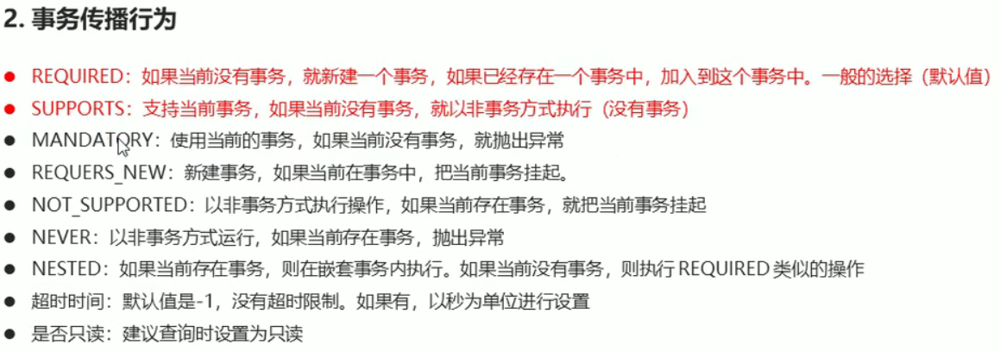

[TOC]

# 编程式事务控制

## Platform Transaction Manager

`PlatformTransactionManager`接口是`Spring`的事务管理器，它提供了我们常用的操作事务的方法

|                             方法                             |        说明        |
| :----------------------------------------------------------: | :----------------: |
| `TransactionStatus getTransaction(TransactionDefination defination)` | 获取事务的状态信息 |
|           `void commit(TransactionStatus status)`            |      提交事务      |
|          `void rollback(TransactionStatus status)`           |      回滚事务      |

Tips：`PlatformTransactionManager`只是一个接口，我们需要根据我们的使用场景调用不同的实现类

## Transaction Definition

`TransactionDEfinition`是事务的定义信息对象，它提供了方法供我们获取事务的相关信息

|             方法             |        说明        |
| :--------------------------: | :----------------: |
|   `int getIsolationLevel`    | 获取事务的隔离级别 |
| `int getPropogationBehavior` | 获取事务的传播行为 |
|       `int getTimeout`       |    获取超时时间    |
|     `boolean isReadOnly`     |      是否只读      |

- 隔离级别：略

- 传播行为：

  

## Transaction Status

`TransactionStatus`接口提供的是事务具体的运行状态

|            方法            |      说明      |
| :------------------------: | :------------: |
|   `boolean hasSavepoint`   | 是否存储回滚点 |
|   `boolean isCompleted`    |  事务是否完成  |
| `boolean isNewTransaction` |  是否是新事务  |
|  `boolean isRollbackOnly`  |  事务是否回滚  |

# 声明式事务控制

`Spring`声明式事务就是**采用声明的方式来处理事务**。即用在配置文件中声明的方式来代替编程式的处理事务

由于声明式事务控制不侵入开发的组件，即业务逻辑对象不需要关心自己是否正在处于事务之中，完成了解耦业务层面的业务逻辑和系统层面的事务控制。如果需要改变事务管理策划，也只需要修改配置文件即可

`Spring`声明式事务控制底层就是`AOP`

## 基于XML的声明式事务控制

在实现事务控制之前，我们需要明确几件事

- 谁是切点
- 谁是增强
- 如何配置切面

### 快速入门

- 将目标对象交给`Spring`管理

- 配置平台事务管理器（事务增强需要声明用哪一种管理器进行事务管理）

- 配置事务的增强

- 配置织入

  ```xml
  <!-- 将目标对象交给Spring管理 -->
  <bean id="target" class="xxx.Target"/>
  
  <!-- 配置平台事务管理器，按需求配置相应的事务管理器即可 -->
  <bean id="transactionManager" class="xxx.xxxTransactionManager">
  	<!--
  		Tips:这里需要将数据源作为参数传给事务管理器，
  		因为事务管理器对事务进行管理需要得到连接对象
  	-->
      <property name="dataSource" ref="dataSource"/>
  </bean>
  
  <!-- 配置事务的增强 -->
  <tx:advice id="txAdvice" transaction-manager="transactionManager">
      <!--
  		设置事务的属性信息
  			method：
                  name：被增强的方法
                      方法名中带有*代表通配符
                  isolation：隔离级别
                  propagation：传播行为
                  timeout：超时时间
                  read-only：是否只读
  	-->
  	<tx:attributes>
      	<tx:method name="*"/>
      </tx:attributes>
  </tx:advice>
  
  <!-- 织入事务 -->
  <aop:config>
  	<aop:advisor advice-ref="txAdvice" pointcut="[切点表达式]"/>
  </aop:config>
  ```

### 基于注解的声明式事务控制

- 组件扫描：`<context:component-scan base-package="[需要进行扫描的包]">`

- 配置注解

  - `Transactional([optional])`：配置事务，可以在参数列表中加入属性声明

    另外，该注解还可以配置到类上，代表该类下所有的方法都被事务所控制

- 配置事务注解驱动：`tx:annotation-driven transaction-manager="[事务控制器]"`

