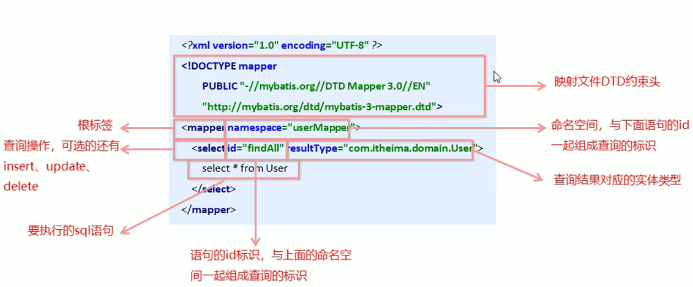

# MyBatis简介

- 原始的`JDBC`开发操作存在如下问题：

  - 数据库连接创建、释放频繁，影响系统性能

    <font color="Orange">利用数据库连接池初始化连接资源</font>

  - `sql`语句中在写死在代码中，不便于维护

    <font color="Orange">将`sql`语句抽取到`xml`配置文件中</font>

  - 查询操作需要手动封装实体，插入操作需要手动将实体的数据设置到占位符位置

    <font color="Orange">利用反射、内省等底层技术，自动将实体与表进行属性与字段的自动映射</font>

- `mybatis`是一个**基于`java`的持久层框架**，它将底层的繁琐的`jdbc`操作进行了封装，使开发者**只需要关注`sql`语句本身，而不需要花费精力去处理加载驱动、创建连接、创建`statement`等繁杂的过程**。它利用`Java`对象和`statement`中的动态参数进行映射，采用`ORM(Object-Relational Mapping)`思想解决了实体和数据库映射的问题，最后**会将`sql`执行后的结果集映射为`Java`对象并返回**，极大的简化了开发步骤

# MyBatis快速入门

## MyBatis开发步骤

1. 添加`MyBatis`坐标

2. 创建数据表

3. 创建相应的实体表

4. 编写映射文件（`.xml`，主要编写`Sql`语句）

   ```xml
   <!-- 编写映射，并赋予命名空间，方便在代码中调用 -->
   <mapper namespace="[命名空间]">
   	<select id="findAll" resultType="xxx.[待封装的实体类]">
       	select * from [tableName]
       </select>
   </mapper>
   ```

5. 编写核心文件`SqlMapConfig.xml`

   ```xml
   <configuration>
   	<!-- 配置数据源环境 -->
       <environments defaults="[默认环境id]">
       	<environment id="[环境id]">
           	<transactionManager type="JDBC"></transactionManager>
               <dataSource type="[数据源类型]">
               	<property name="[数据源参数]" value="[对应的值]"/>
                   ...
               </dataSource>
           </environment>
       </environments>
       
       <!-- 加载映射文件 -->
       <mappers>
       	<mapper resource="xxx.xxMapper.xml"></mapper>
       </mappers>
   </configuration>
   ```

6. 调用`MyBatis`的`API`进行数据库操作

   ```java
   public void test() throws Exception{
       // 1.获得核心配置文件
       InputStream resourceAsStream = Resources.getResourceAsStream("[相对于类加载路径下的配置文件]");
       // 2.获得Session工厂对象
       SqlSessionFactory sqlSessionFactory = new SqlSessionFactoryBuilder().build(resourceAsStream);
       // 3.获得Session回话对象
       SqlSession sqlSession = sqlSessionFactory.openSession();
       // 4.执行操作并获取数据（参数：namespace.id）
       List<[实体类]> list = sqlSession.selectList("userMapper.findAll");
       // 5.释放资源
       sqlSession.close();
   }
   ```

# MyBatis映射文件概述



- `DTD`约束头，可以对标签的内容进行约束
- `Mapper`
  - `namespace`：命名空间，与`mapper`的子标签中的`id`属性共同组成唯一性标识
  - 标签内部：操作标签
- 操作标签
  - `id`：在同一个命名空间中，操作的唯一性标识
  - `resultType`：规定语句的查询结果类型（实体的全限定名），即查询以后需要封装成的目标实体
  - 标签内部：`sql`语句

# MyBatis的CRUD

  `MyBatis`中，`CRUD`的`SQL`被封装到了映射文件中，在代码中我们只需要调用相应的操作，`MyBatis`会自动帮我们完成对象解析成`SQL`，和结果集封装成对象的操作
  
  其中，我们通过映射文件的`xml`标签编写我们的`SQL`语句，并定好我们的`SQL`语句需要进行封装的实体类，来完成业务和`DAO`的解耦合
  
  相关标签
  - 根标签：`mapper`
  - 操作标签
    - `select`：查询
    - `insert`：插入
    - `delete`：删除
    - `update`：更新
  - 通用属性
    - `parameterType`：参数实体类
      
      当我们需要使用预编译的`SQL`语句时，需要一个这样的参数实体类来规定传入的是一个什么
    - `reesultType`：结果实体类