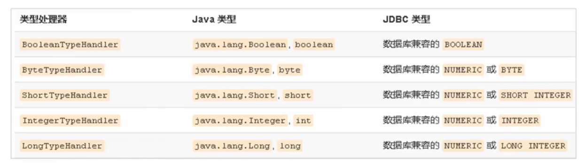

[TOC]

# Mybatis简介

- 原始的`JDBC`开发操作存在如下问题：

  - 数据库连接创建、释放频繁，影响系统性能

    <font color="Orange">利用数据库连接池初始化连接资源</font>

  - `sql`语句中在写死在代码中，不便于维护

    <font color="Orange">将`sql`语句抽取到`xml`配置文件中</font>

  - 查询操作需要手动封装实体，插入操作需要手动将实体的数据设置到占位符位置

    <font color="Orange">利用反射、内省等底层技术，自动将实体与表进行属性与字段的自动映射</font>

- `mybatis`是一个**基于`java`的持久层框架**，它将底层的繁琐的`jdbc`操作进行了封装，使开发者**只需要关注`sql`语句本身，而不需要花费精力去处理加载驱动、创建连接、创建`statement`等繁杂的过程**。它利用`Java`对象和`statement`中的动态参数进行映射，采用`ORM(Object-Relational Mapping)`思想解决了实体和数据库映射的问题，最后**会将`sql`执行后的结果集映射为`Java`对象并返回**，极大的简化了开发步骤

# Mybatis快速入门

## Mybatis开发步骤

1. 添加`Mybatis`坐标

2. 创建数据表

3. 创建相应的实体表

4. 编写映射文件（`.xml`，主要编写`Sql`语句）

   ```xml
   <!-- 编写映射，并赋予命名空间，方便在代码中调用 -->
   <mapper namespace="[命名空间]">
   	<select id="findAll" resultType="xxx.[待封装的实体类]">
       	SELECT * FROM [tableName]
       </select>
   </mapper>
   ```

5. 编写核心文件`SqlMapConfig.xml`

   ```xml
   <configuration>
   	<!-- 配置数据源环境 -->
       <environments defaults="[默认环境id]">
       	<environment id="[环境id]">
           	<transactionManager type="JDBC"></transactionManager>
               <dataSource type="[数据源类型]">
               	<property name="[数据源参数]" value="[对应的值]"/>
                   ...
               </dataSource>
           </environment>
       </environments>
       
       <!-- 加载映射文件 -->
       <mappers>
       	<mapper resource="xxx.xxMapper.xml"></mapper>
       </mappers>
   </configuration>
   ```

6. 调用`Mybatis`的`API`进行数据库操作

   ```java
   public void test() throws Exception{
       // 1.获得核心配置文件
       InputStream resourceAsStream = Resources.getResourceAsStream("[相对于类加载路径下的配置文件]");
       // 2.获得Session工厂对象
       SqlSessionFactory sqlSessionFactory = new SqlSessionFactoryBuilder().build(resourceAsStream);
       // 3.获得Session回话对象
       SqlSession sqlSession = sqlSessionFactory.openSession();
       // 4.执行操作并获取数据（参数：namespace.id）
       List<[实体类]> list = sqlSession.selectList("userMapper.findAll");
       // 5.释放资源
       sqlSession.close();
   }
   ```

## Mybatis映射文件概述


- `DTD`约束头，可以对标签的内容进行约束
- `Mapper`
  - `namespace`：命名空间，与`mapper`的子标签中的`id`属性共同组成唯一性标识
  - 标签内部：操作标签
- 操作标签
  - `id`：在同一个命名空间中，操作的唯一性标识
  - `resultType`：规定语句的查询结果类型（实体的全限定名），即查询以后需要封装成的目标实体
  - 标签内部：`sql`语句

## Mybatis的CRUD

  `Mybatis`中，`CRUD`的`SQL`被封装到了映射文件中，在代码中我们只需要调用相应的操作，`Mybatis`会自动帮我们完成对象解析成`SQL`，和结果集封装成对象的操作

  其中，我们通过映射文件的`xml`标签编写我们的`SQL`语句，并定好我们的`SQL`语句需要进行封装的实体类，来完成业务和`DAO`的解耦合

  相关标签
  - 根标签：`mapper`

  - 操作标签
    - `select`：查询
    - `insert`：插入
    - `delete`：删除
    - `update`：更新
    
  - 通用属性
    - `parameterType`：参数实体类
      
      例：
      
      ```xml
      <insert parameterType="xxx.User">
      	INSERT INTO `user` VALUES(#{id},#{username},#{password})
      </insert>
      ```
      
    - `reesultType`：结果实体类
    
      例：
    
      ```xml
      <select resultType="xxx.User">
      	SELECT * FROM `user`
      </select>
      ```
    
    Tips：当我们需要使用预编译的`SQL`语句时，需要一个这样的参数实体类来规定传入的是一个什么类型的实体，并且利用这个实体通过**自省**来获取到预编译需要的内容
    
    预编译的内容和默认`SQL`的预编译语句略有不同，在配置文件中，`SQL`语句需要预编译的部分可以直接用`#{属性名}`传入，不需要使用占位符

### CRUD中需要注意的问题

- 映射文件中使用`parameterType`属性指定要插入的数据类型
- `SQL`语句中需要使用`#{实体的属性名}`来引用实体中的属性值
- 设计增删改的操作时需要修改数据库，默认情况下`Mybatis`的事务处于开启状态，所以在操作完成以后需要`commit`提交事务

# Mybatis核心配置文件

```xml
<?xml version="1.0" encoding="UTF-8" ?>
<!DOCTYPE configuration
  PUBLIC "-//mybatis.org//DTD Config 3.0//EN"
  "http://mybatis.org/dtd/mybatis-3-config.dtd">
<configuration>
  <properties resource="jdbc.properties"/>
  <environments default="development">
    <environment id="development">
      <transactionManager type="JDBC"/>
      <dataSource type="POOLED">
        <property name="driver" value="${driver}"/>
        <property name="url" value="${url}"/>
        <property name="username" value="${username}"/>
        <property name="password" value="${password}"/>
      </dataSource>
    </environment>
  </environments>
  
  <mappers>
    <mapper resource=""/>
  </mappers>
</configuration>
```


## Mybatis核心配置文件的层级关系

- `Configuration`：配置，**核心配置文件的根标签**
  - `properties`：属性
  - `settings`：设置
  - `typeAliases`：类型别名
  - `typeHandlers`：类型处理器
  - `objectFactory`：对象工厂
  - `plugins`：插件
  - **`environments`：环境**
    - `environment`：环境变量
      - `transactionManager`：事务管理器
      - `dataSource`：数据源
  - `databaseProvider`：数据库厂商标识
  - `mappers`：映射器

## environment

数据库环境的配置，支持**多环境配置**


- `environments`

  - 属性
    - `default`：指定默认的环境
  - 子标签
    - `environment`

  例：

  ```xml
  <!-- 配置数据源环境 -->
  <environments default="dev">
  	<environment id="dev">
      	<transactionManager type="JDBC"/>
          <dataSource type="POOLED">
          	<propertiy name="[连接需要的属性名]" value="[连接需要的属性值]"/>
          </dataSource>
      </environment>
  </environments>
  
  <!-- 加载映射文件 -->
  <mapppers>
  	<mapper resource="xxx/xxx/xxx.xml"></mapper>
  </mapppers>
  ```

- `environment`

  - 属性

    - `id`：环境的唯一性标识

  - 子标签

    - `transactionManager`：事务管理器，有两种参数

      - `JDBC`：这个配置就是直接使用了`JDBC`的提交和回滚设置，它依赖于从数据源得到的连接来管理事务作用域
      - `MANAGED`：这个配置从来不提交或者回滚一个连接，而是让容器来管理事务的整个生命周期。默认情况下它会关闭连接，可以通过将`closeConnection`属性设置为`false`阻止它默认关闭

    - `dataSource`：数据源，有三种参数

      - `UNPOOLED`：这个数据源的实现只是在每次被请求时打开和关闭连接
      - `POOLED`：这种数据源的实现利用“池”的概念将`JDBC`连接对象组织起来
      - `JNDI`：这个数据源的实现是为了能在如`EJB`或应用服务器这类容器中使用，容器可以集中或在外部配置数据源，然后放置一个`JNDI`上下文的引用

      其中`dataSource`含有`property`子标签，可以用于设置数据源的一些参数，如`driver`、`url`、`username`、`password`

      Tips：以上两种配置都支持自定义，其中

      - 自定义事务管理器：实现`TransactionFactory`接口
      - 自定义数据源：实现`DataSourceFactory`接口
      - 一般情况下，事务管理器

- `mappers`：用于加载映射文件

    子标签：

  - `mapper`：该标签的作用是用于加载映射的，主要有以下几种加载方式
    - **使用相对于类路径的资源引用**：`<mapper resource="xxx/xxx/xxx.xml"/>`
    - 使用完全限定资源定位符：`<mapper url="file://xxx/xxx/xxx.xml"/>`
    - 使用映射器接口实现类的完全限定名：`<mapper class="xxx.xxx.xxx（类名）"`
    - 将包内的映射器接口实现全部注册为映射器：`<package name="xxx.xxx.xxx（包名）"`

## properties

  - 类比于`Spring`，`Mybatis`同样可以从外部加载配置文件，并通过`${key}`表达式的形式**引用**外部的配置

    ```xml
    <properties resource
    ```

    

### 给类取别名

```xml
<!-- 起别名 -->
<typeAliases>
  <typeAlias type="xxx.xxx.User" alias="user"></typeAlias>
</typeAliases>

<!--
  在完成了起别名以后，我们再调用这个类时，就可以不必用这个类的全限定名，而是通过别名对类进行引用
-->
<select id="findAll" resultType="user">
  SELECT * FROM `user`
</select>
```

  - 对于一些比较常见的类型，`Mybatis`已经为我们定义好了别名

    |别名|数据类型|
    |:---:|:---:|
    |`string`|`Srting`|
    |`long`|`Long`|
    |`int`|`Integer`|
    |`double`|`Double`|
    |`boolean`|`Boolean`|
    |...|...|

    Tips：别名的定义要定义在使用之前，一般直接跟着`properties`标签一起放在根目录内容的最上方


#    Mybatis的常见API

## SQL Session工厂构建器
  我们构建一个`SQL Sesson`工厂，需要用到工厂构建器：`SqlSessionFactoryBuilder`，而这个类常用的API有
  - `SqlSessionFactory build(InputStream inputStream);`
    
    该方法可以通过`inputStream`中包含的`xml`配置文件，构建出一个`SqlSessionFactory`，通过这个`SqlSessionFactory`我们才能创建出供给我们操作数据库的`SqlSession`
    
    ```java
    String resource = "org/mybatis/builder/mybatis-config.xml";
    // 该Resources是Mybatis提供给我们的一个类，它能帮助我们快捷地定位到类加载路径下的资源（maven工程则定位到resources包下），而不需要从工程的根开始读取
    InputStream inputStream = Resources.getResourceAsStream(resource);
    SqlSessionFactoryBuilder builder = new SqlSessionFactoryBuilder();
    SqlSessionFactory factory = builder.build(inputStream);
    ```
    
## Sql Session工厂对象
  我们构建好了`SqlSessionFactory`以后，还需要通过这个工厂创建操作数据库用的`SqlSession`会话对象，`SqlSessionFactory`常用的API有`openSession`
  - `openSession(boolean autoCommit = false)`：默认开启一个事务，但事务不会自动提交，所以该**事务需要手动提交**，对数据库的**更新操作**才会被写入数据库，如果`autoCommit`设置为`true`则不需要手动提交

    ```java
    // 假设已经获取了SqlSessionFactory对象（factory）
    // 该对象为默认值，即不对更新操作进行自动提交
    SqlSession sqlSession = factory.openSession();
    // 该对象将autoCommit设置为了true，则在完成一条SQL语句以后会对事物进行一次自动提交
    SqlSession sqlSession = factory.openSession(true);
    ```
    
## Sql Session会话对象

  获取到了`SqlSession`对象以后，我们就可以通过这个对象，对数据库进行`CRUD`、事务等操作了，它的主要方法有：

 ```java
 /*
  * 以下方法中的参数说明：
  *   statement：映射文件中sql标签的唯一标识，用于定位需要用到的sql语句
  *   parameter：需要传入的参数，对应映射文件中的parameterType；若传入的参数是一个基本数据类型或字符串，那么则不对标签中的表达式和类型作要求
  */
 // 查询一条数据，返回相应的一个对象
 <T> T selectOne(String statement, Object parameter);
 // 查询多条数据，返回相应的映射类的List
 <E> List<E> selectList(String statement, Object parameter);
 // 以下方法的返回值均是对数据库操作所影响的总行数
 // 将数据插入到表中
 int insert(String statement, Object parameter);
 // 更新数据
 int update(String statement, Object parameter);
 // 删除数据
 int delete(String statement, Object parameter);
 
 // 以下为一些对数据库的事务的操作方法
 // 提交事物
 void commit();
 // 回滚事务
 void rollback();
 ```

# Mybatis的dao层实现

## 传统的dao层实现方式

1. 创建一个`dao`层的接口（如：`User`）
2. 创建一个实现类，用于实现`dao`层相应的接口
3. 在`service`层创建`dao`层对象，调用相应的方法

该方法繁琐，每一次都要写接口写实现类实现某一个功能，影响开发效率

## 接口代理的dao实现方式

采用`Mybatis`代理的方式实现`dao`层的开发是开发的主流

`Mapper`接口开发方法只需要我们编写`Mapper`接口（即：`dao`接口），，由`Mybatis`框架根据接口定义创建连接接口的动态代理对象，代理对象的方法体同上边`dao`接口实现类方法

其中，`Mapper`接口开发需要遵顼以下规范：

1. `Mapper.xml`文件中的`namespace`与`mapper`接口的全限定名相同

2. `Mapper`接口方法名和`Mapper.xml`中定义的每个`statement`的`id`相同

3. `Mapper`接口方法的输入参数类型和`Mapper.xml`中定义的每个`sql`的`parameterType`的类型相同

4. `Mapper`接口方法的输出参数类型和`Mapper.xml`中定义的每个`sql`的`resultType`的类型相同

   只要满足了以上的条件，我们只需要调用相应的`API`，`Mybatis`就会在实现时动态地为我们生成代理对象，来调用不同的方法，而不需要我们手动实现

例：

接口类：

```java
// 定义了dao方法的接口类
public interface UserMapper{
    // 查找所有User对象
    List<User> findAll();
	// 根据id查找某个User对象
    User findById(int id);
}
```

`xml`配置：

```xml
<!-- 映射了sql语句的配置文件 -->
<!-- namespace应该与以上的接口的全限定名一致 -->
<mapper namespace="com.xxx.xxx.UserMapper">
    <!--
		相应的sql映射的id应该和上面的接口方法名一致
		parameterType的类型应该和方法传入的参数一致
		resultType的类型应该和方法的返回值一致
 	-->
	<select id="findAll" resultType="com.xxx.xxx.User">
    SELECT * FROM user
    </select>
    
    <select id="findById" parameterType="int" resultType="com.xxx.xxx.User">
    SELECT * FROM `user` WHERE `id`=#{id}
    </select>
</mapper>
```

调用：

```java
public static void main(String[] args){
    InputStream resourceAsStream = Resources.getResourceAsStream("[以上配置文件的路径]");
    SqlSessionFactoryBuilder builder = new SqlSessionFactoryBuilder();
    SqlSessionFactory factory = builder.build(resourceAsStream);
    SqlSesion sqlSession = factory.openSession();
    // 以上获取Session的方法都是一致的，下面是调用动态代理接口的API
    // 该方法会根据接口和传入的xml配置文件，动态生成一个有具体方法的对象，功能实现靠xml的sql语句实现，而不需要我们重复写繁杂的实现类
    UserMapper userMapper = sqlSession.getMapper(UserMapper.class);
    // 调用UserMapper的方法
    List<User> userList = userMapper.findAll();	// 获取一个存放了所有User的List
    User user = userMapper.findById(1);	//获取id为1的User对象
}
```

# Mybatis映射文件深入

## 动态SQL语句

### 动态sql语句概述

`Mybatis`的映射文件中，前面我们的`SQL`都是比较简单的，有些时候业务逻辑复杂时，我们的`SQL`是动态变化的，此时前面的学习中我们的`SQL`就不能满足需求了，那么此时我们就需要使用动态`SQl`语句来满足我们的需要

### 动态SQL标签——if

- 根据实体类的不同取值，我们可以使用不同的`SQL`语句来进行查询，比如在`id`不为空时我们可以根据`id`查询，如果`username`不为空时还要加入用户名作为条件

- 语法：`<if test="[condition]">SQL Body</if>`，如果`if`中`test`属性的条件成立，则动态地添加`SQL Body`到已有的`SQL`语句后面

  例：

  ```xml
  <select id="findByCondition" parameterType="com.xxx.xxx.User" resultType="com.xxx.xxx.User">
  	SELECT * FROM `user` WHERE 1=1
      <!-- 在以下的标签中，会对test属性进行判断，如果结果为true，则将标签体中的内容拼接到以上的SQL语句后面 -->
      <if test="id!=0">
          AND `id`=#{id}
      </if>
      <if test="username!=null">
          AND `username`=#{username}
      </if>
      <if test="password!=null">
          AND `password`=#{password}
      </if>
  </select>
  ```

  以上就是`if`标签的用法，但是在`SQL`语句中后跟`WHERE 1=1`使得我们的代码不太优雅，所以我们需要引入一个新的标签——`where`，它可以自动地识别我们的标签，并为我们的标签判断是否需要动态地后接一个`WHERE`语句和是否需要添加前置的`AND`，这样我们就不需要在原本的`SQL`中后跟一个`WHERE 1=1`了

  ```xml
  <!-- where标签的使用 -->
  <select id="findByCondition" parameterType="com.xxx.xxx.User" resultType="com.xxx.xxx.User">
  	SELECT * FROM `user`
      <!--
  		例如以下的标签中，
  			如果只有第二第三个标签的test为true的话，则SQL为：SELECT * FROM `user` WHERE `username`=#{username} AND `password`=#{password}
  			如果所有标签的test都为false的话，则SQL为：SELECT * FROM `user`
  	-->
      <where>
          <if test="id!=0">
              AND `id`=#{id}
          </if>
          <if test="username!=null">
              AND `username`=#{username}
          </if>
          <if test="password!=null">
              AND `password`=#{password}
          </if>
      </where>
  </select>
  ```

### 动态SQL标签——foreach

- 有些时候，我们还可能会进行大量的查询或插入，这时候我们就需要循环生成`SQL`语句了，这时候`foreach`标签就可以派上用场了，`foreach`标签会循环将我们需要的数据集（数组、链表等）拼接到`SQL`语句中

- 语法：`<foreach collection="[封装数据的结构类型]" open="[开头]" close="[结尾]" item="[接收集合的每一个项]" separator="[分割符]">[itemValue]</foreach>`

  例如：

  ```xml
  <!-- 根据list的id获取User -->
  <!-- 
      首先我们先设想一下，我们所要完成的需求是不是想以下这样的:
        <select id="findByIds" parameterType="list" resultType="xxx.xxx.User">
            SELECT * FROM `user` WHERE `id` IN({list里的值})
        </select>
      但由于list的值是动态的，所以我们不能写死在配置文件中，必须要动态地载入sql语句中，所以就引入了foreach标签，结合where标签的用法，就变成以下这样
  -->
  <select id="findByIds" parameterType="list" resultType="xxx.xxx.User">
  	SELECT * FROM `user`
      <where>
      	<foreach collection="list" open="IN(" close=")" item="id" separator=",">
          	#{id}
          </foreach>
      </where>
  </select>
  ```
  
  

### SQL语句的抽取

- 为了`SQL`语句的复用，我们可以将相同部分的`SQL`语句进行抽取，然后对`SQL`片段进行引用，这样我们的`SQL`就可以进行复用，更便于维护

- 语法：`<sql id="selectUser">[需要抽取的SQL语句]</sql>`

  例如：

  ```xml
  <!-- 如在前几个例子中，我们就可以抽取对user表查询的SQL语句的前半部分 -->
  <sql id="selectUser">SELECT * FROM `user`</sql>
  <!-- 引用上述标签 -->
  <select id="findByIds" parameterType="list" ></select></se>resultType="xxx.xxx.User">
  	<include refid="selectUser"
      <where>
      	<foreach collection="list" open="IN(" close=")" item="id" separator=",">
          	#{id}
          </foreach>
      </where>
  </select>
  ```

# Mybatis核心配置文件深入

## Type Handler

- 在`Java`和`MySQL`中，数据的类型是不太一样的，那么在`MySQL`和`Java`之间传递数据的时候，就需要一定的类型转换，而`Mybatis`就已经提供了以下的默认类型转换

  

- 但开发场景多，并不是什么类型都可以用以上的类型转换器的，所以我们还自定义类型转换器

  自定义`TypeHandler`可以支持我们去完成一些`Mybatis`默认不支持的类型转换，具体做法如下

  1. 实现`org.apache.ibatis.type.TypeHanler`接口，或者继承`org.apache.ibatis.type.BaseTypeHanler`类
  2. 重写方法
     - `setNonNullParameter`：`Java`设置数据到数据库的回调方法
     - `getNullableResult`：查询时`MySQL`的字符串类型转换为`Java`的`Type`类型的方法
  3. 将它映射到某一个`JDBC`类型
  4. 注册到`Mybatis`核心配置文件中

  如：

  ```xml
  <!-- 从user表中查询id在集合L中的数据 -->
  <select id="findInList" parameterType="list" resultType="list">
  	SELECT * FROM `user` WHERE `id` IN('<该集合的数据>')
  	<!--
  		以上是预想的实现方案，但由于集合的数据是动态的，我们不能写死在xml中，而是要动态生成，这时候我们就可以用上foreach标签，来利用一个循环动态的拼接集合的每一个元素
  	-->
  </select>
  ```

  

