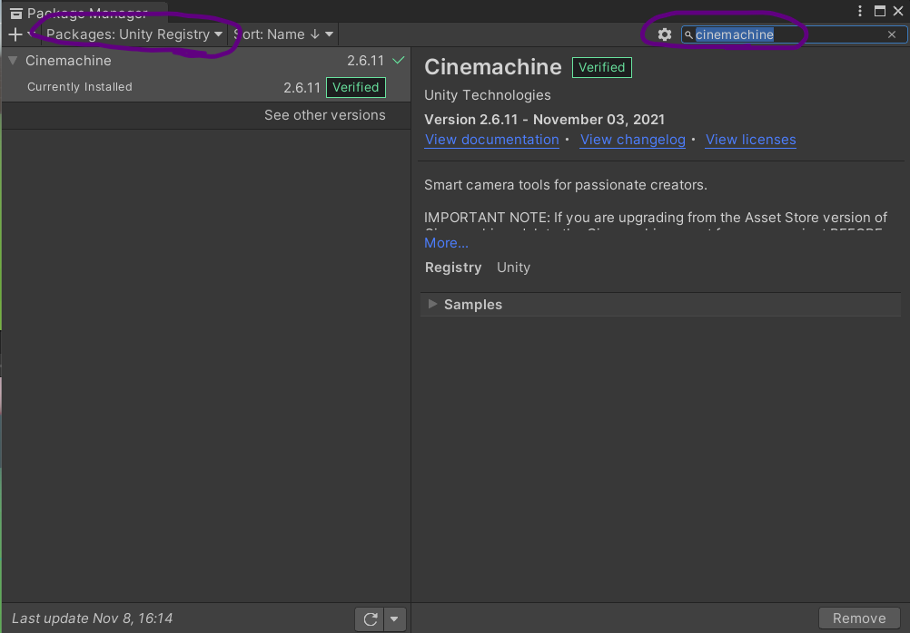
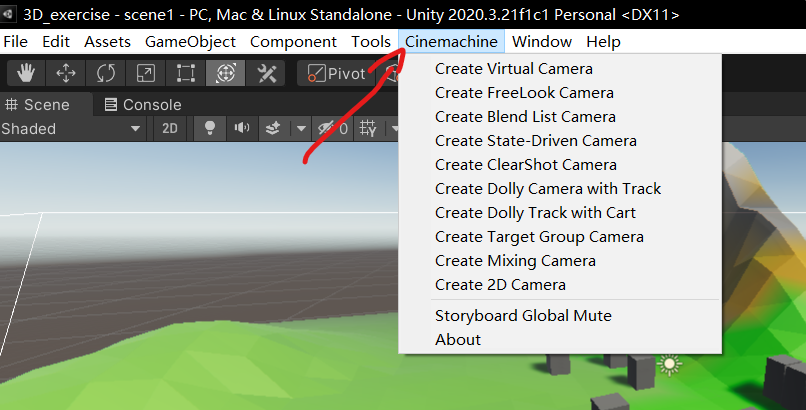

[TOC]

# Navigation

在日常的游戏开发过程中，我们可能会需要游戏角色自动寻路（如在RPG中自动去寻找`NPC`接任务或完成任务），这些我们如果每一次都自己编写代码，逻辑将会变得很复杂且繁琐，那么我们可以利用`Unity`提供的`Navigation`这个组件包，来对我们的角色进行操作，它封装了一些**寻路网格**的方法，帮助我们进行自动寻路

## NavMashAgent

属性

- `destination`：这是指定了人物的目的地的变量，通过`setDestination`可以修改人物的目的地，让`Navigation`自动寻路到目的地（即目的坐标）

# Events

- `Events`是`unity`中的事件系统，通过事件，我们可以自定义许多玩家的操作会触发的情况，例如我们给鼠标左键绑定了一个`onMouseClick`事件以后，在玩家点击了鼠标的某一个键以后，就会自动调用我们提前设置好的方法，来调度游戏中的对象

  具体自定义步骤

  ```C#
  // 使得这个类的对象可以被序列化
  [System.Serializable]
  // 自定义一个事件，并继承于Unity的事件，用泛型表示出我们需要的是什么变量
  public class EventVector3:UnityEvent<Vector3> {}
  ```

  然后在我们需要的地方创建出这样的变量，就可以在组件中配置我们的时间信息了

# Cinemachine

- `cinemachine`是unity提供的一个用于控制摄像机的组件，可以通过`Package Manager`下载

  

然后`install`完成以后会在菜单栏出现一个`cinemachine`，点开会有一个列表，里面可以选择不同的`cinemachine`



## Virtual Camera

### Body


- `Do Nothing`

  摄像机不会进行任何操作

- `3rd Person Follow`

  将相机水平和垂直地旋转在玩家周围，**以跟随**目标。

- `Framing Transposer`

  在固定屏幕空间关系中移动到**跟随**目标。

  即常规的3D RPG（如剑网三）的视角一样，以上帝视角观察游戏角色

- `Hard Lock To Target`

  在**跟随**目标处使用相同的位置。

- `Orbital Transposer`

  在可变关系中移动到**跟随**目标，可选地接受玩家输入。

- `Tracked Dolly`

  沿着预定的道路移动。

- `Transposer`

  在固定关系中移动到**跟随**目标。

